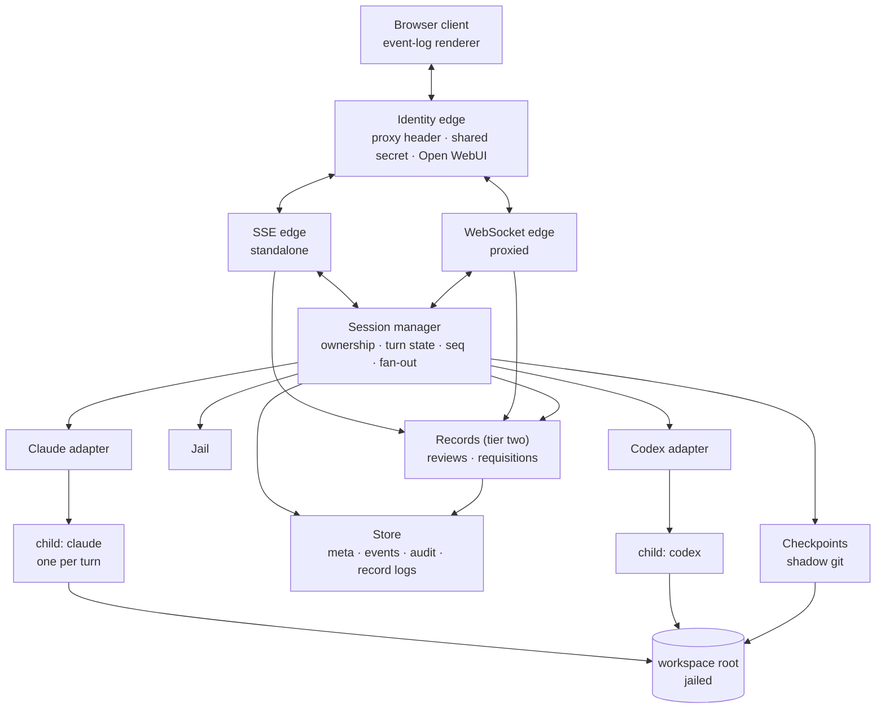
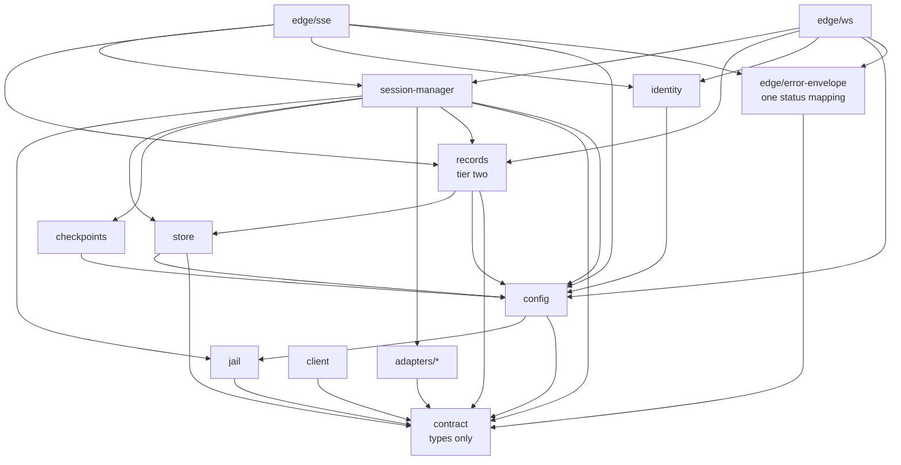

# Design — SkyNet HR

Reading order: `00-brief.md` first. This document assumes its non-goals are binding.

**The brief has two tiers and so does this document.** Tier one is the console — everything
that was here before the prototype adjudication. Tier two is the operator's working surfaces
admitted by D53 to D55 and D58, and it is binding scope rather than a wish list. Where a
section carries tier-two material it is marked **(tier two)**, for one reason: tier one is
finishable on its own (D59), and an implementer must be able to see which structures they
may leave unbuilt without leaving a half-wired state behind.

Tier two adds two persisted entities and no new architecture. That is the headline result of
this revision, and it is a claim to check rather than accept — see *Alternatives considered*
D65, which is where the option that would have added one is rejected.

## Shape



Four layers, and the boundaries matter more than the boxes:

- **Transport edges** know about requests, identity and streams. They know nothing about
  vendors. There are two of them (D10) because the transport is a deployment property, not
  an architectural one.
- **Session manager** knows about ownership, lifecycle, turn state and the filesystem jail.
  It speaks only the normalised event vocabulary in `20-contract.md`.
- **Adapters** are the only code that knows a vendor exists. One per CLI.
- **Child processes** are the agents. We supervise them; we do not reimplement them.

**Records is a peer of the session manager, not a layer** (D77). It owns the two things tier
two persists that are not sessions — a review outlives the session it is about, and a
requisition exists before any session does — and it owns nothing about turns, `seq`, fan-out
or child processes. The reason it is a module rather than five more methods on the session
manager is that lifecycle: giving the one module that already owns the most in this system a
second, unrelated lifecycle is how that module becomes the place everything goes.

The rule that keeps this honest: **a vendor string must never appear above the adapter
layer.** If the session manager or the client needs to branch on `claude` vs `codex`, the
normalised vocabulary is wrong and the fix belongs in `20-contract.md`, not in a
conditional.

The rule has one deliberate exception, and it must be stated or it will be discovered as a
bug: **vendor-minted opaque identifiers do cross the boundary.** See *Data model §
Identity spaces*.

## Prior art

Findings from reading `Forks-Claude-Code-Chat` at commit `ab6e307`. That repository is
licensed all-rights-reserved with a reference-only grant, so these are protocol facts and
techniques, **not** code to copy. Line references are for a reader who wants to check the
claim.

### Take

**The transport.** The Claude CLI is driven with
`--output-format stream-json --input-format stream-json --verbose`, with **stdin held
open** for the life of the turn (`src/extension.ts:926`). Messages go in as JSON lines;
events come out as NDJSON. Holding stdin open is what makes interactive permissions
possible at all — closing it after the prompt, which is the obvious first implementation,
forecloses the whole feature.

**The line splitter.** Accumulate, `split('\n')`, `pop()` the trailing fragment and carry
it into the next chunk (`src/extension.ts:1178-1185`). Obvious once seen, and the single
most common source of corrupt-JSON bugs when not done.

**The permission handshake.** `--permission-prompt-tool stdio` makes the CLI emit
`{type: 'control_request', request: {subtype: 'can_use_tool', ...}}`. The host renders a
prompt and writes back a `control_response` carrying `behavior: 'allow' | 'deny'`
(`src/extension.ts:2039`). `updatedPermissions` on an allow is how "always allow" is
expressed. This replaced an older approach that stood up a whole MCP server for the
purpose; that repo still carries the 540 KB fossil at its root.

**We take the handshake and leave `updatedPermissions`** (D35). Handing a standing grant to
the CLI persists it in the CLI's own settings, outside this server's storage, and every
later tool call it matches then runs with no `can_use_tool` on the wire — no
`permission.request`, no `permission.resolved`, no audit append, in this session or in a
later session on the same workspace owned by a different operator. DoD #7 promises a record
of *every* tool approval, so the standing rule is held here instead. See *Control flow § 2*.

**Session state is the CLI's, not ours.** `session_id` arrives on the `system`/`init`
event and goes back out as `--resume <id>` on the next turn (`src/extension.ts:971`). We
keep a transcript for display and replay only. This is the difference between a console
and a reimplementation of context management.

**Checkpoints via a shadow git directory.** A second `GIT_DIR` in server storage, pointed
at the workspace as its work-tree (`src/extension.ts:1742`):

```
git --git-dir=<storage>/<session>/ckpt.git --work-tree=<workspace> add -A
git --git-dir=<storage>/<session>/ckpt.git --work-tree=<workspace> commit --allow-empty -m "<label>"
git --git-dir=<storage>/<session>/ckpt.git --work-tree=<workspace> checkout <sha> -- .
```

The operator's real `.git` is never touched, the workspace needs no git at all, and the
mechanism is vendor-agnostic — which is why it survives our move to two backends intact.
The best idea in that repository.

**Its restore is those three lines, and three lines is not a restore** (D31). `checkout
<sha> -- .` writes the target tree over the work-tree and deletes nothing absent from it,
so every file the agent created since the target survives — including the wrong migration
or the injected script the rollback was invoked to remove. Our restore semantics are in
*Data model § Checkpoint*.

**Coarse "always allow" patterns.** Deriving `npm run *` from a concrete command so a
standing approval is a shape rather than a string. We need this, and the instruction that
stood here — do not invent a grammar before looking at what `permission_suggestions` offers
on the wire — was followed and returned nothing. **The field is not merely un-mapped, it is
unobservable**: the `control_request` that would carry it has never appeared on this
transport across two independent probes three days apart, and the upstream defect was
stale-closed without a fix. So the grammar is ours after all, and it is a local one —
`"<tool>:<pattern>"`, declared in `20-contract.md § Event payloads` (D108). The vendor's
array is still forwarded verbatim and read by nothing (D104, I44).

### Leave

- **The rendering.** A 5,359-line `<script>` inside a template literal, 5,053 lines of CSS
  in another, `innerHTML =` throughout, no virtualisation, no batching. An unbounded DOM.
- **No token-level streaming.** `--include-partial-messages` appears nowhere in that
  source; assistant text arrives as whole blocks. We should try the flag — see *Open*.
- **The CSP.** `default-src * 'unsafe-inline' 'unsafe-eval' data: blob:` — survivable in a
  webview whose only user owns the machine, disqualifying in a browser app that renders
  model output.
- **Everything about its trust model.** A webview has exactly one user, who is also the
  machine owner. Nothing in that repository generalises to more than one operator, and
  `--dangerously-skip-permissions` is exposed as a checkbox.

### Not applicable

Its provider router (`src/router/`, ~500 lines translating Anthropic `/v1/messages` to
OpenAI `/chat/completions` behind `ANTHROPIC_BASE_URL`) is a clever way to make one CLI
talk to another vendor's *API*. We are doing the opposite — driving each vendor's own CLI —
so it solves a problem we do not have. Worth remembering if that ever changes.

## The hard problem: two permission models that do not unify

This is where the cross-vendor decision costs something, and it should be understood before
implementation starts rather than discovered in it.

| | Claude CLI | Codex CLI |
|---|---|---|
| When policy is set | Per tool call, at runtime | `sandbox_mode` at launch; `approval_policy` decides whether it *also* asks at runtime |
| Mechanism | `control_request` / `control_response` over stdio | `approval_policy`, `sandbox_mode` in config. Under `app-server` a runtime prompt arrives as a JSON-RPC **request**, `item/commandExecution/requestApproval`; `exec --json` has no such channel and cannot have one |
| Granularity | This command, this path, now | The sandbox is whole-session. An `on-request` prompt is per call, and is reachable on one of the two transports |
| Operator sees | A prompt they answer | A sandbox chosen in advance. Nothing more under the shipped policy, which is `preauthorised` |
| Source | Documented by the vendor and observed in the fork — **not** against the shipping CLI, where it does not fire (D88) | Observed against `codex-cli 0.146.0`, both transports — `design/findings/S8-codex-adapter.md` (S8.1) |

**Codex has a runtime approval concept of its own, and S8.1 established that it is
reachable.** Every profile in `codex/PROFILES.md` carries `approval_policy = "on-request"`,
and the question D27 asked — whether that prompt reaches a programmatic stream at all, or
lives only inside the terminal UI where a browser console cannot answer it — now has an
answer. Under `codex app-server` with `approvalPolicy: 'on-request'`, the server sends a
genuine JSON-RPC request, `item/commandExecution/requestApproval`, carrying `reason`,
`command` and an `availableDecisions` enum, which a client can answer. Under `exec --json`
it sends nothing of the kind and structurally cannot: that transport is non-interactive by
construction and represents a sandbox denial only as the model narrating its own failure.

So the asymmetry is one of **verification, not of capability**, and the two slices that
probed it moved it in opposite directions. **Claude's runtime approval is the one not
observed on a live wire** (D88). Its handshake was read out of the fork and is documented by
the vendor; run against the installed CLI at 2.1.226, `--permission-prompt-tool stdio` emits
no `can_use_tool` of any subtype and the tool simply executes. That is an open upstream
defect — anthropics/claude-code#34046, tracked since 2.1.6 — with three probes recorded in
`design/findings/S1-claude-adapter.md`. **Codex's is now the observed one**, which is the
reverse of what this section assumed when it was written. The Claude column that reads
"verified" above therefore means *verified in someone else's code*, which is not the same
thing and cost this project a slice to find out. A
lowest-common-denominator design — launch-time policy only — would throw away the single
most valuable thing the console offers, which is approving a tool call from somewhere that
is not the server's terminal, and it would do so on the strength of an assumption nobody has
tested.

**Decision: model the interactive case as the contract, and let Codex under-deliver
against it, visibly.** See `90-decisions.md` D5, D27 for the corrected premise above, and D96
for why the broken Claude handshake does not reopen D5 — a vendor defect in a documented
mechanism is behaviour to be restored, not a capability that was never there.
A Codex session launches with an explicit `sandbox_mode`, surfaces that mode in the UI as a
standing banner, and emits no `permission.request` events. The client must therefore treat
"no permission events" as a normal state for a session, not as a stuck turn.

**The experiment open question 4 asked for has run, and D5 is not revised here.** S8.1 found
`on-request` reachable on `app-server`, so the asymmetry D5 accepted is measurably narrower
than when it was accepted — but S8's *Out of scope* says a reachable prompt is reported, not
acted on, and revising D5 is `/design`'s call, not a reconciliation's.
`20-contract.md § Vendor mapping — Codex` therefore carries the row marked *unreachable under
the shipped policy* rather than deleting it: the mapping it would need is one decision away,
not one experiment away.

**Codex's live stdio protocol was unverified when this was written and now is not, and what
it turned out to be is not what this section predicted.** The prediction was that the live
stream might match the *on-disk rollout schema* — `~/.codex/sessions/YYYY/MM/DD/rollout-*.jsonl`,
records wrapped in `payload`, opening with `session_meta`, usage as `token_count` events
under `payload.info` (`tools/Measure-Session.ps1:28-29,181,454`). **It does not.** S8.1
observed two live interfaces at `codex-cli 0.146.0` and neither emits `session_meta`,
`payload.info` or `token_count`; that schema describes a file on disk, which S8's *Out of
scope* forbids scraping, and it is not what the CLI puts on a wire. Both interfaces are
mapped from observation in `20-contract.md § Vendor mapping — Codex`, with `app-server`
primary and `exec --json` the fallback (D107). The instruction that stood here — budget the
first Codex slice as an experiment rather than an implementation — was right and was
followed; what it bought is recorded in `design/findings/S8-codex-adapter.md`.

## Data model

Ten entities. Seven of them are persisted, and knowing which is which is the whole point of
this section. The counts are checkable against *Persistence summary* at the end; if they
disagree, that table is right and this sentence is the defect.

**Payroll and incidents are not entities and no implementer may add one for them.** Tier-two
items 8 and 11 are *views*: token burn and idle time are folds over a session's own event
log, and the incident history is a filtered read of `audit.ndjson`. They are described under
*Derived views* below rather than here, because an entity is a thing with a lifecycle and
these have none of their own. Item 12, the theme, is not here either — D60 put the choice in
the browser, so this server holds no part of it.

### Session

The unit of ownership. Everything else hangs off one.

| Field | Type | Mutability | Source |
|---|---|---|---|
| `id` | `SessionId` (UUIDv4) | immutable | server, at create |
| `owner` | `OperatorId` | immutable | identity edge, at create |
| `vendor` | `'claude' \| 'codex'` | immutable | client request, validated |
| `cwd` | absolute path | immutable | **jail output**, never the client string (D4) |
| `model` | `string \| null` | immutable | client request |
| `policy` | `PermissionPolicy` | immutable | adapter capability, at create |
| `sandbox` | `string \| null` | immutable | client request, validated by the adapter |
| `cliSessionId` | `string \| null` | **last-write-wins** | **vendor**, from *every* `system/init` |
| `lastSeq` | `number` | monotonic | server, on every emit; **derived at boot** |
| `state` | `'live' \| 'ended'` | one-way | server |
| `turn` | `Turn \| null` | mutable | server; `null` means idle. Always `null` when ended |
| `createdAt` / `endedAt` | ISO 8601 UTC | set once each | server |

`state` distinguishes the two ways a session has no turn running. A **live, idle** session
accepts a new message; an **ended** session does not, and answers `409 session_ended`. A
session rehydrated after a restart is always ended (D20), so `state` is what a client reads
to know whether the compose box should be enabled.

**There are three ways into `ended`, and the operator's is the one that was missing** (D36).
A server restart ends every session it rehydrates (D20); a storage failure ends the session
it struck (D41); and `POST /api/sessions/:id/end` ends one because the operator is finished
with it. Without that third path, "free the workspace" and "keep the record" are mutually
exclusive — the workspace stays busy under D19 until the session is deleted, and delete is
the path that destroys the transcript, the checkpoints and the tool output. The route is
refused with `409 turn_in_flight` while a turn runs, and everything on disk survives it.

`lastSeq` is **derived at boot from the tail of `events.ndjson`**, not read back from
`meta.json` (D37). A rehydrated session has an empty ring buffer and must still bound its
own replay; the alternative — keeping `meta.json` current on every emit — is a full-file
rewrite per envelope and leaves a torn write between the spill's real tail and the number
that claims to name it. `meta.json` carries a copy as a hint for diagnostics; where the two
disagree, the spill is right.

`sandbox` is the mode actually requested at create, stored so it can be answered for later.
`policy` is the adapter's *capability*; `sandbox` is the *choice*, and only the second one
answers "which sandbox was this session under?" after the fact — which the threat model
says the operator must be able to ask. It is also copied onto every audit record, because
D25 deletes `meta.json` and keeps `audit.ndjson`.

`cwd` deserves its own sentence: it is the **resolved real path** and it is resolved
exactly once, at session creation. Every later spawn reuses the stored resolution rather
than re-resolving the client's string. This is a deliberate TOCTOU trade — a root that is
re-pointed by symlink mid-session is not re-checked — accepted because the alternative
(re-resolving per turn) lets a session silently migrate to a different directory between
turns, which is worse.

`policy` and `sandbox` are immutable for the life of the session because both are
properties of how the child was launched. Changing a Codex sandbox means a new session, not
a mutation.

`cliSessionId` is **last-write-wins, from every `system/init`, not write-once** (D34). The
Claude CLI is documented to mint a fresh session id on each `--resume`, so a write-once cell
would have turn 3 resuming the id turn 1 reported — forking stale context that never saw
turn 2, or failing outright, depending on CLI version. The manager stores whatever the most
recent `init` reported and resumes with that. If a child dies before emitting `init` at all,
the cell stays null, the next turn spawns **without** `--resume`, and that emits
`session.notice / warn` saying the conversation context was not carried forward. It is
stated because the failure it prevents is the one D20 rejected full resumption over: a fresh
conversation the operator believes is continuous, rendering as an unbroken transcript.

### Turn

At most one live per session. **The child process belongs to the turn's lifetime but not to
this record** — see *Concurrency § Process lifetime* for the lifetime, and the row this table no
longer has for why.

**There is no `child` field, and removing it is a correction rather than a simplification**
(D123). This table listed a process handle; the manager holds none. The child is spawned inside
`Adapter.send` and terminated through `Adapter.kill`, so the adapter is its only declared owner —
and a second reference here would hand `session-manager` a way to reach a process it is
deliberately not the owner of, which is the leaf property *Module boundaries* exists to protect.
`20-contract.md § Turn` has carried the divergence since the contract was derived and left the
ruling to this pass.

| Field | Type | Notes |
|---|---|---|
| `turnId` | `TurnId` (UUIDv4) | server-minted; carried on `turn.started`, and required on `POST /interrupt` |
| `phase` | `'starting' \| 'running'` | `starting` from the moment the slot is claimed until the pre-turn checkpoint returns (D32) |
| `startedAt` | ISO 8601 UTC | |
| `pending` | `Map<RequestId, PendingPermission>` | in-memory only; outstanding permission requests. Each carries `callId`, `tool`, `input` and the adapter's `matchTarget` — the last so that I43 is checked against the projection the request arrived with, rather than by re-reading `input` here, which would put tool-shape knowledge in this module (D114, I46) |

**Turn is derived, not stored.** No `turns.json` exists. The turn history of a session is
reconstructible from its event log by pairing `turn.started` with `turn.ended`, and that
reconstruction is the only durable record. The live `Turn` object is scheduling state.

### Process record

The one part of a `Turn` that must outlive it, because the thing it describes can outlive
the server (D23). Boot reaps orphaned children, and it cannot reap what it cannot name.

| Field | Type | Notes |
|---|---|---|
| `pid` | `number` | OS process id, at spawn |
| `pgid` | `number \| null` | POSIX process group id; `null` on Windows, which has no equivalent to record |
| `sessionId` / `turnId` | ids | Which turn owned it |
| `startedAt` | ISO 8601 UTC | **Load-bearing** — see the reuse guard below |
| `image` | string | Executable name the child was spawned as |
| `exitedAt` | ISO 8601 UTC \| `null` | Set by folding in the tombstone line the child's close appends. That line is narrower than this record and the reader folds the two — shape and rule in `20-contract.md § Process record` (D95) |

Append-only, server-wide, `pids.ndjson`. Server-wide rather than per-session for the same
reason the audit log is: the reader is boot, which has no session in hand yet and would
otherwise have to walk every session directory before it is allowed to accept a connection.

**A bare pid is not safe to kill and this is the trap the record exists to avoid.** Operating
systems reuse process ids, so a pid recorded before a reboot may name something entirely
unrelated afterwards — reaping it would kill an innocent process, as root on some hosts.
Boot therefore reaps an entry only when it has no `exitedAt`, its `startedAt` is later than
the host's last boot time, **and** the live process's image matches. An entry failing any of
those is not reaped; it is logged and tombstoned, because a stale record is a bookkeeping
problem and a wrong kill is an incident.

**Reaping kills the tree, not the pid** (D38). The recorded process is the agent CLI; what
holds the workspace open is whatever it spawned — a compiler, a test runner, a language
server. Killing the CLI alone orphans those to the OS, and the next session on that
workspace then fails a checkpoint restore on Windows because a process nothing tracks holds
a handle, which is the exact platform failure D16's per-turn child claims to make impossible
by construction. The mechanism is the platform's own, so D23's "Node exposes neither
natively" objection does not reach it: `taskkill /PID <pid> /T /F` on Windows, which walks
the tree from the live process table at kill time; `detached: true` at spawn plus
`process.kill(-pgid)` on POSIX. The reuse guard gates the group leader exactly as before —
it is the entry that is checked, and nothing is killed if that check fails. This is the same
discipline interrupt uses, and for the same reason; see *Concurrency § Interrupt*.

**The window between `spawn` returning and the append landing is an accepted exposure.** A
crash inside it leaves a child no record names, which boot cannot reap at all. Closing it
needs a handle that exists *before* the process does — a Windows Job Object — which is the
dependency D23 rejected and the reasoning there is unchanged. The window is short and its
consequence is one orphan an operator kills by hand, so it is written down rather than
designed around.

### Event envelope

`(sessionId, seq)` is the primary key of the entire system. Everything replayable is keyed
on it, which is why D2 put `seq` assignment in the session manager and why it is expensive
to change.

Shape is owned by `20-contract.md § Event envelope`; it is not restated here.

Two storage tiers, and they are not the same data:

- **Ring buffer**, in memory, bounded by `Caps.ringCapacity` — a deployment's value, not a
  constant of this design (D99). It ships defaulting to 2000, which is the figure every
  argument below is calibrated on. Serves live replay after a reconnect, and serves it fast.
- **Spill file**, `events.ndjson`, append-only, unbounded. The durable transcript, and
  **a read path as well as a write one** (D20), **for live sessions as much as ended ones**
  (D40). A rehydrated session has an empty ring buffer, so the spill is the only place its
  transcript exists — and a *live* session whose turn has outrun the ring is in the same
  position for the events that fell off the back of it.

A too-old `Last-Event-ID` is therefore answered from the spill, not with a gap. `replay_gap`
survives only for the case the spill genuinely cannot serve — it stopped being written
(D41), or its tail was torn — which is the honest residual and is reportable exactly as
before. A single turn emitting more than 2000 envelopes is not exotic: a test run streaming
tool results does it routinely, and under a ring-only read path brief DoD #5 fails precisely
mid-turn, which is the case it was written for.

The ring buffer is a strict suffix of the spill. If that ever stops being true, replay is
lying.

**Truncation happens before the envelope exists, and that is what protects the invariant**
(D22). A `tool.result` above the byte cap is truncated once, on the way in; the envelope
that reaches the ring buffer and the envelope appended to the spill are the same bytes. The
untruncated output is written separately, to
`<storage>/sessions/<sessionId>/tool-output/<turnId>/<callId>`, and is reachable only
through a session-scoped route so the ownership check applies to it like every other session
route. A design where the spill held the full output and the wire held the truncated one
would make replay-from-disk and replay-from-memory return different transcripts, which is
the same failure as a gap with none of the reporting.

**The `turnId` in that path is load-bearing, not decoration.** `callId` is vendor-minted, and
*Identity spaces* only *assumes* it is unique within a session. If a vendor mints one unique
within a turn, a `callId`-only path lets turn 2's oversized output overwrite turn 1's at the
same path — and the turn-1 envelope's fetch link then serves turn-2 bytes. That is silent
wrong data in the one store meant to preserve full outputs, and it is worse than the missing-
blob case, which at least announces itself with a `404`. `turnId` is server-minted and
session-unique, so the path holds whatever a vendor does. This closes the collision only: the
*correlation* half of the same question — pairing a `tool.result` to its `tool.call` — is
untouched and stays open.

These blobs are the one part of storage with no stated retention rule — see *Open questions*.

That invariant is what makes the two tiers interchangeable for reads, and D40 spends it: it
is *because* the ring is a strict suffix of the spill that a replay can be served from
either without the client being able to tell. S3.3 tests that a gap is reported **only when
the spill cannot serve one**, rather than for any too-old `Last-Event-ID`; that slice change
is made.

**How the spill is read is stated rather than assumed, and its cost is stated with it.** A
replay streams the file from the start, skipping until `after`, and serves from there. That
is O(file) per replay request, and the first cut accepts it: a session in the expected range
— tens of thousands of envelopes — is a single sequential read of a few megabytes. It does
not stay true for a session two orders of magnitude larger, where opening it becomes a
multi-second scan that grows with its own history. An offset index is the fix and it is not
designed here; it is in `90-decisions.md § Open` so it becomes an issue rather than a
surprise.

### Identity spaces

Six identifier namespaces coexist, three ours and three the vendor's. Conflating them is the
most likely source of a subtle cross-vendor bug, so they are enumerated:

| Id | Minted by | Unique within | Opaque to |
|---|---|---|---|
| `sessionId` | server | server | client |
| `turnId` | server | session | client |
| `seq` | server | session | nobody — it is ordered and compared |
| `cliSessionId` | **vendor** | vendor's own store | everything above the adapter |
| `callId` | **vendor** | session (assumed) | everything above the adapter |
| `requestId` | **vendor** | turn (assumed) | everything above the adapter |

The last three are the exception to "no vendor above the adapter". They cross the boundary
because the contract needs to correlate a `tool.result` to its `tool.call`, and inventing a
server-side alias for a vendor id buys nothing but a mapping table to get wrong. **They are
opaque**: no code above the adapter may parse, compare-for-ordering, or infer structure
from them. Equality is the only permitted operation.

The two "(assumed)" rows are assumptions about Claude that hold in the observed stream. **For
Codex they are no longer assumptions and no longer one answer** — S8.1 measured them, and the
result splits by transport:

- **`codex app-server`: UUID-based** (`exec-a2215fa5-…`), distinct across two sequential
  turns of one thread. That is evidence of the scheme rather than proof it never collides —
  two turns were probed, and only for `commandExecution` items — so it is treated exactly as
  Claude's is: assumed, and stated as an assumption.
- **`codex exec --json`: a per-turn counter** — `item_0`, `item_1`, `item_2` — that
  **restarts on every turn of the same thread**, reproduced across two independent
  `codex exec resume --last` runs. On that transport the `callId` row's "unique within:
  session" is **false**, measured rather than doubted.

So tool correlation across a session does break on the fallback, exactly as the old wording
feared it might. Storage does not rest on the assumption — the blob path carries `turnId`, so
a turn-scoped `callId` cannot overwrite anything (D22, I22) — but correlation does, and no
path scheme fixes that. S8.7 stopped the slice before implementing correlation on that
transport rather than inventing an alias for it; the choice is reserved in
`20-contract.md § Unresolved` 13, and open question 7 below carries the design half.

### Checkpoint

| Field | Type | Source |
|---|---|---|
| `sha` | git object id | git |
| `label` | string | server |
| `ts` | ISO 8601 UTC | git commit time |

**Entirely derived.** The checkpoint list is `git log` against the shadow `GIT_DIR`; no
mirror is kept. Git is the store, and a second copy would be a second thing to fall out of
sync.

**Restore is four operations, and the middle one is not the one D31 named** (D112):

```
commit   --allow-empty -m "before restore to <sha>"   a way back
read-tree --reset -u <sha>                            make the work-tree match, exactly
clean    -fd                                          remove directories read-tree emptied
verify   diff --quiet <sha>, ls-files --others        prove it, do not infer it
```

**D31 specified `checkout <sha> -- .` here, and that sequence cannot do what D31 says it
does.** The argument was that `clean -fd` removes what the agent created since the target.
It does not, because D31's own first step prevents it: the safety commit runs `add -A`, so
every file the agent created is *tracked* by the time the second step runs. `checkout
<sha> -- .` writes only paths the target's tree holds, and `clean` never removes a tracked
path — so such a file survives both operations. That is precisely the failure D31 exists to
close, reintroduced by D31's own opening move. S6 found it while implementing and shipped
the correction; this section is the last place that still described the broken sequence.

`read-tree --reset -u <sha>` makes the index and, through `-u`, the work-tree match the
target exactly — additions, edits and removals alike — **without moving `HEAD`**, so the
shadow history stays linear and `list`'s `git log` still walks it. Creating files is the
common case for a coding agent, and the brief's DoD #6 says "roll the workspace back to its
state before any earlier message"; half a rollback is not that.

Three properties make this safe enough to do without a confirmation dialog carrying a
warning:

- **The safety checkpoint comes first.** The reset deletes work, including work never
  checkpointed, and an operator who restores to the wrong `sha` would otherwise have no way
  back. Committing the current state first means the mistake is itself a checkpoint.
- **Ignored paths are neither checkpointed nor cleaned.** `add -A` reads the workspace's own
  `.gitignore`, so `node_modules`, build output and local env files never enter the shadow
  repo — and neither `read-tree` nor `clean -fd` takes `-x`, so exactly the same set is left
  alone. The pair is deliberate and symmetric: a restore can only remove things a checkpoint
  could have restored, so it never forces a dependency reinstall — the failure that would
  make operators stop using restores. D31's symmetry argument survives the change of
  mechanism unaltered.
- **Success is verified rather than inferred from an exit code.** `read-tree` exits 0 with
  only a warning when it cannot remove a directory an embedded repository occupies, and
  `clean` declines such a directory unless forced twice, which this deliberately never does.
  So the sequence ends with `diff --quiet <sha>` for tracked content and
  `ls-files --others --exclude-standard` for what was left behind. Either coming back dirty
  is `CheckpointError.restore_incomplete`.

None of these operations is atomic, so *Failure modes* keeps its partially-restored row —
but that row now describes a state this code **detects and reports**, rather than one it
accepts silently.

### Audit record

**This is the canonical schema.** It was stated twice, here and in *Security controls*, and
the two copies had come to disagree about `reason`; that section now points here and states
nothing of its own.

```
{ts, operator, sessionId, vendor, sandbox, tool, input, decision, scope, reason}
```

`reason` is `string | null`. It carries the operator's stated reason on a denial, and it is
what names the cause when the *server* forced the decision rather than an operator — an
audit append that failed (see *Control flow § 2*), or a permission resolved
`cancelled_process_exit` because the child died.

`vendor` and `sandbox` are copied from the `Session` at decision time rather than looked up
later, and that redundancy is the point: D25 deletes `meta.json` and keeps `audit.ndjson`,
so a record that stored only `sessionId` could not answer "which sandbox governed this?"
about exactly the session someone had reason to remove. The threat model says the operator
must be told which sandbox they are under; this is what still says it a month afterwards.

Append-only, server-wide (`audit.ndjson`), never per-session. Server-wide because the
question it answers is "who approved what", which crosses sessions, and because a
per-session file is deletable along with the session it indicts.

**Never truncated, never derived, never lossy.** `input` is the exact input that was
approved — the same bytes shown to the operator. This is the only place in the system where
the byte cap that governs `tool.result` does not apply, and that is deliberate: an audit
record of a truncated command records something that did not run.

### Review (tier two)

Brief item 9: *record a performance review against a session, with an author and a draft
state, and see whether a session is under a performance plan.*

| Field | Type | Mutability | Source |
|---|---|---|---|
| `reviewId` | `ReviewId` (UUIDv4) | immutable | server, at create |
| `subject` | `SessionId` | immutable | client request |
| `snapshot` | `SessionSnapshot` | immutable | copied from the session at authorship (D67) |
| `author` | `OperatorId` | immutable | identity edge |
| `state` | `'draft' \| 'final'` | one-way | author |
| `rating` | `Rating \| null` | mutable while draft | author |
| `pip` | `boolean` | mutable while draft | author |
| `body` | string | mutable while draft | author |
| `createdAt` / `updatedAt` | ISO 8601 UTC | set once / on every append | server |

`Rating` is five tokens — `does_not_meet`, `meets_some`, `meets`, `exceeds`, `exceptional` —
and the wording an operator sees is the client's (D82). Tokens rather than display strings
because this is an append-only employment record: rewording the scale later must not become a
migration of `reviews.ndjson`, and a numeric scale would invite arithmetic on a judgement whose
five points are not evenly spaced.

**Its subject is a session, not a person** (D66), and that is the ruling that keeps D3
intact. The brief says "against a session" and this design takes it literally: there is no
employee record, no operator entity, and nothing here that an identity provider renaming
someone could invalidate. `author` is an `OperatorId` string on a record, exactly as
`AuditRecord.operator` already is — the same treatment, for the same reason.

**Stored server-wide, in `reviews.ndjson`, and never under the session** (D67). A review is
an employment record and behaves like the audit log rather than like a transcript: D25
deletes a session's storage, and a review that vanished with its subject would be evidence a
subject can destroy. `snapshot` is the denormalised session identity at authorship —
`owner`, `vendor`, `cwd`, `createdAt` — copied for the same reason `AuditRecord` copies
`vendor` and `sandbox`: after D25 the session it names no longer resolves, and a review that
can only say "session `9f2c…`" says nothing.

**The file is append-only and the latest line for a `reviewId` wins** (D65). Editing a draft
appends; the earlier drafts stay on disk. That is not a storage compromise, it is the
behaviour an employment record should have, and it is the same latest-line-wins pattern
`pids.ndjson` already uses for tombstones.

`state` is one-way, and it governs two things rather than one. A `final` review is terminal —
a further append for that `reviewId` is refused — **and it is the point at which the review
becomes visible to anyone but its author.** A draft is readable and writable by its author
alone; a final is readable by every authenticated operator. This is the one carve-out in
D70's open-read rule, and it is what makes "draft state" a state rather than a label: the
purpose of drafting is not having published yet, and a draft everyone can read has not got
that purpose. A `404` answers a non-author asking for a draft, matching D50's treatment of a
session they do not own.

**PIP status is derived, and only finals set it** (D72). "Is this session under a performance
plan?" is answered by the most recent **final** review for that subject having `pip: true`.
**Most recent** means the greatest `updatedAt` among the finals, ties broken by the later line
in `reviews.ndjson` (D83) — which needs no finalisation timestamp of its own precisely because
`final` is terminal, so `updatedAt` on the final line *is* the finalisation time.
Drafts are excluded, and given the visibility rule above they must be: a half-typed draft
that changes a badge every other operator sees would leak the draft's content in the one bit
that matters most, which is worse than the badge arriving when its author finishes.

### Requisition (tier two)

Brief item 10, first half: *open a session through a requisition someone approved.*

| Field | Type | Mutability | Source |
|---|---|---|---|
| `requisitionId` | `RequisitionId` (UUIDv4) | immutable | server, at create |
| `raisedBy` | `OperatorId` | immutable | identity edge |
| `title` / `justification` | string | immutable | client request |
| `workspace` | string | immutable | client request — **the unresolved string**, see below |
| `vendor` | `'claude' \| 'codex'` | immutable | client request, validated |
| `state` | `'open' \| 'approved' \| 'rejected' \| 'consumed'` | one-way, see lifecycle | server |
| `decidedBy` | `OperatorId \| null` | set once | identity edge, at the decision |
| `decidedAt` | ISO 8601 UTC \| `null` | set once | server |
| `sessionId` | `SessionId \| null` | set once | server, at consumption |
| `raisedAt` | ISO 8601 UTC | immutable | server |

Lifecycle is `open → approved → consumed`, or `open → rejected`, and nothing else. Every
other transition is refused.

**`workspace` is the client's string and is never resolved at requisition time.** This is
the one place the design deliberately declines to reuse D4's resolve-once discipline, and
the reason is that a requisition can sit unapproved for a day: resolving at raise time would
store a path whose meaning may have changed by the time it is used, and would leak whether a
directory exists to any operator who can raise one. The jail runs at session creation as it
always has, so **an approval is permission to try, not a grant**. A requisition for a path
outside every root is approvable and then fails `409 outside_workspace_root` at the moment it
is used, which is the correct place for that refusal to land.

**Consumption is once, and it is claimed synchronously** (*Concurrency § The single-writer
invariant*). Two `POST /api/sessions` naming one approved requisition would otherwise both
pass the state check before either wrote it back — the identical shape D32 already closes for
the turn slot and the workspace claim, and the same rule closes it here.

**A requisition never gates ordinary session creation** (D68). It is a second, optional path
in. Making it mandatory would turn tier-one item 2 into an approval workflow and break D59's
guarantee that tier one is finishable on its own.

**Self-approval is permitted and recorded** (D69). `decidedBy` may equal `raisedBy`.

**Stored server-wide in `requisitions.ndjson`**, latest line per id wins, same as reviews.
It has to be server-wide whichever way you look at it: it exists before any session directory
does, and it must be visible to an operator who does not own the session it will become.

### Onboarding checklist (tier two)

Brief item 10, second half: *work a first-run checklist for it.*

The item template is a `config` value — a deployment's own first-run steps, the same kind of
value as a cap. It is **not** per-requisition and not per-vendor; a checklist that varies by
who raised the requisition is a workflow engine, which nothing has asked for.

**Completion lives in the session's own event stream, and the checklist is the fold** (D71).
A `checklist.item.completed { itemId, by }` envelope goes through the same `emit` as
everything else, which buys ordering, replay, multi-client fan-out and durability with no
new machinery. The alternative — a `checklist.json` per session — is a second per-session
mutable file needing its own write protocol, its own atomic-rename discipline and its own
torn-write failure row, for a handful of booleans.

**Derived, like `Turn`.** No checklist entity is stored. It dies with its session under D25,
and that is correct: it is first-run provisioning, not evidence.

### Operator

`{ id: OperatorId }`. **Not persisted.** There is no user record, no profile, no
preferences — D3 chose delegated identity precisely so that no credential or account state
lives here. An operator exists as a string on a `Session`, an `AuditRecord`, a `Review` and a
`Requisition`, and nowhere else.

**Tier two put this under real pressure and it held** (D60, D66). D58 asked for a persisted
per-operator theme preference and D54 for a performance review — both of which read as an
employee record, and either of which would have made this the first server in the system to
hold account state. The theme went to the browser and the review's subject became a session.
Neither is a workaround: an operator here is a claim made by an upstream identity provider,
and a row we keep about them is a copy of that claim which nothing keeps current.

### Derived views (tier two)

Two brief items are answered by reading what is already written. Neither adds an entity and
neither adds a file.

**Payroll — item 8.** Token burn to date and paid idle time are folds over a session's event
log; budget is a `config` value per session, so "remaining" is subtraction. Per-deployment
and per-operator budgets were both considered and neither works here: a per-deployment budget
lets one session exhaust the number every other session is measured against, and a
per-operator budget needs the operator record D3 refuses.

- **Burn** is the sum of the normalised `usage` events for the session. It is a sum only
  because the adapter guarantees the numbers are summable — see D75 below and open question
  14, which is where each vendor's answer is recorded.
- **A session on `codex exec --json` reports a burn of zero, and that is not a bug in this
  fold.** That transport's usage basis is undetermined, I28 forbids guessing, and the
  adapter therefore emits no `usage` events at all (`20-contract.md § Usage`,
  `## Unresolved` 12). The fold sums what it is given and is given nothing. Whether a
  session that reports no burn should *say* so is undecided: it needs a `SessionNoticeCode`
  that does not exist, and the design's *fail loudly, never degrade quietly* rule argues for
  adding one. Until then this screen shows a zero it cannot distinguish from an idle
  session, which is the one number on it that must not be silently wrong.
- **Idle** is wall-clock time the session was `live` with no turn: the gaps between
  `turn.ended` and the next `turn.started`, plus creation-to-first-turn and last-turn-to-end.
- **Idle excludes any interval containing a restart** (D76). A crash mid-turn is closed at
  boot by D39, whose synthetic `turn.ended` carries the *boot* timestamp — so an outage of
  any length is attributable to neither the turn nor the idle gap around it, because the
  events that would separate "the operator went to lunch" from "the server was down" were
  never written. The interval is dropped and the view says how many were dropped. Reporting a
  server outage as an operator's idle time is a wrong number on a screen headed *payroll*.

A live session's burn is also tracked as a running counter in `emit`, which sees every
envelope exactly once and is therefore exact and free. A rehydrated session has no counter
and is folded from the spill. The two must agree; if they ever do not, the spill is right,
for the same reason it is right about `lastSeq`.

**Incidents — item 11.** A filtered, bounded read of `audit.ndjson`: denials, decisions the
server forced rather than an operator (a failed audit append, a `cancelled_process_exit`),
and standing-rule auto-allows. The brief asks for a history rather than a flat log, and the
grouping is by session and by operator over a time window. It is a read shape, not a store.

**The audit log had no read route and tier one needs one** (D73). Brief item 7 — read an
audit record of every tool approval: who, what, when — is tier one, and this design specified
the append path in detail and never said how anyone reads it. That is a gap in this document
rather than in the contract derived from it. The route serves a bounded window with a cursor,
newest first, because `audit.ndjson` is the one file in the system with unbounded lifetime
growth: it is never truncated and survives every session deletion, so a read that scans it
whole gets slower forever. The bound is what makes that acceptable without an index; open
question 11 already carries the index for the spill and now carries it for this file too.

**That cursor is opaque and server-minted** (D86). An `AuditRecord` carries nothing unique to
page on, and both obvious alternatives publish something that must later change: a byte offset
makes the file's physical layout a public interface, which is exactly what open question 11's
index would move, and `(ts, index)` collides at millisecond precision under a fast stream —
the argument D2 already made against timestamps as a key. No caller may parse one; what it
encodes is `store`'s business.

**Who may read all of this is a deliberate policy and it is not the session rule** (D70). See
*Threat model*.

### Persistence summary

```
<storage>/sessions/<sessionId>/
  meta.json           schemaVersion + Session, minus turn/buffer/subscribers   (D49)
  events.ndjson       envelopes, append-only
  tool-output/<turnId>/<callId>   untruncated tool output, one file per call  (D22)
  ckpt.git/           shadow git dir, work-tree = the session's workspace
<storage>/audit.ndjson
<storage>/pids.ndjson                                                (D23)
<storage>/reviews.ndjson             (tier two) latest line per reviewId wins       (D65)
<storage>/requisitions.ndjson        (tier two) latest line per requisitionId wins  (D65)
```

**`meta.json` has a write protocol, and it is not "whenever something changes"** (D37). It
is written by temp-file-then-atomic-rename — never in place — and it is written on exactly
three occasions: session create, a `state` transition, and a change to `cliSessionId`. It is
**not** written per event. The rejected alternative is the one the earlier wording implied:
rewriting the file on every emit to keep `lastSeq` current, which is thousands of full-file
rewrites per turn and still leaves a crash mid-rewrite corrupting the single file
rehydration depends on. Boot derives `lastSeq` from the spill's tail instead, so the number
cannot drift from the events it describes.

**It also carries a `schemaVersion`, and an unknown one is a corrupt file** (D49). The
file rehydration depends on is the one place where reading old data as though it were new is
silent wrong state rather than a parse error, so it carries a discriminator and boot treats
an unrecognised value exactly as it already treats unparseable JSON: skip the session, log
it, leave its files untouched, never abort. The append-only files carry no per-line version
— readers ignore unknown fields, added fields are optional, and a removed or retyped field
is a `schemaVersion` bump on `meta.json` plus a refusal to rehydrate older sessions.

**The two record logs follow the append-only files' rules, with one difference that matters**
(D65). Like `pids.ndjson` they are append-only with latest-line-wins per id, and like every
append-only file here a torn trailing line is dropped at read. The difference is what
dropping costs: in an *event* log the transcript is one event short, but in a *latest-wins*
log the previous line becomes authoritative again — the record does not lose its tail, it
travels backwards. A review reverts to its prior draft. A requisition reverts to its prior
state, and the sharpest case is a lost consumption line: an approval that was spent shows as
`approved` again, so one approval can produce two sessions. Both new sessions still face the
jail and the workspace busy check, so the consequence is a bookkeeping lie rather than a
hazard, but it is the one place D68's once-only claim can be untrue and it is written down
rather than left to be found.

This is accepted rather than solved, and `pids.ndjson` already carries the same shape — a
dropped tombstone makes boot believe a child is live, which is why the reuse guard exists
(D23). The alternative here is refusing to boot over one bad line in a file that has nothing
to do with running a session, and a state reverted to one its own author last wrote is
recoverable by re-doing the edit.

**"Durable" means fsync, and it is defined once here because D26 rests on it.** An append
that has reached the OS survives a process crash; it does not survive a host crash. Where
this design says *durable* — the audit record before a permission response reaches the child
— it means the data is fsync'd, and for a rename, the containing directory too. Ordinary
spill appends are **not** fsync'd per line; the cost is unjustifiable at event rates and the
loss window is bounded by the OS writeback interval. That difference is deliberate and is
stated so that nobody later reads one guarantee as the other.

A corrupt `meta.json` still costs the session — boot skips it (*Failure modes*), and the
transcript, checkpoints and blobs beside it become unreachable through the console. The
atomic rename is what makes that a hardware story rather than a routine one.

The four server-wide files are server-wide for the same reason and it is worth stating once:
their reader is not a session. Audit answers "who approved what" across sessions and must
survive the deletion of the session it indicts (D25); `pids.ndjson` is read by boot, before
any session exists in the registry; a review outlives its subject for D25's argument
verbatim (D67); and a requisition is read before the session it becomes exists at all.

| Entity | Memory | Disk |
|---|---|---|
| Session | registry `Map` | `meta.json` — **read at boot** (D20) |
| Turn | live object | derived from events |
| Process record | the live child handle | `pids.ndjson` — **read at boot** (D23) |
| Envelope | ring buffer (bounded) | `events.ndjson` (unbounded), **read for live and ended sessions alike** (D40); oversized `tool.result` output in `tool-output/` |
| Checkpoint | — | `ckpt.git` |
| Audit record | — | `audit.ndjson` |
| Review (tier two) | registry `Map` | `reviews.ndjson` — **read at boot** (D65) |
| Requisition (tier two) | registry `Map` | `requisitions.ndjson` — **read at boot** (D65) |
| Onboarding checklist (tier two) | — | derived from events |
| Operator | request-scoped | — |

Seven of the ten are on disk. `Turn` and the checklist are derived from the event log and
`Operator` is request-scoped by choice (D3); those three absences are decisions rather than
omissions.

Both record logs are held in an in-memory registry as well as on disk, and that is not
convenience — the once-only requisition claim has to be tested and taken in one synchronous
block (D32), which a file read cannot be.

**Still no database, and tier two is where that was re-examined rather than assumed** (D65).
D7 said the moment to add SQLite is when listing needs querying beyond "mine, recent". Two
mutable, authored, cross-operator entities is the closest this project has come to that
moment, and it still is not one: the volumes are a handful of trusted operators' worth, every
query is a full scan of a file measured in kilobytes, and the alternative costs a dependency,
a schema migration story, and a second durability model beside the one the audit log already
needs. Adding SQLite for tier two would also mean the audit log either moves into it — losing
the append-only-file property that makes it evidence — or stays out, leaving two stores.

## Module boundaries

Thirteen modules — the two transport edges are two modules, not one with a slash in its name,
which is the whole point of D10; `records` is the twelfth, added by tier two (D77); and
`edge/error-envelope` is the thirteenth, extracted so that two transports cannot answer one
failure with two different statuses (D118, D123). The dependency graph is acyclic, and the edges
most likely to be drawn backwards are called out below the diagram.



| Module | Owns | Depends on | Exposes |
|---|---|---|---|
| `contract` | The normalised vocabulary | *nothing* | Types only, no runtime |
| `config` | Roots, auth mode, bind address, origin allow-list, caps | `contract`, `jail` | A validated config object |
| `identity` | Request → `OperatorId`, or rejection | `config` | One function per deployment mode |
| `jail` | Path resolution, normalisation and containment | `contract` | `resolveInsideRoot`, `pathsOverlap`, `stripExtendedPrefix` |
| `store` | meta, spill, tool-output blobs, audit, process records, **the two record logs**, ring buffer | `config`, `contract` | Read/append primitives |
| `checkpoints` | Shadow git lifecycle | `config`, `contract` | create / list / restore |
| `adapters/*` | **The only vendor knowledge** | `contract` | `send`, `respond`, `kill`, and one inbound `notify` (D46) |
| `records` *(tier two)* | Review and requisition lifecycle, their registries, the incident read | `config`, `store`, `contract` | Raise / decide / claim, author / finalise, read |
| `session-manager` | Ownership, turn state, `seq`, fan-out, reaping, the payroll fold | `config`, `jail`, `store`, `checkpoints`, `adapters`, `records`, `contract` | Session CRUD, subscribe |
| `edge/error-envelope` | The one `ApiErrorCode` → HTTP status mapping, and the only way an edge writes a refusal | `contract` | `statusForCode`, `sendError`, `FALLBACK_STATUS` |
| `edge/sse` | SSE framing, `Last-Event-ID` reconnect, **origin check on mutating routes**, the static client assets, and the `POST /api/login` exchange (D115) | `config`, `session-manager`, `records`, `identity`, `edge/error-envelope`, `contract` | HTTP routes |
| `edge/ws` | WebSocket framing, first-message auth, **origin check at the handshake** | `config`, `session-manager`, `records`, `identity`, `edge/error-envelope`, `contract` | HTTP routes |
| `client` | Rendering, **under the CSP and no-`innerHTML` rules** (D43, D74); the four themes (D58, D78) | `contract` | — |

**Adapters are leaves.** They depend on `contract` and nothing else. They do not read
config, do not touch the store, do not write audit records, and do not know whether a turn
is in flight. They are handed a resolved `cwd` and one outbound channel and that is their
entire world. This is what keeps a second vendor from becoming a second architecture.

**That channel is `notify`, a four-member notification union, not a bare `emit`** (D46).
Three facts have to reach the manager that are not normalised events: the `cliSessionId` from
every `system/init`, because the manager stores it and supplies `--resume` (D34); the spawned
child's pid, pgid and image, because the manager appends `pids.ndjson` (D23); and the child's
exit. With an envelope-only callback there is no signature for any of them, and the first
implementer either adds the adapter→store edge this section forbids or smuggles them through
`raw`. So the union is `event | cli-session | spawned | exited`, the adapter emits payloads
carrying no `seq`, `sessionId`, `ts` or `turnId`, and the manager assigns all four. `spawn` is
internal to `send` for the same reason — *Control flow § 2* spawns the child inside the turn,
not at session creation, so it was never a boundary-crossing call.

Two edges that must not be drawn, because each looks natural and each creates a cycle:

- **Adapter → session-manager**, to ask "is a turn already running?" The adapter must not
  own that question. See *Concurrency*, which moves it.
- **Adapter → store**, to write the audit record at the moment of the permission response.
  Tempting, because that is where the decision is known. The manager writes it instead,
  from the `permission.resolved` event, so that audit is a property of the event stream and
  not of one vendor's code path.

Three edges that must be drawn and were not. **session-manager → config**: the manager owns
fan-out, the ring buffer and truncation, and every bound on those is a cap owned by `config`
— the ring size, D18's per-subscriber high-water mark, the `tool.result` byte cap. With the
edge missing, the first implementer either adds it silently or buries the constants in the
manager, and buried constants are how a cap becomes unconfigurable without a release. **Both
edges → config**, for the origin allow-list (D29), which each edge applies before it resolves
identity — it is a property of the request rather than of the operator, so it does not belong
behind `identity`.

**One edge was drawn backwards, and S1 found it: `config` depends on `jail`, not the reverse**
(D94). `jail` was given a `config` dependency here for the workspace roots, and it does not
need one — `resolveInsideRoot` takes the roots as a parameter, which is what
`20-contract.md § jail` has always said. The real edge runs the other way: `config` must
canonicalise each declared root with **the same normalisation** the jail applies to a
candidate, or a legitimate `cwd` is refused for spelling — a Windows 8.3 short name, a
`\\?\` prefix, a case variation. So `jail` owns three exported functions rather than one:
`resolveInsideRoot`, the `pathsOverlap` predicate the busy check needs (D30), and the
normalisation `config` shares. There is exactly one containment predicate in this server and
no module may hand-roll a second.

**`records` must not depend on `session-manager`, and the edge that tempts it is the review**
(D77). A review carries a `SessionSnapshot`, so the natural move is for `records` to ask the
manager for one — which makes tier two's module a client of the single biggest module in the
system and puts a live-session dependency inside something whose whole point is outliving
sessions. The composition happens one level up instead: the **edge** resolves the session
through `session-manager`, applies the ownership check it already applies to every session
route, and hands the snapshot to `records` as a parameter. `records` never learns that a
session registry exists. The direction that *is* drawn — `session-manager → records` — exists
for exactly one call, the once-only requisition claim during session creation, and it is the
right way round: consuming a requisition is part of creating a session, not the reverse.

**`edge/error-envelope` is a module because two transports must not disagree about a status
code** (D118, D123). It is small enough to read as an internal helper of `edge/sse`, and that
reading is what would kill it: D10 makes the second transport a deployment property, so the
moment `edge/ws` lands there are two callers, and the alternative to one shared mapping is two
copies of it — which *Single ownership* forbids, with the divergence surfacing as one failure
answered two ways depending on how the operator connected. It is a leaf on `contract`, exactly
as `jail` is, and nothing outside `edge/*` may reach it.

`checkpoints` depending only on `config` and `contract` — never on adapters — is what let
D6 survive the move to two backends unchanged. Keep it that way.

## Control flow

Three paths carry tier one, and tier two adds a fourth.

### 1. Session creation — operator picks a workspace and a vendor

```
POST /api/sessions {vendor, cwd, model?, sandbox?, requisitionId?}
  edge          → origin allow-list check               → 403 bad_origin       (D29)
  edge          → identity: resolve OperatorId, else 401
  edge          → session-manager.create(owner, vendor, cwd, model, sandbox, requisitionId)
  manager       → jail.resolveInsideRoot(cwd, roots)     → 409 outside_workspace_root
  manager       : resolved path overlaps a live session's cwd?
                                                         → 409 workspace_busy   (D30)
  manager       : requisitionId given?  (tier two)          SYNCHRONOUS         (D68)
                    records.claim(id) — must be 'approved'
                    not found          → 404 no_such_requisition
                    not approved       → 409 requisition_not_approved
                    already consumed   → 409 requisition_consumed
  manager       → adapters[vendor].create({cwd: resolved, model, sandbox, notify})   (D46)
                    unsupported vendor or sandbox → 422, with NO claim taken   (D123)
  manager       : claim the path in the registry            SYNCHRONOUS         (D32)
  ──────────────── every check above completes before the first await ─────────────
  manager       → store: mkdir, write meta.json, open spill
  manager       → checkpoints: init ckpt.git             → notice on failure, not fatal
  manager       → records: attach sessionId to the requisition   (tier two)
  manager       ← {sessionId}                            → on any failure, release BOTH claims
```

**Creating the adapter sits above the claim, not below the storage writes, and the order is the
one the code found rather than the one this diagram first drew** (D123). `createAdapter` is
synchronous and it is where a vendor validates the requested sandbox, so it is the last check
that can refuse — and a refusal that lands *before* the claim has nothing to release. Drawn the
other way, an `unsupported_sandbox` on a Codex session with no `sandbox` set would take the
workspace claim, take the requisition claim beside it, and then need both released on a path
that never touched storage at all.

Nothing is spawned. A session with no turn has no child process. The vendor's `policy` is
determined here, from adapter capability, and is what the client renders as either "you
will be asked" or a standing sandbox banner; `sandbox` is the mode the operator actually
chose, and it is stored, because the banner needs it on every rehydration and the audit
record needs it after the session is gone.

The jail check is the second step and never later. Every subsequent use of `cwd` reads the
stored resolution — including the busy check, which compares resolved paths so that two
spellings of one directory cannot slip past as two workspaces.

**The busy check is an overlap test, not an equality test** (D30). It refuses when the
resolved path *equals, contains, or is contained by* a live session's `cwd`. Equality alone
admits `D:\work\repo` and `D:\work\repo\packages\api` as two workspaces, and the second is
inside the first's work-tree — so session A's `add -A` checkpoints B's files and A's restore
silently reverts B's work, which is the exact hazard D19 exists to close.

**The claim is taken in the same synchronous block that tests it** (D32). Two `POST
/api/sessions` for one workspace arriving in the same tick would both pass a check that is
followed by an `await` on `mkdir`, and both would be admitted. The rule is stated once, in
*Concurrency § The single-writer invariant*, and it applies here, to the requisition claim
below, and to `POST /message`.

**`requisitionId` is optional and its absence is the ordinary case** (D68). Tier one's item 2
is "start a session against a workspace directory", with no approver anywhere in it, and it
has to keep working on its own for D59's two tiers to mean anything. So the field adds a
second way in rather than a gate: supplied, it is claimed once and only from `approved`;
absent, nothing in this path changes.

**The requisition claim sits after the jail and busy checks, not before, and the order is
deliberate.** A requisition names an unresolved workspace string (*Data model § Requisition*)
and the approval was permission to try, so the path can still be outside every root or held
by a live session at the moment it is used. Claiming first would burn the requisition on a
refusal that has nothing to do with it, leaving an operator holding an approval they cannot
spend and a second approval to ask for. Both claims release on any later failure.

### 2. A turn, interrupted by a permission request — the path that justifies the project

```
POST /api/sessions/:id/message {text}
  edge     → origin allow-list check                → 403 bad_origin        (D29)
  edge     → identity, then manager.get(id, owner)  → 404 if not owner
  manager  : state == 'live'?  else → 409 session_ended
  manager  : turn == null?     else → 409 turn_in_flight
  manager  : turn = {turnId, phase:'starting'}         SYNCHRONOUS          (D32)
  ──────────── every check above completes before the first await ────────────
  manager  → checkpoints.commit("before turn N")   → checkpoint.created
                                     on failure    → session.notice/warn; turn proceeds
                                                     with no restore point   (D42)
  manager  : turn.phase = 'running'                → turn.started
  manager  → adapter.send(text)
  adapter  → spawn(claude, --stream-json --permission-prompt-tool stdio [--resume id])
                       resume id is the LATEST init reported, or absent      (D34)
                    → notify{spawned: pid, pgid, image}                      (D46)
  manager  → store.appendPid(...)                     the manager writes it, not the adapter
  adapter  → stdin: {"type":"user", ...}           stdin STAYS OPEN

  child    → stdout: system/init                   → notify{cli-session}     (D46)
                                                     cliSessionId = LAST init reported (D34)
                                                     manager emits session.started, first turn only
  child    → stdout: assistant/text                → message
  child    → stdout: control_request/can_use_tool  → permission.request
                       matches a standing rule?    → auto-answered here, audited (D35)
                                                     ... else turn blocks, child waits ...

POST /api/sessions/:id/permission {requestId, decision, scope}
  edge     → origin allow-list check                → 403 bad_origin        (D29)
  manager  : pending.delete(requestId)                 SYNCHRONOUS          (D33)
             missed?  → {accepted:false}, nothing else happens
  manager  → store.audit(...)      DURABLE FIRST                  (D26)
                       append failed? → deny, with reason; notice; no allow ever sent
  manager  → adapter.respond(...)  → stdin: control_response
  manager                                          → permission.resolved
  manager  : scope == 'always'?    → record the standing rule in THIS server  (D35)

  child    → stdout: user/tool_result              → tool.result
  child    → stdout: result                        → turn.ended; adapter closes stdin
  child    : exits
  manager  : turn = null
```

Six things here are easy to get wrong and expensive to discover late.

**stdin stays open across the permission round trip.** Closing it after the prompt
forecloses the feature entirely, and it is the obvious first implementation.

**The checkpoint is committed before the turn**, not after, because the state worth
returning to is the one before the agent touched anything.

**The audit record is durable before the response reaches the CLI** (D26). Writing it after
is the natural order — the decision is freshest there, and the operator waits a millisecond
less — but a crash in that window leaves a tool that ran with no record of who let it. The
threat model calls this log the artifact that makes multi-operator use defensible, and a log
with a hole exactly where the process died is not that. The cost is one durable append on
the approval path.

**The `pending` delete comes before the audit append, and that ordering is load-bearing in
both directions** (D33). It has to be synchronous with the lookup or two clients answering
at once both pass it during the first one's append — two audit records and two
`control_response`s on one child's stdin, with CLI behaviour undefined. And it has to be
*first*, because a crash between the delete and the append then loses the record of a
decision that never reached the child: nothing ran, so nothing is unaccounted for. The
reverse order puts the crash window somewhere it costs evidence instead of nothing.

**An audit append that fails denies the tool.** Disk full on `audit.ndjson` is a real state
and the design has to choose: fail open and run a tool with no record, or fail closed and
wedge a turn whose child is blocked forever. It does neither — it sends
`control_response {behavior:'deny'}` with the storage failure as the reason, emits
`permission.resolved` carrying that denial and a `session.notice / error` naming the cause.
The turn continues, the agent can respond to the denial, the operator is told why, and
nothing unaudited executes. Denial is the only decision that is safe to make without being
able to record it.

**"Always allow" is recorded here, not handed to the CLI** (D35). `updatedPermissions` would
persist the grant in the CLI's own settings, where every later match runs with no
`can_use_tool` on the wire at all — no event, no audit record, in this session or in a
later one on the same workspace owned by someone else. The manager keeps the rule in its own
session-scoped state and auto-answers matching requests itself, emitting the full
`permission.request` / `permission.resolved` pair with `scope: 'standing'` and appending an
audit record **every time**. That is what makes DoD #7's "every tool approval" literally
true, and it keeps a standing grant enumerable and revocable by the server that granted it.
The cost is that we need a matching grammar of our own — open question 8 stopped being
optional for the slice that ships standing approvals, and the expectation recorded here, that
`permission_suggestions` would supply the shape, was **falsified**: the field never arrives
on this transport at all. The grammar is local, `"<tool>:<pattern>"`, and the tool-shape
knowledge it needs lives in the adapter as `PermissionRequest.matchTarget` rather than in the
manager (D108, D109, I46). A rule is in-memory, session-scoped and allow-only, and dies with
the process — so "revocable by the server that granted it" is literally true and needs no
persisted schema to be (D110, I45).

The child exits at the end of a normal turn. That is the design, not a failure — see
*Concurrency § Process lifetime*.

### 3. Reconnect and replay — brief DoD #5, "refresh mid-turn and lose nothing"

```
GET /api/sessions/:id/events        Last-Event-ID: 41
  edge     → identity, manager.get(id, owner)
  manager  → replay(session, after=41)
             buffer holds 41?  → yes: emit 42.. then subscribe live
                               → no:  read the spill from 42, then subscribe live   (D40)
                               → spill cannot serve it (write failed, tail torn)?
                                      emit one error{kind:'replay_gap'}
  edge     : subscribe; keepalive comment every 15 s
```

The turn is untouched by any of this. A disconnected client does not pause, cancel or
otherwise reach the child — events accumulate in the buffer and the spill exactly as they
would have. That property is what makes "close the laptop, answer the prompt from a phone"
work, and it falls out of the child being owned by the turn rather than by the connection.

**The spill is read here whether the session is live or ended** (D40), and that is what makes
the paragraph above true rather than aspirational. Closing the laptop is exactly how a
`Last-Event-ID` gets older than a 2000-envelope ring, and a turn streaming tool results
passes 2000 without being unusual. Serving the gap only for ended sessions would fail brief
DoD #5 in the middle of the case it was written for, with the events unrenderable until the
turn that produced them finished.

### 4. Requisition to session — brief item 10 (tier two)

The only tier-two path that crosses more than one route, more than one operator, and the
boundary between two modules. The rest of tier two is single routes, so they are named here
rather than drawn — the contract needs to know the surfaces exist, and this document does not
give them signatures:

- **Reviews.** Create a draft, append to one's own draft, finalise it, list the finals for a
  subject, read one. Author-only until final (D70).
- **The audit read**, and the incident view over it, which is the same read with filters
  (D73). Tier one's, not tier two's — it is listed here only because it was missing.
- **The payroll read** for a session: burn, budget, remaining, idle, and the count of
  intervals dropped for spanning a restart (D76).
- **The checklist tick**, drawn below because it is the one tier-two write that emits an
  envelope.

Every one of them is a read or a write of something *Data model* already describes. None
adds a file, a module or a lifecycle beyond what this section draws.

```
POST /api/requisitions {title, justification, workspace, vendor}
  edge     → origin check, identity
  edge     → records.raise(raisedBy = operator, ...)
             workspace is stored AS THE CLIENT'S STRING — no jail call here
  edge     ← 201 {requisitionId}                       state = 'open'

GET /api/requisitions                    every authenticated operator, not just the raiser
  edge     → records.list()                                                   (D70)

POST /api/requisitions/:id/decision {decision: 'approve' | 'reject'}
  edge     → origin check, identity
  manager-free path: records only
  records  : state == 'open'?                        SYNCHRONOUS      (D32's rule)
                    else → 409 already_decided
  records  : state = decision, decidedBy = operator, decidedAt = now
  records  → store.appendRequisition(...)            latest line wins
             self-approval is permitted and recorded                          (D69)

POST /api/sessions {..., requisitionId}                       → control flow 1, unchanged
             the claim is once-only and synchronous; the jail still runs      (D68)

POST /api/sessions/:id/checklist/:itemId
  edge     → origin check, identity, ownership check (session route)
  manager  : itemId in the config template?           else → 404 no_such_item
  manager  → emit checklist.item.completed {itemId, by}                       (D71)
             already complete → no second envelope, 200; ticking is idempotent
```

Three things about this path are decisions rather than mechanics.

**The decision route belongs to `records` alone and never touches the session manager.** A
requisition at this point has no session, no workspace claim and no turn — nothing the
manager owns. Routing it through the manager anyway is how `records` would end up being
called from the wrong direction later.

**`already_decided` is a refusal, not a last-write-wins.** Two operators reaching a
requisition in the same tick — one approving, one rejecting — is not exotic on a shared list,
and a latest-line-wins file would resolve it silently in favour of whichever `await`
completed second. The state check and the state change are one synchronous block over the
in-memory registry, first wins, and the loser is told. This is the same rule as the turn slot
and the workspace claim and it is stated once in *Concurrency*.

**Ticking a checklist item is idempotent and is not audited.** Two clients on one session
will both tick; the second produces no envelope. And it is not an audit record: brief item 7
promises a record of every *tool approval*, and diluting that log with provisioning clicks
makes the artifact the threat model leans on harder to read for no gain.

## Threat model

State the uncomfortable thing first: **giving someone console access is equivalent to
giving them the ability to run commands as the server's user.** The agent is a shell. Every
control below limits accident and scope; none of them defends against a determined
operator, because that would need a container per session and is explicitly out of scope
(`00-brief.md § Non-goals`).

| Adversary | In scope | Control |
|---|---|---|
| The internet | Yes | An auth mode is required in every configuration (D93), and a routable bind is refused unless a `trustProxy` allow-list covers it |
| **A malicious page in an operator's browser** | Yes | Origin allow-list on every mutating route and the WS handshake (D29). **Not** the bind check, and **not** the auth check |
| A curious operator starting a session outside their workspace | Yes | Path jail, resolved after symlinks — see below for what this does *not* cover |
| An agent reaching outside the workspace once running | Partly | Permission prompt (Claude) or vendor sandbox (Codex). **Not the jail** |
| An operator reading another's session | Yes | Ownership check on every session route |
| **An operator reading another's audit records, reviews or requisitions** | **No — deliberately** | None, and the absence is the design. See *The record logs are not private* |
| **An operator writing a review about another's session** | **No — deliberately** | None. `author` is recorded; a review is an attributable claim, not a privileged one |
| **Operator-authored text reaching another operator's browser** | Yes | The no-`innerHTML` rule, widened past agent-derived content to cover everything stored (D74) |
| A confused agent, or prompt injection reaching one | Partly | Permission prompts, sandbox mode, checkpoints to undo |
| A determined operator | **No** | Out of scope — needs per-session containers |
| A compromised server | No | Out of scope |

**The second row is the one that goes around every other control, and it is new** (D29). An
operator's browser holds whatever authenticates it. Any page that browser visits can issue
`POST /api/sessions/:id/message`, or `/permission {behavior:'allow'}`, at the console's
address — cookies ride along on a cross-origin POST, and the response being unreadable does
not matter, because the damage is the request. What arrives at the server is an
authenticated, correctly-shaped instruction from the operator, and the audit log records it
as one. That is worse than an unrecorded compromise: the evidence actively misattributes it.

The *internet* row's controls do not touch this. Binding loopback-only does not help — the
browser is on the machine, or on the LAN, and that is precisely the address the forged
request goes to. Neither does auth, since the attack is a ride on a valid session rather
than a forged one. And the exposure is **not confined to the shared-secret cookie mode**: a
reverse proxy authenticates by its own cookie, which rides along the same way, and then
injects `X-User-Id` onto the forged request itself. The proxy modes are the primary
deployment and they are equally exposed, which is why the control is an origin check and not
a cookie attribute. See *Security controls § Origin discipline*.

**`workspaceRoot` is not a sandbox, and reading it as one is the most likely
misunderstanding of this design** (D28). The jail decides where a session may *start*, and it
pins `cwd` so a session cannot drift to another directory between turns (D4). It does nothing
about where the child process may reach once running: the agent runs with the server user's
full filesystem access, so an approved `cat` of a path outside every root succeeds.

What actually constrains a running agent differs by vendor, and the difference is not
cosmetic:

- **Claude** — the permission prompt, and nothing else. Containment is the operator's
  attention, one tool call at a time. This is the control the console exists to make usable
  from somewhere other than the server's terminal.
- **Codex** — its own `sandbox_mode`, enforced by the CLI below us. A `read-only` or
  `workspace-write` session is genuinely confined in a way a Claude session is not, which is
  the one place the vendor asymmetry runs in Codex's favour.

The two together are the honest statement of the *confused agent* row. Content the agent
reads — a README, an issue body, a web page — can contain text aimed at it. Where the control
is a prompt, **the prompt must show what is actually being run**, not a summary of it, and
the audit log must record the exact input that was approved. Where the control is a sandbox,
the operator must be told which one, which is what D5's standing banner is for.

**The record logs are not private, and that is a decision** (D70). Every authenticated
operator can read the whole audit log, every requisition, and every **final** review —
including reviews about sessions they do not own and reviews they did not write. Three
reasons, and the first is the one that settles it:

- **The audit log's stated purpose requires it.** *Data model § Audit record* says it is
  server-wide because the question it answers, "who approved what", crosses sessions. Scoped
  to each operator's own records it answers only "what did I approve", which nobody needed a
  log for, and the artifact this design calls the thing that makes multi-operator use
  defensible stops being one.
- **A requisition cannot be approved by someone who cannot see it.** Brief item 10 says
  "a requisition someone approved" — a second person, by construction.
- **There is nothing here for the control to protect.** The threat model already concedes
  that a determined operator has shell access as the server's user, and can therefore read
  every one of these files directly off disk. A visibility rule the filesystem does not
  enforce is a UI convention presented as a control.

**This narrows the justification for an existing decision and the narrowing is stated rather
than left to be discovered.** D50 returns `404 no_such_session` for a session an operator does
not own, and its reason was that session existence should not be probeable. Reviews and audit
records name `SessionId`s, so from tier two onward existence *is* discoverable through the
record logs. The `404` stays and is still load-bearing, but what it now buys is access
control, not concealment. The `SessionSnapshot` on a review exists partly for this: a reader
never has to resolve the session to make sense of the record, so nothing is tempted to relax
the `404` later to make a screen render.

**There is exactly one carve-out, and it is the draft review.** A review in state `draft` is
readable and writable by its author alone, and becomes readable by everyone the moment it is
finalised. That is not a hole in the rule above, it is what a draft state is for — the
purpose of drafting is not having published yet, and D54 made draft state a feature rather
than a label. It is one carve-out rather than a general privacy model, and it is bounded by
being one-way: nothing ever becomes less visible.

What this does **not** mean is that the logs are writable across operators. Only a review's
author may append to it; only the session's owner may tick its checklist; the ownership check
on every session route is unchanged. Read is open; write is attributed and constrained.

None of this contradicts the brief; it makes explicit what the brief's first non-goal already
concedes. It is written out because a table row reading "path jail" invites a reader to
believe the agent is confined, and that belief is the one that gets someone hurt.

## Security controls

**Auth by delegation.** Primary mode trusts an identity header set by a reverse proxy
(Authelia, Authentik, oauth2-proxy, Cloudflare Access). A third mode consumes Open WebUI's
proxy contract — `X-User-Id`, `X-Session-Id`, bearer upstream auth (D11). Fallback mode is
a shared secret in a cookie, for a bare LAN box. We do not store credentials, hash
passwords, or implement reset flows — for a handful of trusted operators that is code with
a real vulnerability surface and no corresponding benefit. See `90-decisions.md` D3.

The header-trust modes have one sharp edge that must be got right: **a trusted header is
only trustworthy if the client cannot set it.** The server therefore binds loopback-only in
those modes by default, and refuses to start listening on a routable interface unless an
explicit `trustProxy` allow-list of upstream addresses is configured.

**Origin discipline.** Authenticating the *operator* is not the same as authenticating the
*page that made the request*, and every mode here authenticates by something a browser
attaches automatically. So: **every state-changing route requires an origin match** (D29).
`POST` and `DELETE` under `/api/`, and the WebSocket handshake before its first-message
auth, are accepted only when `Origin` — or `Sec-Fetch-Site: same-origin` where the browser
sends it — matches a configured allow-list. Anything else is `403 bad_origin`, refused
before identity is even resolved, because a request that should not have been made does not
deserve a lookup.

Three notes on why it is shaped this way:

- **The check is the control; `SameSite` is not.** The fallback cookie is
  `SameSite=Strict; HttpOnly; Path=/` as defence in depth, and that is all it can be — it
  governs *our* cookie, and the proxy modes are authenticated by a cookie belonging to
  Authelia or oauth2-proxy that we do not set and cannot attribute.
- **The WebSocket edge needs it at the handshake, not at the first message.** Browsers do
  not apply the same-origin policy to WebSocket connections, and `Origin` is the only signal
  the handshake carries. Deferring the check to first-message auth means the connection is
  already open and driven by whoever opened it.
- **It is refused, not sanitised.** There is no partial credit for a missing `Origin` on a
  mutating request; a browser always sends one on a cross-origin POST, and a non-browser
  client that cannot is configured with an allowed origin like any other caller.

The read routes are deliberately not covered. A cross-origin `GET` cannot be read back by
the attacking page, and putting the check on `GET /events` would break the one client shape
— a reverse proxy rewriting `Origin` — that is otherwise legitimate.

**Rendering.** The client is a browser app whose entire content is attacker-influenceable:
model output, tool results, stderr, and blobs fetched from `tool-output/`. The confused-agent
row in the threat model is not hypothetical for the renderer, so its rules are stated
here rather than left to whoever writes it (D43):

- A strict CSP, served on the document:
  `default-src 'none'; script-src 'self'; style-src 'self'; img-src 'self' data:; connect-src 'self'; frame-ancestors 'none'; base-uri 'none'; object-src 'none'`.
  No `unsafe-inline`, no `unsafe-eval` — which is what makes the criticism of the prior
  art's CSP something this design has standing to make.
- **No `innerHTML` for anything this codebase did not write** (D74). The rule used to say
  "derived from an agent", which was the whole population of untrusted strings until tier two
  added review bodies and requisition justifications — operator-authored text, stored, and
  rendered in a *different* operator's browser under D70. That is the first stored path from
  one operator to another in the system. The rule is widened rather than given a second
  clause, because "is this string agent-derived?" is a question a renderer will eventually
  get wrong, and "did we write this literal?" is one it cannot. Text nodes only; diffs, code,
  tool output and prose are built into elements the client constructs, never parsed as markup.
- The tool-output fetch route serves `Content-Type: text/plain; charset=utf-8` with
  `X-Content-Type-Options: nosniff` and `Content-Disposition: attachment`, so a tool result
  that happens to be HTML cannot render as a document in the console's own origin.
- **The four themes are CSS custom properties in a stylesheet served from `'self'`, and the
  switcher sets an attribute on the root element** (D78). No style text is generated,
  injected or interpolated at runtime, which is what keeps D58's product feature compatible
  with a `style-src 'self'` that has no `unsafe-inline`. The choice is read from and written
  to browser storage and never reaches the server (D60). Stated because the obvious
  implementation of a theme switcher — writing a `<style>` block — would require weakening
  the one CSP directive this design has standing to be strict about.

The consequence of skipping this is specific rather than theoretical: script executing in
the console's origin can issue exactly the POSTs the operator can, from a page the origin
check trusts.

**Fail closed on startup.** An auth mode is required in every configuration, so the
configuration this rule was originally written against — a bind with no auth at all — cannot
be loaded (D93). What remains, and what `insecure_bind` now names, is a routable bind that no
`trustProxy` allow-list covers: a trusted header nothing constrains the source of is a header
any client can set. The server refuses to start. Not a warning. A misconfigured console is a
remote shell, and the failure mode of a warning is that nobody reads it.

**Workspace jail.** Configuration declares one or more `workspaceRoot` paths. A requested
working directory is accepted only if its **fully resolved real path** — symlinks followed,
`..` collapsed, case-normalised on Windows — is inside a root. The check runs at session
creation and the resolved path, never the client's string, is what gets passed as `cwd`.
What this control does and does not cover is stated in *Threat model*; the short version is
that it governs where a session starts, not where the agent can reach.

**Every route that reads session data is under `/api/sessions/:id`.** Not a style
preference — it is what makes "ownership check on every session route" a true statement
rather than an aspiration. A route keyed on a vendor-minted identifier instead, such as
fetching untruncated tool output by `callId` alone, is reachable by any authenticated
operator who can guess or observe one, and no amount of care elsewhere fixes it. D22 puts
the tool-output fetch under the session for this reason and no other.

**Audit trail.** Every permission decision appends a record to an append-only log,
**durably, before the decision reaches the CLI** (D26). The schema is owned by *Data model §
Audit record* and is not restated here — it was, the two copies disagreed about `reason`,
and an implementer following the wrong paragraph would have shipped a field short on an
append-only evidentiary file. This is the artifact that makes multi-operator use defensible,
and it is cheap. It is also the thing nobody adds later. It is server-wide and survives the
deletion of the session it describes (D25) — a log a subject can delete is not evidence.

Two decisions elsewhere exist to keep the word *every* honest in that first sentence:
standing approvals are matched by this server rather than by the CLI (D35), so an
auto-allowed call still appends; and a decision that cannot be appended is denied rather
than allowed (D33), so the log never has a hole where a tool ran.

**And it is read, which this design specified nowhere until now** (D73). Brief item 7 is
tier one and it is a *read* — "read an audit record of every tool approval: who, what, when"
— against a section that described the append in six paragraphs and the read in none. The
route serves a bounded window, newest first, with a cursor, to every authenticated operator
(D70). Bounded rather than whole because this file is the only one in the system that grows
for the lifetime of the deployment: never truncated, never shortened, and explicitly outliving
every session it names (D25). A read that scans it entirely is a read that gets slower every
month it is not used, which is how a screen that worked at install becomes a screen nobody
opens. The incident view of item 11 is the same read with filters, which is the whole reason
that item costs no new storage.

## Failure modes

Grouped by boundary, because that is where the handling lives.

### Child process boundary

| Failure | Detection | System does | Operator sees | State left behind |
|---|---|---|---|---|
| CLI not installed | `spawn` `ENOENT` | `error / agent_unavailable`, `fatal`; turn cleared | "Agent unavailable" | Session live, no turn. Retryable |
| Child dies mid-turn | `close` with non-zero or signal | Resolve every pending permission with `cancelled_process_exit`; `turn.ended` | Turn ended abnormally, stderr shown | Session live. Checkpoint from before the turn is intact |
| Child dies before `system/init` | `close` with no init seen | `turn.ended`; `cliSessionId` unchanged (D34) | Turn ended abnormally | Session live. **Next turn spawns with no `--resume`** and says so — `session.notice / warn`, conversation context not carried forward |
| Child exits normally | `result` then `close(0)` | `turn.ended`, clear turn | Turn complete | Session idle |
| **Operator interrupts a turn** | `POST /interrupt` | Manager kills the child, resolves pending permissions with `cancelled_process_exit`, emits `turn.ended` with an interrupted stop reason (D24) | "Turn interrupted" — not an error | Session live and idle. Checkpoint from before the turn is intact; partial file writes are **not** rolled back |
| Interrupt of a turn that has already ended | No live child | `{ok: true}`, nothing emitted | Nothing | Idle, unchanged |
| Child hangs with no output | Client-side elapsed-since-last-envelope | **Nothing is killed** (D21); the client shows "no output for N min" | Elapsed time, and interrupt | Turn continues until the operator acts |
| Unrecognised record kind | `default` in the mapper | `error / adapter_unknown_record`, non-fatal, record preserved in `raw` | A diagnostic line | Stream continues |
| Malformed JSON line | Splitter parse failure | `error / adapter_bad_line`, non-fatal | A diagnostic line | Stream continues |
| Codex stream shape mismatch | Adapter schema check | `error / adapter_schema_mismatch`, **fatal** | Session refuses to start | Nothing renders and it says so |

Two rows deserve their own sentence.

**A Codex adapter that silently renders nothing is worse than one that refuses to start**,
because the operator will believe the agent is thinking. Fail loudly, never degrade quietly.

**Nothing in this system kills a turn on a timer** (D21). A long compile emits nothing and
looks exactly like a hang, so any threshold would kill the legitimate case this console
exists to supervise. The client instead reports elapsed silence and leaves interrupt to
hand — consistent with the threat model, where the operator is the control and can only be
one if they are given the information to act on. The SSE keepalive every 15 s is what lets
a client tell a silent agent from a dead connection, so this costs nothing on the wire.

### Client boundary

| Failure | Detection | System does | Operator sees | State left behind |
|---|---|---|---|---|
| Client disconnects mid-turn | Stream close | Nothing. Turn continues; events buffer | On return, full replay | Buffer and spill intact |
| Reconnect within buffer | `Last-Event-ID` present | Replay from `seq + 1` | Seamless | — |
| Reconnect past buffer | `Last-Event-ID` older than the ring | **Serve from the spill** (D40), then join live | Seamless, slower first paint | — |
| Reconnect past buffer, spill cannot serve | Spill write failed, or its tail is torn | One `error / replay_gap` | Brief reload | Client refetches. This is now the only path to a gap |
| Two clients answer one permission | Second lookup misses `pending` | `{accepted: false}` — **not an error** | "Already answered" | One response reached the CLI |
| Slow client stalls the stream | Per-subscriber queue high-water | Drop that subscriber, report a gap to it only | That client reloads | Other clients unaffected |
| Huge tool result | Byte cap on `tool.result` | Truncate **before the envelope is built**, set `truncated` and the real `bytes` (D22) | "Output truncated" with a fetch link | Full output at `sessions/<id>/tool-output/<turnId>/<callId>`; envelope identical in buffer and spill |
| Tool-output blob missing or unreadable | Read error on fetch | `404` on the fetch route; the truncated envelope is unaffected | "Full output no longer available" | Transcript intact |

### Filesystem and storage boundary

| Failure | Detection | System does | Operator sees | State left behind |
|---|---|---|---|---|
| `cwd` outside every root | Jail check | `409 outside_workspace_root` | Refusal naming the roots | No session created |
| Workspace overlaps a live session's | Registry lookup: equal, ancestor or descendant of a live `cwd` (D30) | `409 workspace_busy` | Refusal naming the holding path and operator | No session created; the existing one is untouched |
| Workspace is not a git repo | — | Nothing; shadow git needs no repo in the workspace | Checkpoints work normally | — |
| `ckpt.git` init fails | git exit code | `session.notice / warn`; session proceeds **without** checkpoints | Banner: no checkpoints | Session usable, DoD #6 unavailable |
| Pre-turn `checkpoint.commit` fails | git exit code | `session.notice / warn` naming the cause; **the turn proceeds** with no restore point (D42) | "This turn has no checkpoint", and `ckpt.git/index.lock` named when that is the cause | Turn runs. Earlier checkpoints intact; this turn is not rollback-able |
| Restore while a turn is in flight | Manager turn state | `409 turn_in_flight` | "Finish or interrupt first" | Workspace untouched |
| Restore fails part-way | **The verification pass, not the exit code** — `diff --quiet <sha>` for tracked content, `ls-files --others --exclude-standard` for what was left behind (D112) | `error / checkpoint_restore_failed`, non-fatal, plus `500 checkpoint_failed` | Failure named, with the paths left behind | **Workspace is partially restored.** No step in the sequence is atomic, and `read-tree` exits 0 on the embedded-repository case, which is why this is detected rather than assumed absent. The safety checkpoint (D31) is already committed, so the pre-restore state is still reachable |
| Disk full or write error on spill | Write error | **Fatal to the session** (D41): interrupt the live turn with `stopReason: 'storage_failure'`, mark the session ended | "Storage failed; this session has ended" | Transcript ends at the last durable event. The ring never outruns the spill, so replay stays truthful |
| Audit append fails | Write error on `audit.ndjson` | **Deny** the permission with the failure as its reason; `session.notice / error` (D33) | "Denied — the approval could not be recorded" | Turn continues. No tool ran unaudited |
| Torn trailing line in `events.ndjson` | Last line fails to parse at read | Drop it, log it, serve the rest (D20 made the spill a read path, so this is now reachable) | Transcript one event short | File untouched; the next append starts a fresh line |
| Delete while a turn is in flight | Manager turn state | `409 turn_in_flight` | "Finish or interrupt first" | Nothing deleted |
| Operator ends a session | `POST /:id/end` | `state = 'ended'`, `endedAt` set, `session.ended` emitted, `meta.json` rewritten (D36) | Compose box disabled; everything still readable | **Workspace freed** for D30. Transcript, checkpoints and blobs all intact |
| End while a turn is in flight | Manager turn state | `409 turn_in_flight` | "Finish or interrupt first" | Nothing changed |
| Delete a live idle or ended session | — | Remove `meta.json`, `events.ndjson`, `tool-output/`, `ckpt.git/` and the registry entry. **`audit.ndjson` untouched** (D25) | Session gone from the list | Audit history intact; checkpoints unrecoverable |
| Partial failure during delete | Filesystem error | `error`, non-fatal; registry entry removed anyway | "Session removed, storage may need cleaning" | Orphaned files on disk, named in the log. Preferred over a session that reappears |
| Storage root unwritable at boot | Startup check | **Refuse to start** | Startup error | — |

**The spill-failure row lands in two slices, and saying which avoids reading a partial as the
whole** (D100). S1 owns the half that keeps the invariants true: the turn slot is cleared and
`meta.json` is written on the transition, so `state === 'ended'` still implies `turn === null`
(I8) and a state change is still on disk (I16). The half that needs a child killed and a notice
vocabulary — interrupting the live turn with `stopReason: 'storage_failure'` and emitting
`session.ended` plus `session.notice / error` — is **S5's**, which owns interrupt and the process
tree kill. Until S5 lands, a session struck by a spill failure stops accepting turns and says
nothing on the wire about why.

### Records boundary (tier two)

| Failure | Detection | System does | Operator sees | State left behind |
|---|---|---|---|---|
| Append to `reviews.ndjson` or `requisitions.ndjson` fails | Write error | `500 record_write_failed`; **the registry is not mutated** | "Not saved" — the edit is still in the form | Nothing changed anywhere. The in-memory registry and the file still agree |
| Two operators decide one requisition | Registry state check, synchronous | First wins; second gets `409 already_decided` naming the decision and who made it | "Already approved by X" | One decision, recorded once |
| Session created against an unapproved or consumed requisition | Registry state check, synchronous | `409 requisition_not_approved` / `409 requisition_consumed` | Refusal naming the state | No session; no claim taken |
| Session creation fails after the requisition claim | Any later error in control flow 1 | Release the claim; requisition returns to `approved` | The creation error, unchanged | Requisition spendable again. Both claims release together |
| Requisition names a workspace outside every root | Jail, at creation — never at raise (D68) | `409 outside_workspace_root`; **claim not taken**, because the jail runs first | Refusal naming the roots | Requisition still `approved` and still spendable |
| Append to a `final` review | Registry state check | `409 review_final` | "This review is final" | Unchanged |
| Append to a review by someone other than its author | Author check | `404 no_such_review` | Not found | Unchanged. `404` rather than `403`, matching D50 |
| Read a `draft` review by someone other than its author | Author check on the read | `404 no_such_review`; drafts are absent from the list route entirely | Not found — a draft is invisible until finalised (D70's one carve-out) | Unchanged |
| Review names a session that no longer exists | — | Nothing. It renders from its `SessionSnapshot` (D67) | The review, whole, with the session identity as it was | Correct by construction; D25 cannot orphan a review |
| Torn trailing line in a record log | Last line fails to parse at boot | Drop it, log it. **The previous line for that id becomes authoritative again** | A review one draft old, or a requisition back at `open` | File untouched; the next append starts a fresh line. Stated in *Persistence summary* as accepted |
| Payroll fold over an unreadable spill | Read error | `500`; the session itself is unaffected | "Usage unavailable" | Nothing. It is a read of a file the session is still writing |
| Payroll fold spans a server restart | `turn.ended / server_restart` in the log | Drop that interval from idle and report the count of dropped intervals (D76) | "Idle excludes 2 intervals spanning a restart" | Nothing |
| Audit read over a very large log | — | Bounded window with a cursor (D73); never a whole-file scan | Paged history | Nothing. The unbounded-growth cost is named in open question 11 |

**A failed record append must not mutate the registry, and that ordering is the reverse of
the audit path's** (D26). Audit appends durably *before* the decision reaches the child,
because the thing being protected is evidence of something irreversible that is about to
happen. A review or a requisition decision is not irreversible and nothing downstream acts on
it, so the file is written first and the registry follows: a crash between them loses an edit
the operator can retype, where the other order would leave a registry claiming a state the
disk does not have — and after the next boot, which reads the disk, it would silently revert.

### Platform divergence (tier one)

D64 makes Windows and Linux both supported targets held to the same definition of done and
gated by an automated run that does not exist yet. That gate needs a target list, and it is
a design artifact rather than a CI detail, because these are the places where one design
compiles into two behaviours:

| Surface | Windows | Linux | Where it is decided |
|---|---|---|---|
| Path resolution | Case-normalised, drive letters, `\` separators, `\\?\` long paths | Case-sensitive, `/` | *Security controls § Workspace jail* |
| Workspace overlap comparison | Follows from the above — two spellings of one path must compare equal (D30) | — | *Concurrency § Races* |
| Spawning the CLI | The bare `claude` name resolves through `PATH` + `PATHEXT` to a `.cmd` shim, which modern Node refuses to exec directly — so the spawn goes through a shell, and a shim path containing a space must be quoted because a shell spawn concatenates rather than escapes | Direct exec; no shell | D91 |
| What may reach the child's argv | A shell sees the command line, so anything interpolated into it — the model string, a vendor-reported resume id — is refused unless it matches a conservative charset | Same refusal, applied uniformly rather than per platform | D90 |
| Process termination | `taskkill /PID <pid> /T /F`; no signals, and `kill('SIGINT')` terminates rather than signals | `detached: true` at spawn, `process.kill(-pgid)` | *Concurrency § Interrupt*, D38 |
| Process group id | None to record; `pgid` is `null` | Recorded and load-bearing for the tree kill | *Data model § Process record* |
| Checkpoint restore | An open handle blocks the write — which is why D16's per-turn child matters here and not on Linux | No equivalent block | *Concurrency § Process lifetime* |
| Host boot time, for the pid reuse guard | Different source | Different source | *Data model § Process record* |

**Nothing on this list is verified on both platforms today.** The pair is a requirement of the
brief and the design carries code paths for both, which is exactly the state D64 objects to:
a two-platform claim gated by nothing. Building the gate is tier-one work and no slice covers
it — carried in `90-decisions.md § Open`.

### Server lifecycle

| Failure | Detection | System does | Operator sees | State left behind |
|---|---|---|---|---|
| Restart with sessions live | Boot rehydration | Load `meta.json`, derive `lastSeq` from the spill tail (D37), mark ended (D20) | Transcript and checkpoints browsable; compose box disabled | Sessions readable, not resumable |
| Restart mid-turn — spill ends on an unpaired `turn.started` | Boot scan of the spill tail | **Close the turn on disk** (D39): `permission.resolved / cancelled_process_exit` for each outstanding request, then `turn.ended / stopReason: 'server_restart'` | A turn that ends, saying the server restarted | Ordering guarantees hold unconditionally; no renderer special case |
| Message to a rehydrated session | `state == 'ended'` | `409 session_ended` | "This session ended when the server restarted" | Nothing started |
| Restart with a child running | `pids.ndjson` entry with no `exitedAt` | Reap before accepting connections, after checking the reuse guard (D23) | — | Orphan killed, entry tombstoned |
| Recorded pid predates the host's last boot, or its image does not match | Reuse guard | **Do not kill.** Log it, tombstone the entry, continue | — | Whatever now owns that pid is left alone. A stale record is bookkeeping; a wrong kill is an incident |
| `meta.json` unreadable or corrupt | Parse failure at boot | Skip that session, log it; **boot continues** | One session missing | Its files untouched for inspection |
| `meta.json` carries an unknown `schemaVersion` | Version check at boot (D49) | **Identical to a parse failure**: skip, log, continue. Never a migration attempt, never a partial read | One session missing, the log saying it is a newer format | Its files untouched. This is the whole reason the field exists |
| A record log is unreadable at boot *(tier two)* | Open error | Log it; start with that registry empty; **boot continues** | Reviews or requisitions missing | File untouched. Tier two failing must not deny an operator tier one |
| One corrupt line in a record log *(tier two)* | Parse failure on that line | Drop the line, log it, keep reading | The record at its previous state, or absent | See *Persistence summary* for why a drop here reverts rather than shortens |
| Routable bind with no `trustProxy` allow-list | Startup check | **Refuse to start**, say why | Startup error naming the fix | — |
| No auth mode in the configuration | Config parse (D93) | **Refuse to start** — `missing_field`, before any bind decision | Startup error naming the field | — |

## Concurrency and ordering

### What is actually concurrent

Very little, and that is deliberate. The Node event loop is single-threaded, and every
event in the system passes through one `emit` function per session. **`emit`'s synchronous
prefix is the serialisation point** — assigning `seq`, pushing the ring, and handing the
envelope to every subscriber all happen before the function yields — and it is what makes
`seq` gap-free and totally ordered without a lock. There is no mutex anywhere in this design,
and if one appears, something has been built wrong.

**The durable append is not in that prefix, and saying so is the difference between the
argument holding and merely sounding right** (D89). Writing a line to `events.ndjson` is I/O,
and two writes issued in `seq` order do not complete in `seq` order on their own — so `emit`
chains each session's append onto that session's own append chain and awaits it. The chain
is ordering, not mutual exclusion: it excludes nothing, blocks no other session, and cannot
deadlock, which is why "no mutex" survives it intact. Awaiting it is what lets a failed
append end the session (D41) instead of leaving the ring holding events the spill never gets.

**That argument covers `emit` and stops there.** `emit`'s prefix is synchronous; the request
handlers are not, and a guard tested before an `await` is not held across it. What replaces
the lock in those paths is a rule rather than a primitive — see *The single-writer invariant*
(D32).

Genuinely simultaneous:

- **Multiple sessions**, each with its own child, buffer and sequence. Independent by
  construction; they share only the storage root and the four server-wide append files —
  `audit.ndjson`, `pids.ndjson`, and tier two's `reviews.ndjson` and `requisitions.ndjson`.
  **Those four files are the design's only shared mutable state on disk**, and the claim that
  no lock is needed rests on something worth stating rather than assuming: every writer goes
  through `store`, which appends each line to a handle opened `O_APPEND`, so the kernel places
  the write at the file's current end rather than at an offset a caller remembered. Two writers
  in one single-threaded process therefore cannot land at the same offset, and no writer has to
  know another exists. Tier two added two files to this set and no new argument, which is the
  point of choosing append-only files for it (D65). Two server processes over one storage root
  would break it for all four, and nothing currently prevents that — see *Open questions*.

  **The earlier wording said each file is opened once as a single long-lived stream, and that
  is not what `store` does** (D124). A handle is opened and closed per append. The conclusion is
  unchanged — `O_APPEND` is what the guarantee actually rests on, and it is the stronger of the
  two, because it survives a second handle on the same file where a single-stream argument
  assumes there is never one. What it does not carry is a line long enough to be split across
  writes: `AuditRecord.input` is explicitly never truncated (*Data model § Audit record*), so
  that file is the one with no bound on a line's length. Carried in `90-decisions.md § Open`.
- **The two record registries** *(tier two)*, which are shared mutable state in *memory* and
  therefore governed by the same rule as the turn slot: every state test that decides
  something is claimed in the synchronous block that tests it. There are exactly two such
  claims — deciding a requisition, and consuming one — and both are named below.
- **Multiple subscribers to one session.** Fan-out is one-to-many over the same envelopes.
- **Child stdout arriving while an HTTP request is being handled.** Interleaved by the
  event loop at chunk granularity, never mid-envelope, because an envelope is constructed
  and dispatched inside `emit`'s synchronous prefix.

### Process lifetime — the child belongs to the turn

**One child process per turn, not per session.** The CLI owns conversation state and it is
carried forward with `--resume <cliSessionId>`; the process itself is disposable. This is
the model the prior art verified, and it is what the spike implements.

Three consequences, and the third is the reason to prefer it:

1. `system/init` arrives on **every** turn, so `session.started` must be emitted only on
   the first — otherwise the client sees the session restart continuously.
2. An idle session holds no process, no file handles and no memory beyond its buffer.
3. **Checkpoint restore is safe by construction.** Restore is refused while a turn is in
   flight; no turn means no child; no child means nothing holds a handle on the workspace.
   On Windows, where an open handle blocks the write, this turns a whole class of
   platform-specific restore failure into an impossibility rather than a retry loop.

This is logged as D16, and it is the reason the contract needs an amendment — see
*Alternatives considered*.

### Interrupt — the operator's half of D21

D21 removed every server-side timer and put the judgement with the operator. That only works
if the operator has something to act with, so interrupt is a first-class path rather than a
convenience, and its semantics are stated here rather than left to the adapter (D24).

**Interrupt is the manager killing the turn's child.** The adapter exposes `kill` as
mechanism; everything about what it *means* — which events fire, what state is left, whether
it counts as a failure — belongs to the manager, for the same reason D17 moved turn state
there. `POST /interrupt` on a session with no live turn is `{ok: true}` and emits nothing;
an interrupt is a statement about a desired end state, not a command that can arrive too
late.

**It says which turn, and that is not a formality.** `POST /interrupt` carries `{turnId}`,
required, and the manager no-ops with `{ok:true}` when it does not match the live turn. Two
clients are an explicitly supported shape: client 1's interrupt for turn N can be in flight
as turn N ends on its own and client 2 starts turn N+1. Unscoped, that interrupt is not the
harmless late no-op the paragraph above describes — it terminates a turn nobody asked to
stop, seconds in, reported as an expected interruption and attributable to no one. The
client always has the `turnId`; it arrived on `turn.started`.

Three properties it must have:

1. **It is expected.** The resulting `turn.ended` carries an interrupted stop reason and the
   session stays live and idle. An operator who interrupts has not caused a crash and must
   not be shown one — that distinction is why the contract needs a stop-reason value it does
   not currently have, listed under *Open questions*.
2. **It terminates on Windows.** A child there does not receive `SIGINT` the way the Unix
   path assumes, and `child.kill('SIGINT')` on Windows terminates rather than signals. The
   sequence is therefore terminate-then-force with a grace period, on a process **tree**,
   because an agent CLI's own children — a compiler, a test runner — are what hold the
   workspace open and are exactly what makes D16's Windows guarantee matter. The mechanism
   is the platform's own — `taskkill /T /F`, or `process.kill(-pgid)` against a group
   established by `detached: true` — and **boot reaping uses the same one** (D38), which it
   previously did not: it killed the recorded pid and left the tree behind.
3. **Pending permissions resolve.** Every outstanding `permission.request` gets a
   `permission.resolved` carrying `cancelled_process_exit`, the same as an unexpected death,
   so no client waits forever on a prompt whose child is gone.

What interrupt does **not** do is undo anything. Files the agent already wrote stay written;
the checkpoint taken before the turn is what returns the workspace, and that is a separate
operator action. Interrupt stops the agent; restore stops the consequences.

A graceful protocol-level interrupt — asking the CLI to close its own turn so its session
state stays coherent — is strictly better if a vendor exposes one, and is additive on top of
this. It is not the design because it is unverified for both vendors, and because its
behaviour when the child is blocked awaiting a permission response is undefined, which is
precisely the state an operator most wants to escape.

### The single-writer invariant

**At most one turn in flight per session.** This is the invariant everything else leans on,
and it is enforced by the **session manager**, not by the adapter.

That ownership matters and is a correction to the spike, where `turn_in_flight` is raised
from inside the adapter. Two operations need the answer:

- `POST /message` — must refuse a second turn.
- `POST /checkpoint/restore` — must refuse while a turn runs (S6.5).

Restore does not go through the adapter and must not have to. Putting turn state in the
manager keeps the adapter a leaf and gives both operations one authority to ask. Logged as
D17.

**Single-threaded is not the same as atomic, and this is where that distinction is paid for**
(D32). The `emit` argument above is about a synchronous function, and none of these handlers
are synchronous. Written in the natural order, `POST /message` reads
`check turn == null` → `await checkpoints.commit` — a git subprocess, seconds on a large
tree — → `set turn`. Two requests arriving in the same tick both pass the check before
either sets the guard, and two children spawn for one session. `POST /sessions` has the
identical shape around the busy check and `await mkdir`, which defeats D30.

So the rule, and it is the only concurrency rule in this design beyond `emit`:

> **A guard is claimed in the same synchronous block that tests it. No `await` may sit
> between a check and the mutation that check protects.**

Concretely, there are four guards and they all follow it:

| Guard | Tested and claimed before | Released on |
|---|---|---|
| The turn slot, on `POST /message` | `await checkpoints.commit` | Any failure in control flow 2 |
| The turn slot, on `POST /checkpoint/restore` | `await checkpoints.restore` | The restore returning, either way (D123) |
| The workspace claim | `await store.mkdir` | Any failure in control flow 1 |
| A requisition's decision *(tier two)* | `await store.appendRequisition` | Nothing — a decision is terminal |
| A requisition's consumption *(tier two)* | `await store.mkdir`, with the workspace claim | Any failure in control flow 1, with the workspace claim |

The turn slot is occupied by a `Turn` in phase `starting` before the checkpoint is awaited,
and the workspace claim is registered before storage is touched. Distinguish *the slot is
claimed* from *`turn.started` is emitted*: the event still follows the checkpoint, so the
ordering guarantee that a turn's checkpoint precedes its `turn.started` is untouched.

**Restore is a second claimant of the turn slot, not merely a second reader of it** (D123).
D17 put turn state in the manager so that restore could *ask* whether a turn is running; asking
is not enough, because restore's own git sequence is exactly as unsafe to interleave with a
concurrent one, or with a `POST /message`, as two turns are with each other. So it takes the
slot under a server-minted `turnId` and releases it in a `finally`. That `turnId` reaches a
client only in a `409 turn_in_flight` detail — it names no turn any `turn.started` announced,
emits nothing, and spawns no child — which is stated because a client that assumed every
`turnId` it sees came from an event would find one that did not.

**Tier two adds two rows to this table and no new mechanism, and that is the test it had to
pass.** Both new guards have the identical shape to the two that were already here — a state
check followed by an `await` on a file write — so if the rule had needed an exception for
either, the rule would have been the thing to re-examine. It did not.

This is why the races table below can name "manager turn state" as an enforcer and be
telling the truth. Without the rule, that column describes an intention.

A mutex would also solve it, and is rejected for the reason the section opens with: an async
lock is a scheduler, it has to be acquired correctly in five places instead of one, and
"there is no mutex anywhere in this design" is a claim worth being able to keep making.

### Ordering guarantees the renderer may rely on

Guaranteed by the design, not by convention:

- `seq` is strictly increasing by one, per session, from 1. A gap is a bug, never a dropped
  event. Only the ring buffer may lose events, and only by reporting `replay_gap`.
- `turn.started` precedes every event of that turn, and `turn.ended` follows all of them.
- `tool.result` follows its `tool.call`. Absent one by `turn.ended`, the call was abandoned.
- `permission.request` is answered by exactly one `permission.resolved`, including when the
  child dies — that case carries `cancelled_process_exit`.
- The checkpoint for turn N is committed **before** `turn.started` for turn N.
- The audit record for a permission decision is durable **before** that decision reaches the
  child (D26). Not renderer-facing, but it is an ordering guarantee and this is where the
  ordering guarantees live.

**These hold across a server crash, and that costs boot some work** (D39). A process that
dies mid-turn leaves a spill ending on an unpaired `turn.started`, which would falsify the
second and fourth items above for every rehydrated session that was busy when the server
went down — the common case, not an edge one. Boot appends the closing events rather than
the guarantees being weakened to accommodate it. See *Boot ordering*.

**"Every event of that turn" means turn-scoped events, and session-scoped ones interleave.**
`checkpoint.created`, `session.notice` and tier two's `checklist.item.completed` can and do
land between a `turn.started` and its `turn.ended` — an operator ticking a checklist item
while the agent works is the ordinary case, not an edge one. The discriminator already
exists and no renderer needs to guess: D44 put `turnId` on every turn-scoped payload, so
belonging to a turn is a field, never a position in the stream. A renderer that treats the
interval between `turn.started` and `turn.ended` as the turn's contents will attribute an
operator's click to the agent.

Not guaranteed, and the client must not assume it:

- That `usage` arrives once per turn. Claude emits it per assistant record.
- That `message.delta` and `message` do not both appear for one turn. The client renders
  one or the other and must pick by `turnId`.
- **That raw vendor `usage` numbers are summable.** They are not summed anywhere above the
  adapter without the adapter having normalised them first — see D75, and open question 14,
  which is the unverified half of it.

### Races, and what resolves each

| Race | Resolution | Enforced by |
|---|---|---|
| Two clients answer one permission | First wins; second gets `{accepted:false}` | `pending` map delete, **synchronous with the lookup and before the audit append** (D33) |
| Two clients send a message at once | First wins; second gets `409` | Manager turn state, **claimed before the first `await`** (D32) |
| Restore during a turn | Refused `409` | Manager turn state |
| Interrupt for turn N arrives after turn N+1 started | No-op `{ok:true}`; N+1 is untouched | `turnId` on the interrupt route |
| Child emits while a client reconnects | Buffer is appended before fan-out; replay reads the buffer | `emit`'s synchronous prefix |
| A slow subscriber | Per-subscriber queue; drop that one, gap it, keep the rest | Fan-out; logged as D18 |
| Interrupt arrives as the turn ends on its own | Whichever clears `turn` first wins; the loser is a no-op returning `{ok:true}` | Manager turn state (D24) |
| Delete arrives during a turn | Refused `409` | Manager turn state (D25) |
| Two sessions on overlapping workspaces | The second is refused at create | Manager, on **overlap** of the resolved paths of **live** sessions (D19 + D20 + D30), claimed synchronously |
| A client arrives during boot rehydration | Cannot — listening starts after rehydration | Boot ordering |
| Two operators decide one requisition *(tier two)* | First wins; second gets `409 already_decided` | `records` registry, claimed synchronously with the check |
| Two sessions created against one approved requisition *(tier two)* | First wins; second gets `409 requisition_consumed` | `records` registry, claimed synchronously with the workspace claim |
| Two tabs of one author edit one draft review *(tier two)* | **Not a race.** Last append wins and both drafts stay on disk | Nothing, deliberately — a latest-wins log with history is the correct behaviour for an edit, and no downstream state depends on which won |
| Two clients tick one checklist item *(tier two)* | First emits, second is a no-op returning `200` | Manager, on the derived checklist state; ticking is idempotent |

The last row is the one race resolved by exclusion rather than by ordering. Two sessions
whose work-trees overlap would have independent shadow git directories and no lock between
them, so a restore in one silently reverts the other's work. Rather than build a locking
story to make that safe, **a workspace admits one live session at a time** and the second
`POST /api/sessions` is refused. The comparison is on the resolved real path, so two
spellings of one directory are correctly caught as the same workspace.

**Overlap, not equality** (D30). `add -A` walks the whole subtree under the work-tree, so a
session at `D:\work\repo\packages\api` is inside the work-tree of one at `D:\work\repo` and
the hazard is identical — in both directions, since either can be created first. The check
therefore refuses a resolved path that equals, contains, or is contained by a live session's
`cwd`. It costs something real and it should be said rather than discovered: **two operators
cannot take different packages of one monorepo.** The refusal names the holding path and
operator so at least the second one knows why, and the alternative — pathspec-scoping each
session's checkpoints — was rejected because it makes restore partial by design and hands
the shared-workspace question back to every downstream component.

That refusal is the whole mechanism. Nothing downstream — checkpoints, restore, the
adapters — needs to consider a shared workspace, because there cannot be one.

**The check tests `state == 'live'`, and that qualifier is load-bearing.** Rehydrated
sessions are ended (D20) but still hold their `cwd`. A busy check that ignored `state`
would let one restart make a workspace permanently unusable, with the only remedy being to
delete storage — two individually correct decisions combining into a defect. This is the
one place D19 and D20 touch, and it is why they are stated together.

### Boot ordering

Five steps, and the order is the point:

```
1. reap    pids.ndjson entries with no exitedAt, subject to the reuse guard   (D23)
           kill the process TREE, not the recorded pid                        (D38)
2. rehydrate  meta.json → registry, every session marked ended                (D20)
           an unknown schemaVersion is handled as a corrupt file              (D49)
           lastSeq derived from the spill's tail, not read from meta.json      (D37)
3. close   any turn the spill left unterminated, by appending to the spill     (D39)
4. load    the two record logs → registries, latest line per id     (tier two, D65)
5. listen  only now are connections accepted
```

Reaping precedes rehydration so that no rehydrated session can be adopted by an orphan
still holding its workspace. Listening comes last so that no client can observe a registry
that is half-loaded — a `GET /api/sessions` answered mid-rehydration would report a partial
list as though it were complete, which is a wrong answer rather than a slow one.

**Step 3 exists because every crash during a turn produces a transcript that violates the
guarantees the renderer was told to rely on** (D39). The spill ends on a `turn.started` with
no `turn.ended`, possibly an unanswered `permission.request`, possibly a `tool.call` with no
result. *Ordering guarantees* states that `turn.ended` follows all of a turn's events and
that a `permission.request` is answered by exactly one `permission.resolved` — without
qualification, because the guarantee is what a client is entitled to assume. So boot makes
it true rather than the guarantees acquiring an exception: a `permission.resolved` carrying
`cancelled_process_exit` for each outstanding request, then a `turn.ended` with an
interrupted-by-restart stop reason, appended at the next `seq` and durable before the session
is served. The cost is that boot writes to the spill; the alternative is every renderer and
every replay consumer carrying a case for "the transcript might just stop", forever.

Step 3 runs before listening for the same reason step 2 does. A client that connected first
would read the broken tail.

**Step 4 runs before listening because the requisition guards are synchronous** (D32). A
claim that has to be tested and taken without an `await` cannot read a file to find out
whether the requisition is approved, so the registry must be whole before any request can
reach it. It comes after step 3 rather than before step 1 only because tier one should finish
booting even if tier two's files are broken — which is also why an unreadable record log
starts an empty registry rather than aborting.

Step 1 kills nothing it cannot positively identify. An entry whose `startedAt` predates the
host's last boot, or whose pid now belongs to a process with a different image, is logged
and tombstoned rather than reaped — the reasoning is in *Data model § Process record*, and
the short version is that pid reuse turns a tidy-up into a wrong kill.

**No step may abort boot.** A `meta.json` that fails to parse, or carries a version this
build does not know, is skipped and logged; an unreapable pid is tombstoned and logged; an
unreadable record log yields an empty registry and a log line. One unreadable session must
not deny the operator every other session, one broken tier-two file must not deny them tier
one, and every affected file is left untouched so the failure can be inspected rather than
cleaned up automatically.

## Alternatives considered

Full entries, with rejected options and reversibility, live in **`design/90-decisions.md`**
— that file is the canonical record and this section is an index into it. The lines below
exist so a reader can see that a choice was made without leaving the page; where they and
`90-decisions.md` disagree, that file wins and this one is the defect.

New in this pass:

- **D16 — the child process is turn-scoped.** Chosen: spawn per turn, carry state with
  `--resume`. Rejected: a long-lived child per session — it holds workspace handles across
  idle time, which on Windows blocks checkpoint restore and converts a structural guarantee
  into a retry loop; it also needs idle supervision and reaping that a per-turn child does
  not.
- **D17 — turn-in-flight state is owned by the session manager.** Chosen: the manager holds
  it. Rejected: the adapter holding it, as the spike does — checkpoint restore also needs
  the answer and does not go through an adapter, so the adapter would have to be consulted
  about something outside its concern, making it non-leaf and creating the cycle *Module
  boundaries* forbids.
- **D18 — fan-out uses a per-subscriber queue with explicit gap reporting.** Chosen: each
  subscriber gets its own bounded queue; overflow drops that subscriber and tells it.
  Rejected: a shared synchronous write to every subscriber — one slow client applies
  backpressure to every other client and to the child's stdout drain. Rejected unbounded
  per-subscriber buffering — turns a slow client into a server memory leak.
- **D19 — a workspace admits one live session at a time.** Chosen: refuse the second with
  `409 workspace_busy`, compared on the resolved real path. Rejected: allowing it with a
  warning banner — the hazard is silent data loss and a banner is not a lock, so it tells an
  operator about a race they cannot avoid. Rejected allowing it with checkpoints disabled on
  the second session — removes the hazard but costs that operator DoD #6 for reasons outside
  their own session. Rejected deferring to S6 — creation ships in S2, and this is the same
  argument D4 makes about the jail belonging in the create path from the first commit.
- **D20 — sessions rehydrate read-only after a restart.** Chosen: load `meta.json` at boot,
  mark every session ended; transcript and checkpoints browsable, no new turns. Rejected:
  full resumption via `--resume` — it assumes the vendor CLI still holds that
  `cliSessionId`, which is unverified, and it fails *silently* by starting a fresh
  conversation the operator believes is continuous. Rejected deleting storage on boot —
  discards hours-old transcripts and weakens the audit trail S7 exists for. Rejected keeping
  today's behaviour — the storage root grows without bound with sessions nothing can reach.
- **D21 — no turn timeout; a stall indicator instead.** Chosen: no server-side timer ends a
  turn; the client reports elapsed silence and interrupt stays to hand. Rejected an idle
  timeout on silence, and rejected a hard cap on duration — a long compile or test run emits
  nothing and is indistinguishable from a hang, so both kill the legitimate case this
  console exists to supervise. Rejected configurable-and-off-by-default — a kill path that
  is off by default is never exercised, which is how it becomes a bug found during an
  incident.

- **D22 — untruncated tool output is a per-session blob behind a session-scoped route.**
  Chosen: truncate before the envelope exists, write the full bytes to
  `sessions/<id>/tool-output/<turnId>/<callId>` — the `turnId` segment added by the
  structural pass, so a turn-scoped vendor `callId` cannot overwrite an earlier turn's blob —
  and fetch it under `/api/sessions/:id`. Rejected: the
  spill holding the full output while the wire carries the truncated one — replay from disk
  and replay from memory would then return different transcripts, falsifying the stated
  ring-is-a-suffix-of-the-spill invariant with none of `replay_gap`'s reporting. Rejected
  dropping the fetch entirely — cheapest, and it also removes the unowned route, but a large
  test log becomes permanently unreadable through the console. Rejected keeping the route
  keyed on `callId` alone — a vendor-minted identifier outside `/api/sessions/:id` is
  reachable by any authenticated operator, which is a hole in the ownership check the threat
  model relies on.
- **D23 — orphan reaping reads a server-wide `pids.ndjson` with a reuse guard.** Chosen: an
  append-only record per spawn, tombstoned at exit, reaped at boot only when the recorded
  start time is after the host's last boot and the process image still matches. Rejected:
  the pid inside each `meta.json` — writes that file on every turn, and makes reaping depend
  on rehydration having parsed it, so a corrupt `meta.json` orphans its child. Rejected a job
  object or process group and no record at all — structurally the strongest, and it deletes
  the file entirely, but Node exposes neither natively on the platform pair the brief
  requires, so it buys a dependency to replace one append-only file.
- **D24 — interrupt is the manager killing the turn's child, and it is an expected end.**
  Chosen: terminate-then-force on the process tree, pending permissions resolved
  `cancelled_process_exit`, `turn.ended` with an interrupted stop reason, session stays live
  and idle. Rejected: a graceful protocol-level interrupt over the CLI's own control channel
  — better where it exists, but unverified for both vendors and undefined when the child is
  blocked awaiting a permission response, which is the state an operator most wants to
  escape. It remains additive later. Rejected refusing interrupt while a permission is
  outstanding — removes the escape hatch in the one state where the turn is definitely not
  progressing.
- **D25 — deleting a session removes its storage and never the audit log.** Chosen: remove
  `meta.json`, the spill, the tool-output blobs, `ckpt.git` and the registry entry; refuse
  with `409` during a turn; leave `audit.ndjson` whole. Rejected: a soft delete — adds a
  third lifecycle state beside live and ended, plus a cleanup path someone must write or the
  storage root grows without bound, which is the failure D20 was written to close. Rejected
  keeping `meta.json` as a tombstone — a new rehydration case for a session whose transcript
  is gone, to record something the audit log already records.
- **D26 — the audit record is durable before the permission response reaches the child.**
  Chosen: append, then respond. Rejected: responding first — the natural order, marginally
  lower latency, and it leaves a window where a crash means a tool ran with no record of who
  authorised it. Rejected a best-effort append with no ordering — the same hole, harder to
  see.
- **D27 — Codex's approval model was overstated; the asymmetry is one of verification.**
  Chosen: state that `approval_policy = "on-request"` gives Codex a runtime approval concept
  and that what is unverified is whether it is reachable over a programmatic stream. D5's
  decision is unchanged; its premise is corrected. Rejected: leaving the earlier wording —
  it reads as a settled capability gap and would have justified never running the experiment
  that open question 4 asks for.

- **D28 — the workspace jail is a start-time control, not a sandbox, and the threat model
  now says so.** Chosen: split the jail row into what it covers (where a session starts, and
  `cwd` not drifting between turns) and what constrains a running agent (the permission
  prompt for Claude, the vendor sandbox for Codex). Rejected: leaving the row — it was not
  false against the brief, whose first non-goal already concedes console access is shell
  access, and that is the problem: a cell reading "path jail" invites belief in containment
  while the concession sits in another document. Rejected adding real containment instead —
  that is per-session containers, a binding non-goal.

From the structural review pass (D29–D43):

- **D29 — cross-origin request forgery is a named adversary, answered by an origin
  allow-list.** Chosen: every mutating route and the WS handshake require `Origin` or
  `Sec-Fetch-Site` to match; `403 bad_origin` otherwise; `SameSite=Strict` on the fallback
  cookie as defence in depth only. Rejected: a double-submit token — the textbook answer,
  buying nothing the origin check does not, at the cost of issuance, rotation and a WS path
  that must carry it. Rejected bearer-token-only auth — removes the class by construction
  and costs the bare-LAN mode D3 assumes and the Open WebUI contract D11 assumes. Rejected
  relying on `SameSite` alone — it governs our cookie, and the proxy modes authenticate by
  one we do not set.
- **D30 — the workspace busy check tests overlap, not equality.** Chosen: refuse when the
  resolved path equals, contains or is contained by a live session's `cwd`. Rejected:
  pathspec-scoped checkpoints per session — preserves monorepo use, and makes restore partial
  by design while handing the shared-workspace question back to every downstream component
  D19 freed from it. Rejected accepting the nesting hazard — it is the silent data loss D19
  exists to close.
- **D31 — restore removes files created after the target, behind a safety checkpoint.**
  Chosen: commit, then a reset of the work-tree to the target, then `clean -fd`. Rejected:
  `checkout` alone — leaves every file the agent created, which is half of DoD #6 reported as
  success. Rejected `clean` without the preceding commit — a mistaken restore then has no way
  back. **Superseded in its mechanism by D112**: the reset is `read-tree --reset -u <sha>`,
  because D31's own `checkout <sha> -- .` cannot remove a file the safety commit's `add -A`
  has just tracked. The goal and both rejections stand.
- **D32 — a guard is claimed in the same synchronous block that tests it.** Chosen: state the
  rule once and apply it to the turn slot and the workspace claim. Rejected: a per-session
  async mutex — solves it and makes "no mutex anywhere" false, in five call sites instead of
  one.
- **D33 — the `pending` delete precedes the audit append, and a failed append denies.**
  Chosen: synchronous delete, durable append, then respond; on append failure send a denial
  carrying the reason. Rejected: appending before the delete — duplicate responses on one
  child's stdin. Rejected fail-open — a tool runs unaudited. Rejected wedging the turn — the
  child blocks forever in the one state an operator cannot escape.
- **D34 — `cliSessionId` is last-write-wins from every `system/init`.** Chosen: store the
  latest, resume with it, and warn loudly when there is none. Rejected: write-once — the CLI
  mints a new id per `--resume`, so turn 3 would resume turn 1's conversation.
- **D35 — standing approvals are held by this server, not handed to the CLI.** Chosen: keep
  the rule in session state, auto-answer, emit the full event pair and audit every match.
  Rejected: forwarding `updatedPermissions` — persists the grant outside our storage, where
  later matches run with no event and no audit record, for other operators, unrevokably.
  Rejected dropping "always allow" — most defensible, and it makes an `npm run *` loop
  unusable.
- **D36 — an operator can end a session.** Chosen: `POST /:id/end`, refused during a turn,
  frees the workspace and keeps everything on disk. Rejected: an idle auto-end — a
  server-side timer, which D21 removed deliberately.
- **D37 — `meta.json` has a write protocol, and `durable` means fsync.** Chosen: atomic
  rename, written on three occasions, never per event; `lastSeq` derived from the spill tail.
  Rejected: a per-event rewrite — thousands of full-file writes per turn, still torn by a
  crash.
- **D38 — reaping kills the process tree.** Chosen: `taskkill /T /F` on Windows,
  `process.kill(-pgid)` on POSIX, both platform-native so D23's dependency objection does not
  reach them; the spawn→append window is stated as accepted. Rejected: killing the recorded
  pid alone — orphans the grandchildren that actually hold the workspace.
- **D39 — boot closes a turn the crash left open.** Chosen: append the resolutions and a
  `turn.ended` before serving. Rejected: qualifying the ordering guarantees — pushes the case
  onto every renderer and every replay consumer permanently.
- **D40 — the spill serves replay for live sessions, not only ended ones.** Chosen: a
  too-old `Last-Event-ID` is read from disk; `replay_gap` survives for the case disk cannot
  serve. Rejected: a larger ring — moves the threshold without bounding it. This resolves
  open question 1 and changes what S3.3 tests.
- **D41 — a spill write failure ends the session.** Chosen: interrupt the turn, mark ended.
  Rejected: continuing to stream — the ring then holds events the spill never will, which is
  the invariant D22 protects, broken by our own error handling and with none of
  `replay_gap`'s reporting.
- **D42 — a failed pre-turn checkpoint warns; the turn proceeds.** Chosen: `session.notice /
  warn`, naming `index.lock` where that is the cause, and the turn runs without a restore
  point. Rejected: refusing the turn — protects DoD #6 and wedges the session on a stale lock
  file the operator cannot clear from the console.
- **D43 — the client's rendering rules are part of the design.** Chosen: a strict CSP, no
  `innerHTML` on agent-derived content, and `nosniff` + `attachment` + `text/plain` on the
  blob route. Rejected: leaving it to the implementation — the design criticises the prior
  art's CSP and had none of its own, and an XSS in this origin can issue every POST the
  operator can.

From the contract derivation (D44–D50), two of which this document had drifted from and no
longer does: **D46**, the adapter's outbound channel is a notification union rather than an
`emit` callback — *Module boundaries* and *Control flow § 2* said `emit`, which left the
`cliSessionId`, the pid and the child's exit with no way to reach the manager except an edge
the same section forbids; and **D49**, `meta.json` carries a `schemaVersion` and an unknown
one is a corrupt file — *Persistence summary* described the write protocol without it and
*Failure modes* had no row for the unknown-version case. The design was the stale side of
both, and both are now stated here.

From the prototype adjudication and the brief amendment (D51–D64), which this pass
propagates rather than revisits: D53 to D55 and D58 admit the tier-two surfaces, D59 makes
the definition of done two tiers, D60 puts the theme in the browser, D62 restates the
orchestration non-goal, D63 keeps Codex in tier one, D64 requires a two-platform gate.

New in this pass, propagating tier two into the architecture (D65–D79):

- **D65 — tier two persists to append-only latest-wins files, not a database.** Chosen: two
  server-wide NDJSON logs, latest line per id, held in memory as registries at boot. Rejected:
  SQLite — D7 named "querying beyond mine, recent" as the trigger and this is not it; it also
  forces a second durability model beside the append-only files the audit log needs, or moves
  the audit log into it and destroys the property that makes it evidence. Rejected mutable
  JSON documents per record — a second write protocol, a second torn-write story, and it
  discards the edit history that an authored record should keep.
- **D66 — a review's subject is a session, not a person.** Chosen: `subject: SessionId`,
  `author: OperatorId` as a string on a record. Rejected: an employee or operator entity —
  the first account state on this server, reopening D3, and it must then answer what the row
  means when the upstream identity provider renames or removes that person. Rejected
  attaching a review to a workspace path — paths are reused and a review would silently
  accrue to whoever holds the directory next.
- **D67 — reviews and requisitions are server-wide and survive session deletion.** Chosen:
  store them beside `audit.ndjson`; a review carries a `SessionSnapshot` denormalised at
  authorship. Rejected: per-session storage — D25 then lets the subject of a review destroy
  it, which is the argument D25 already makes for the audit log, applied to a record with more
  claim to it. Rejected keeping the session's `meta.json` alive as a tombstone so reviews can
  resolve it — D25 rejected exactly that for exactly this reason.
- **D68 — a requisition is an optional second path into session creation, never a gate.**
  Chosen: `requisitionId` is optional on `POST /api/sessions`, claimed once, after the jail
  and busy checks. Rejected: requiring one — tier-one item 2 becomes an approval workflow and
  D59's promise that tier one is finishable alone stops being true. Rejected resolving the
  workspace at raise time — it stores a path whose meaning can change before it is spent, and
  leaks directory existence to anyone who can raise a requisition. Rejected claiming before
  the jail check — burns an approval on a refusal that has nothing to do with it.
- **D69 — self-approval of a requisition is permitted and recorded.** Chosen: `decidedBy` may
  equal `raisedBy`. Rejected: forbidding it — it wedges the single-operator deployment
  entirely, and the threat model already concedes that a determined operator is out of scope,
  so the rule would be an enforcement claim nothing behind it can keep. Honest bookkeeping
  beats a control that is not one.
- **D70 — the audit log, requisitions and final reviews are readable by every authenticated
  operator.** Chosen: read is open, write is attributed and constrained, with one carve-out —
  a `draft` review is its author's alone until finalised, which is what a draft state is for.
  D50's `404` stays but its justification narrows from concealment to access control. Rejected:
  scoping each operator to their own records — the audit log then answers only "what did I
  approve", which is not the question it is server-wide to answer, and a requisition cannot be
  approved by someone who cannot see it. Rejected a reviewer role — the first account state on
  this server, which D3 and D66 both refuse.
- **D71 — the onboarding checklist lives in the session's event stream.** Chosen: a
  `checklist.item.completed` envelope; the checklist is the fold; the template is a `config`
  value. Rejected: a `checklist.json` per session — a second per-session mutable file with its
  own write protocol and torn-write row, for a handful of booleans that already have a durable,
  ordered, replayable, fanned-out home. Rejected a per-requisition template — that is a
  workflow engine and nothing asked for one.
- **D72 — PIP status is derived from the latest final review; drafts do not set it.** Chosen:
  fold the review log per subject, finals only. Rejected: a stored flag on the session — two
  places to be wrong, and it would have to survive D25 deleting the session while the review
  that justified it did not. Rejected letting drafts set it — a draft is invisible to everyone
  but its author under D70, so a draft that set the badge would leak its content in the one bit
  that matters most, while its author was still deciding.
- **D73 — the audit log gets a bounded read route, and tier one always needed one.** Chosen: a
  window with a cursor, newest first; the incident view is the same read with filters.
  Rejected: leaving it unstated — brief item 7 is a *read*, this document specified only the
  append, and an unspecified route is one the contract had no way to derive. Rejected an
  unbounded read — this is the one file that grows for the deployment's lifetime, so a
  whole-file scan is a screen that degrades permanently. Rejected an index now — open question
  11 already carries that for the spill and the bound makes it not yet necessary.
- **D74 — the no-`innerHTML` rule covers everything this codebase did not write.** Chosen:
  widen it past agent-derived content. Rejected: adding a clause for operator-authored text —
  "is this string agent-derived?" is a question a renderer eventually answers wrong, and tier
  two created the first stored path from one operator's keyboard to another's browser (D70).
- **D75 — `usage` is normalised by the adapter, and nothing above it does token arithmetic on
  vendor numbers.** Chosen: the adapter emits usage the contract defines as summable, and the
  payroll fold sums. Rejected: summing raw vendor numbers in the view — whether a vendor
  reports cumulative or incremental counts is vendor knowledge, so a view doing that arithmetic
  is vendor knowledge above the adapter, arriving by the back door exactly as D44 describes.
  It is also wrong under compaction, where Claude's counters reset. Rejected showing the latest
  raw number instead of a total — that is not "burn to date", which is what brief item 8 asks
  for.
- **D76 — derived idle time excludes any interval spanning a restart.** Chosen: drop the
  interval and report how many were dropped. Rejected: counting it as idle — the operator's
  payroll screen then bills them for the server being down. Rejected counting it as turn time
  — the same lie, moved. Rejected inferring the outage from the host's boot time — that is the
  pid reuse guard's signal, it says nothing about how long the process was absent, and it is
  wrong on a host that did not reboot.
- **D77 — `records` is a twelfth module, and it does not depend on the session manager.**
  Chosen: a peer owning the two non-session lifecycles; the edge composes it with the session
  manager for the one route that needs both. Rejected: five more methods on `session-manager` —
  it already owns ownership, turn state, `seq`, fan-out and reaping, and a second unrelated
  lifecycle is how a module becomes the place everything goes. Rejected `records →
  session-manager` for the review snapshot — it makes the outliving module a client of the one
  it outlives.
- **D78 — the four themes are CSS custom properties and a root attribute.** Chosen: one
  stylesheet from `'self'`, a `data-` attribute the switcher toggles, the choice in browser
  storage (D60). Rejected: generating or injecting style text at runtime — the obvious
  implementation, and it needs `unsafe-inline`, which would weaken the one CSP directive this
  design criticised the prior art over. Rejected four stylesheets swapped at runtime — a flash
  of unstyled content on every switch, and four files to keep in step instead of one block of
  variables.
- **D79 — the prototype's employment status is a client-side projection, not a field.**
  Chosen: derive the badge from facts that already exist — `ended` is `CLOCKED OUT`, a live
  session with a pending permission is `BLOCKED`, with a running turn `ON SHIFT`, otherwise
  `IDLE`; `ON PIP` is an orthogonal badge from D72. `PROBATION` is cut: nothing in this system
  is a source for it. Rejected: a stored status field — it overlaps `SessionSummary.state`
  without matching it, which is two fields that must agree and one that eventually does not.
  Rejected extending `state`'s union — it would put presentation vocabulary into the value the
  compose box's enabled-ness is decided by. This resolves the `## Open` item that named the
  overlap.

From the tier-two contract derivation and the red-team pass over it (D80–D86), three of which
this document had left undetermined and no longer does — **D82** fixes `Rating` as five tokens
against a type this document referenced and never defined, **D83** makes `updatedAt` the
ordering key for "the most recent final review", and **D86** makes the audit cursor opaque and
server-minted. The other four are recorded there and change nothing here: **D80**, a
requisition claim lost to a crash is a dead approval; **D81**, an approved requisition cannot
be revoked; **D84**, the contract declares the tier-two text caps and the audit window and sets
no values; **D85**, the checklist fold is served by the server rather than assembled in the
client.

**From implementation, D87 to D126, and this section indexes them rather than restating
them.** They were taken while `design/` was frozen (D105), so each is a fact this document
learned late rather than a choice it made: D88 and D96 on Claude's broken handshake, D89 to
D95 and D97 to D104 on what S1 exposed about `emit`, argv, spawning and the vendor mapping,
D107 on Codex's two transports, D108 to D110 on the standing-rule grammar, D112 on restore,
and D113 to D116 from the reconciliation that lifted the freeze. Where one of them and this
document disagree, `90-decisions.md` wins and this document is the defect — which is what
D113 was written to stop being true eleven times over.

**D117 to D126 are the round after that**, and the direction reversed: D117 to D119 corrected
the contract against the code, and D120 to D126 are this pass — D120 three more contract
corrections (the Codex fallback's unmapped tool events, restore's `session_ended`, a stale
staleness note), D121 the two `seq` exceptions, D122 I11's carve-out, D123 the five structural
corrections *this* document just absorbed, D124 the no-lock argument moving to `O_APPEND`, and
D125 to D126 two adapter decisions that had never been written down anywhere.

Standing decisions this design rests on, all in `90-decisions.md`: D1/D10 transport,
D2 sequencing, D3 delegated auth, D4 the jail, D5 the permission asymmetry, D6 shadow git,
D7 no database, D8 reference-only prior art, D9/D11/D12 the Open WebUI evaluations.

## What we add that the prior art has none of

Ordered by how much they hurt to retrofit:

1. **Auth and per-operator session ownership** — retrofitting ownership through a codebase
   that assumed one user is the expensive one.
2. **The workspace jail** — must be in the session-creation path from the first commit.
3. **Replay on reconnect** — needs a monotonic `seq` on every event from day one. Adding a
   sequence number later means every stored transcript predates it.
4. **The vendor normalisation layer** — the contract, not an afterthought.
5. **Event size caps and backpressure.**
6. **Process supervision and reaping.**
7. **The audit log.**
8. **Token-level streaming**, if `--include-partial-messages` proves out.

Items 1, 2 and 3 are the ones that dictate structure. The rest can be added to a sound
structure without disturbing it.

**Tier two is not on this list and the omission is the finding.** Reviews, requisitions,
onboarding, payroll, incidents and themes are all things the prior art has none of, and none
of them is expensive to retrofit onto the structure above: two append-only files beside the
two already there, one module that depends on nothing new, one optional request field, one
new event kind, and two folds over data the design was already writing. That is the whole
cost of D53 to D55 and D58 at this layer. It is worth saying because three of those four
decisions record *expensive* reversibility, and the expense is real but it is in the product
and the client, not here — a persisted authored record is not un-written, and four themes must
be built four ways from the first component. The architecture is where this was cheap.

## Open questions

Questions this design cannot answer without information it was not given. Carried to
`90-decisions.md § Open` as they are resolved or promoted to issues.

Numbering is stable; a resolved item keeps its number and says what resolved it, because
these are cited by number elsewhere in this document and in the slices.

**Needing a decision from the owner:**

1. **Resolved by D40.** A too-old `Last-Event-ID` is served from the spill for live and ended
   sessions alike. It was framed here as an optional simplification; it was a brief conflict —
   under a ring-only read path, DoD #5 fails mid-turn, which is the case DoD #5 is about.
   S3.3's assertion changed from "a gap is reported" to "a gap is reported only when the
   spill cannot serve"; that slice change is carried in `30-slices.md`.
2. **Tool-output blobs have no retention rule** (D22). They are the only storage that grows
   with tool volume rather than with session count, and a single `find`-heavy turn can
   outweigh a month of transcripts. Options are a per-session byte budget, an age-based
   sweep at boot, or deleting them with their session and otherwise never — the last is what
   the design does today by omission, which is a decision made by not making one.
3. **Nothing prevents two server processes over one storage root.** The no-lock argument in
   *Concurrency* holds for one process and silently stops holding for two — interleaved
   appends to all four server-wide files, two registries disagreeing about which workspace is
   busy (D19), and boot reaping a live sibling's children. Tier two widens it rather than
   changing it: two processes would also both consume one approved requisition, since each
   holds its own registry and the synchronous claim that makes D68 safe is per-process. A lock
   file at the storage root is the obvious answer and it is small; it is listed here rather
   than decided because the failure it prevents is an operator running the server twice by
   accident, and whether that is worth a startup failure mode is a judgement about deployment,
   not about architecture.

**Needing an experiment:**

4. **Answered by S8.1: yes, on one of the two transports.** Under `codex app-server` with
   `approvalPolicy: 'on-request'` the runtime prompt is a genuine JSON-RPC request,
   `item/commandExecution/requestApproval`, carrying `reason`, `command` and an
   `availableDecisions` enum. Under `exec --json` it does not exist and cannot. **A yes
   revisits D5, and this pass does not revisit it** — S8's *Out of scope* reports a reachable
   prompt rather than acting on one, and D5 is `/design`'s. What the answer changes today is
   the honesty of *The hard problem*, not the shipped policy: Codex sessions stay
   `preauthorised` and still emit zero `permission.request` events.
5. Does `--include-partial-messages` give usable token-level deltas, and does it change the
   event contract? Cheap to test, and the answer changes the renderer.
6. **Answered by S8.1: two live interfaces, and neither matches the rollout schema.**
   `codex app-server` is JSON-RPC 2.0 over stdio, marked `[experimental]` by the CLI itself
   and schema-generated rather than hand-transcribed; `codex exec --json` is newline-delimited
   JSON with no deltas of any kind. Neither emits `session_meta`, `payload.info` or
   `token_count` — that schema describes `~/.codex/sessions/**/rollout-*.jsonl` on disk, which
   S8's *Out of scope* forbids scraping. Both are mapped in
   `20-contract.md § Vendor mapping — Codex`, `app-server` primary (D107). Transport selection
   is the adapter's alone; `createAdapter` takes no transport parameter, because a transport
   is a vendor fact and I20 forbids one above `adapters/*`.
7. **Measured by S8.1, and the answer differs by transport.** On `app-server` the ids are
   UUID-based and distinct across turns — assumed session-unique, exactly as Claude's are. On
   `exec --json` they are a per-turn counter that restarts each turn, so `CallId` is **not**
   session-unique there; that is a known collision, not an assumption that might fail. The
   *storage* half stays closed — the blob path carries `turnId` (D22) — and the *correlation*
   half is open on the fallback only. S8.7 stopped before implementing it rather than
   inventing an alias; the obvious fix, composing a `CallId` from `(turnId, itemId)` inside
   the adapter, is invisible above the boundary and may well be right, but choosing it is this
   question's to answer, not a mapping table's. Carried as `20-contract.md § Unresolved` 13.
8. **Answered by S10.1, and more narrowly than it was asked.** The question was whether
   `permission_suggestions` is a *sufficient* grammar. It is not merely insufficient, it is
   **unobservable**: the `control_request` that would carry it has never appeared on this
   transport across two independent probes three days apart, and the upstream defect was
   stale-closed without a fix. "Look before inventing" was followed and there was nothing to
   look at. So the grammar is local — `"<tool>:<pattern>"`, with `parseStandingRule` and
   `match` owned by `session-manager` and the tool-shape knowledge pushed into the adapter as
   `PermissionRequest.matchTarget` (D108–D110). The vendor's array is still forwarded verbatim
   and narrowed by nothing (D104, I44). Two things this did not settle, neither blocking:
   whether a standing *denial* is ever wanted, and whether a rule should be revocable other
   than by ending the session.

**Known drift, not a question:**

9. **Resolved.** All ten amendments this design implied for `20-contract.md` are made, in
   that document, at commit `0535303`. Three needed decisions of their own and carry them:
   D45 for `session.exit` and where `state` lives, D47 for the undefined `Attachment`, and
   D50 for the vendor authorisation the contract asserted and nothing could hold. Two gaps
   the derivation exposed are open rather than closed and are now issues: attachment
   handling (#22), and who owns `ToolCall.summary` (#23).
   **The round this pass opened is closed too.** D65 to D86, D73's audit read route and the
   whole tier-two surface reached `20-contract.md` — the types, the routes, `RecordsError`
   and invariants I29 to I39 — and reached `30-slices.md` as S12 to S18. `90-decisions.md
   § Open` is empty because everything staged there became an issue. What remains from that
   round is not drift but undetermined input, and it is carried where it can be checked:
   `20-contract.md § Unresolved` 5 to 11, each naming its issue, and the seven slices that
   open with a stop rather than with code.
10. `Start-AgentSession.ps1` (D14) is unreconciled against this architecture. Carried in
    `90-decisions.md § Open`; not restated here.
11. **No append-only file here has an index, and every read scans.** For the spill this is
    acceptable at the expected volume and not at 100× it, where opening an old session becomes
    a multi-second scan that grows with the session's own history. **`audit.ndjson` is the
    worse case and it is new to this item**: the spill's scan is bounded by one session's
    history, but the audit log is never truncated and outlives every session it names (D25),
    so its scan grows with the deployment's whole lifetime. D73's bounded window with a cursor
    is what makes the audit read tolerable without an index, not a substitute for one. The two
    record logs are not a concern — human-paced, kilobytes. An offset sidecar is the fix for
    both files that need it; it is listed rather than designed because the bound has not been
    hit and the file format is what it would constrain. Carried in `90-decisions.md § Open`.

**Needing a decision from the owner (tier two):**

12. **Is the token budget per session, per deployment, or per workspace?** D53 says a budget
    is "a value the operator sets in configuration" and stops there, and the three readings
    give brief item 8's "budget remaining" three different meanings. This design takes it as
    per session, because that is the only one needing no new persisted entity and the only one
    where the number on a session's screen is about that session — but a per-deployment budget
    is what an owner watching total spend would actually want, and per-workspace is defensible
    for a shared monorepo. The choice is cheap now and awkward once a screen has shipped
    against one reading.
13. **Operator-driven assignment is in scope and has no definition-of-done item.** D52 keeps
    it — "an operator dragging work onto a session is an operator action and stays" — and D59's
    tier two is items 8 to 12, none of which is a backlog. Either it is permitted but not
    required, which is this design's working read and why nothing above provides for it, or the
    definition of done is one item short. It cannot be designed either way while that is
    unsettled: `90-decisions.md § Open` separately records that a dragged ticket has no defined
    effect and no home in storage, and those are the same question asked from the other end.

**Needing an experiment (tier two):**

14. **Are a vendor's `usage` numbers cumulative or incremental? Answered for Claude by S1,
    and for Codex by S8.1 — on one transport.** D75 makes the adapter responsible for emitting something summable,
    which is the right place for the knowledge. The suspicion recorded here was that Claude
    reports per-context cumulative figures, in which case summing raw values would double-count
    across a turn and again across a compaction. **It does not.** Two probes against the real
    CLI (`design/findings/S1-claude-adapter.md`, fixtures at
    `src/adapters/claude/fixtures/usage-probe-*.ndjson`) show each `assistant` record carrying
    that API call's own marginal usage — no subtraction needed. The real hazard was a different
    one: **one logical message is streamed as several `assistant` records sharing a `message.id`
    and repeating byte-identical usage**, so a naive sum double-counts by duplication rather
    than by accumulation. The adapter emits once per `message.id` and ignores the `result`
    record's usage, which is a materially larger and differently-based figure.

    **Codex's half is no longer blocked behind S8.1, and it splits.** `token_count` under
    `payload.info` turned out to be the on-disk rollout schema and to appear on neither live
    transport (open question 6). What `app-server` does carry is explicit `total` and `last`
    sub-objects on both `turn/completed` and `thread/tokenUsage/updated`; the adapter reads
    `last`, which is that turn's own marginal figure, so D75's summability is met **by reading
    rather than by subtracting** — the same shape of answer S1 reached for Claude, arrived at
    independently. **`exec --json` is undetermined and stays that way.** Its
    `turn.completed.usage` was observed roughly doubling across two sequential resumed turns of
    one thread — `input_tokens` 46276 → 93393, `cached_input_tokens` 33280 → 66560 — which fits
    a running total and fits each call resending a growing context equally well. I28 forbids
    guessing, because a cumulative figure summed as a delta double-counts burn on the one
    screen headed *payroll*, so that transport emits no `usage` at all and its payroll view
    reads zero (*Derived views*). Two questions ride on the answer and neither is settled:
    whether a session reporting no burn says so — which needs a `SessionNoticeCode` this design
    does not have — and whether `reasoning_output_tokens` counts toward `Usage.outputTokens`.
    Carried as `20-contract.md § Unresolved` 12. So brief item 8's "token burn to date" is
    demonstrable for Claude and for Codex on `app-server`, and unavailable on the fallback.
