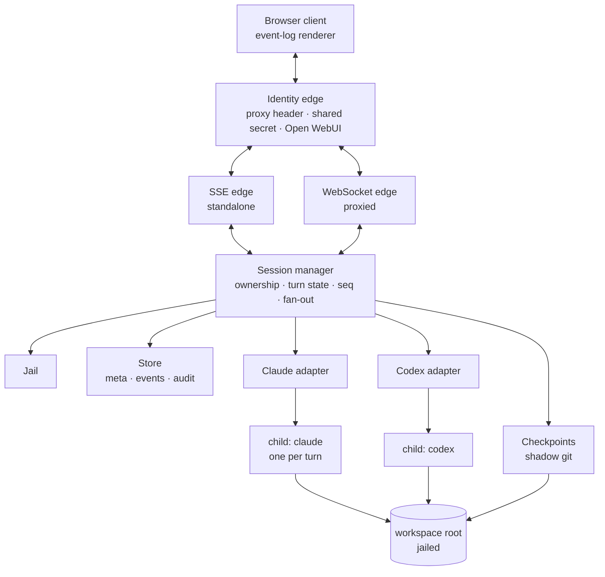
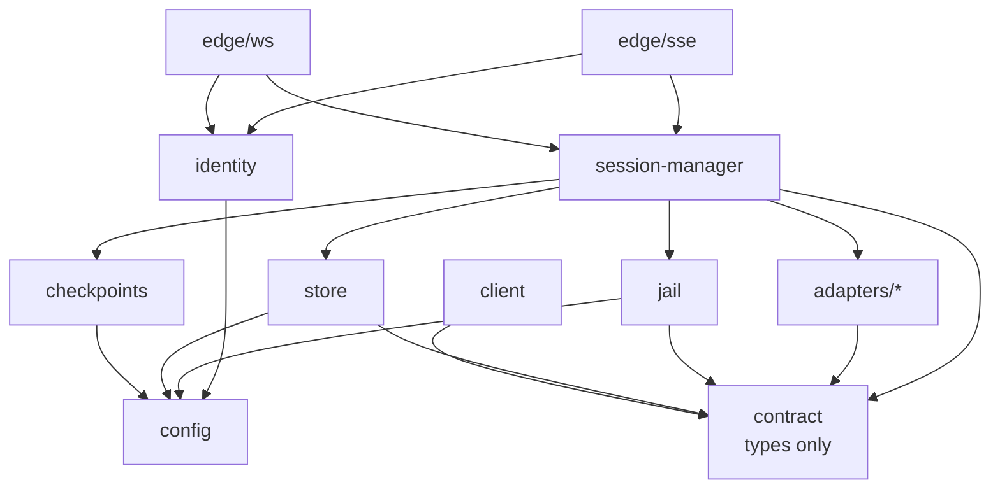

# Design — SkyNet HR

Reading order: `00-brief.md` first. This document assumes its non-goals are binding.

## Shape



Four layers, and the boundaries matter more than the boxes:

- **Transport edges** know about requests, identity and streams. They know nothing about
  vendors. There are two of them (D10) because the transport is a deployment property, not
  an architectural one.
- **Session manager** knows about ownership, lifecycle, turn state and the filesystem jail.
  It speaks only the normalised event vocabulary in `20-contract.md`.
- **Adapters** are the only code that knows a vendor exists. One per CLI.
- **Child processes** are the agents. We supervise them; we do not reimplement them.

The rule that keeps this honest: **a vendor string must never appear above the adapter
layer.** If the session manager or the client needs to branch on `claude` vs `codex`, the
normalised vocabulary is wrong and the fix belongs in `20-contract.md`, not in a
conditional.

The rule has one deliberate exception, and it must be stated or it will be discovered as a
bug: **vendor-minted opaque identifiers do cross the boundary.** See *Data model §
Identity spaces*.

## Prior art

Findings from reading `Forks-Claude-Code-Chat` at commit `ab6e307`. That repository is
licensed all-rights-reserved with a reference-only grant, so these are protocol facts and
techniques, **not** code to copy. Line references are for a reader who wants to check the
claim.

### Take

**The transport.** The Claude CLI is driven with
`--output-format stream-json --input-format stream-json --verbose`, with **stdin held
open** for the life of the turn (`src/extension.ts:926`). Messages go in as JSON lines;
events come out as NDJSON. Holding stdin open is what makes interactive permissions
possible at all — closing it after the prompt, which is the obvious first implementation,
forecloses the whole feature.

**The line splitter.** Accumulate, `split('\n')`, `pop()` the trailing fragment and carry
it into the next chunk (`src/extension.ts:1178-1185`). Obvious once seen, and the single
most common source of corrupt-JSON bugs when not done.

**The permission handshake.** `--permission-prompt-tool stdio` makes the CLI emit
`{type: 'control_request', request: {subtype: 'can_use_tool', ...}}`. The host renders a
prompt and writes back a `control_response` carrying `behavior: 'allow' | 'deny'`
(`src/extension.ts:2039`). `updatedPermissions` on an allow is how "always allow" is
expressed. This replaced an older approach that stood up a whole MCP server for the
purpose; that repo still carries the 540 KB fossil at its root.

**Session state is the CLI's, not ours.** `session_id` arrives on the `system`/`init`
event and goes back out as `--resume <id>` on the next turn (`src/extension.ts:971`). We
keep a transcript for display and replay only. This is the difference between a console
and a reimplementation of context management.

**Checkpoints via a shadow git directory.** A second `GIT_DIR` in server storage, pointed
at the workspace as its work-tree (`src/extension.ts:1742`):

```
git --git-dir=<storage>/<session>/ckpt.git --work-tree=<workspace> add -A
git --git-dir=<storage>/<session>/ckpt.git --work-tree=<workspace> commit --allow-empty -m "<label>"
git --git-dir=<storage>/<session>/ckpt.git --work-tree=<workspace> checkout <sha> -- .
```

The operator's real `.git` is never touched, the workspace needs no git at all, and the
mechanism is vendor-agnostic — which is why it survives our move to two backends intact.
The best idea in that repository.

**Coarse "always allow" patterns.** Deriving `npm run *` from a concrete command so a
standing approval is a shape rather than a string. We need this and should not invent our
own grammar before looking at what `permission_suggestions` already offers on the wire.

### Leave

- **The rendering.** A 5,359-line `<script>` inside a template literal, 5,053 lines of CSS
  in another, `innerHTML =` throughout, no virtualisation, no batching. An unbounded DOM.
- **No token-level streaming.** `--include-partial-messages` appears nowhere in that
  source; assistant text arrives as whole blocks. We should try the flag — see *Open*.
- **The CSP.** `default-src * 'unsafe-inline' 'unsafe-eval' data: blob:` — survivable in a
  webview whose only user owns the machine, disqualifying in a browser app that renders
  model output.
- **Everything about its trust model.** A webview has exactly one user, who is also the
  machine owner. Nothing in that repository generalises to more than one operator, and
  `--dangerously-skip-permissions` is exposed as a checkbox.

### Not applicable

Its provider router (`src/router/`, ~500 lines translating Anthropic `/v1/messages` to
OpenAI `/chat/completions` behind `ANTHROPIC_BASE_URL`) is a clever way to make one CLI
talk to another vendor's *API*. We are doing the opposite — driving each vendor's own CLI —
so it solves a problem we do not have. Worth remembering if that ever changes.

## The hard problem: two permission models that do not unify

This is where the cross-vendor decision costs something, and it should be understood before
implementation starts rather than discovered in it.

| | Claude CLI | Codex CLI |
|---|---|---|
| When policy is set | Per tool call, at runtime | At launch |
| Mechanism | `control_request` / `control_response` over stdio | `approval_policy`, `sandbox_mode` in config |
| Granularity | This command, this path, now | Whole session |
| Operator sees | A prompt they answer | A sandbox they chose in advance |
| Source | Verified — read from the fork | `codex/PROFILES.md` in SubZeroDev.AgentKit |

These are not two spellings of one idea. Claude's model is a conversation; Codex's is a
policy. A lowest-common-denominator design — launch-time policy only — throws away the
single most valuable thing the console offers, which is approving a tool call from
somewhere that is not the server's terminal.

**Decision: model the interactive case as the contract, and let Codex under-deliver
against it, visibly.** See `90-decisions.md` D5. A Codex session launches with an explicit
`sandbox_mode`, surfaces that mode in the UI as a standing banner, and emits no
`permission.request` events. The client must therefore treat "no permission events" as a
normal state for a session, not as a stuck turn.

**Stated as plainly as it deserves: Codex's live stdio protocol is unverified.** What is
verified is its *on-disk rollout schema* — `~/.codex/sessions/YYYY/MM/DD/rollout-*.jsonl`,
records wrapped in `payload`, opening with `session_meta`, usage as `token_count` events
under `payload.info` (`SubZeroDev.AgentKit/tools/Measure-Session.ps1:158,454`). Whether the
live stream matches that schema is an assumption, and the first slice of the Codex adapter
is an experiment to find out, not an implementation. Budget for it accordingly.

## Data model

Six entities. Only three of them are persisted, and knowing which is which is the whole
point of this section.

### Session

The unit of ownership. Everything else hangs off one.

| Field | Type | Mutability | Source |
|---|---|---|---|
| `id` | `SessionId` (UUIDv4) | immutable | server, at create |
| `owner` | `OperatorId` | immutable | identity edge, at create |
| `vendor` | `'claude' \| 'codex'` | immutable | client request, validated |
| `cwd` | absolute path | immutable | **jail output**, never the client string (D4) |
| `model` | `string \| null` | immutable | client request |
| `policy` | `PermissionPolicy` | immutable | adapter capability, at create |
| `cliSessionId` | `string \| null` | write-once-then-stable | **vendor**, from first `system/init` |
| `lastSeq` | `number` | monotonic | server, on every emit |
| `state` | `'live' \| 'ended'` | one-way | server |
| `turn` | `Turn \| null` | mutable | server; `null` means idle. Always `null` when ended |
| `createdAt` / `endedAt` | ISO 8601 UTC | set once each | server |

`state` distinguishes the two ways a session has no turn running. A **live, idle** session
accepts a new message; an **ended** session does not, and answers `409 session_ended`. A
session rehydrated after a restart is always ended (D20), so `state` is what a client reads
to know whether the compose box should be enabled.

`lastSeq` is persisted, not merely held. A rehydrated session has an empty ring buffer and
must still be able to bound its own replay, which it cannot do from memory it no longer has.

`cwd` deserves its own sentence: it is the **resolved real path** and it is resolved
exactly once, at session creation. Every later spawn reuses the stored resolution rather
than re-resolving the client's string. This is a deliberate TOCTOU trade — a root that is
re-pointed by symlink mid-session is not re-checked — accepted because the alternative
(re-resolving per turn) lets a session silently migrate to a different directory between
turns, which is worse.

`policy` is immutable for the life of the session because it is a property of how the child
was launched. Changing a Codex sandbox means a new session, not a mutation.

### Turn

At most one live per session. **The turn owns the child process** — see *Concurrency*.

| Field | Type | Notes |
|---|---|---|
| `turnId` | `TurnId` (UUIDv4) | server-minted |
| `startedAt` | ISO 8601 UTC | |
| `child` | process handle | in-memory only; dies with the turn |
| `pending` | `Map<RequestId, {callId}>` | in-memory only; outstanding permission requests |

**Turn is derived, not stored.** No `turns.json` exists. The turn history of a session is
reconstructible from its event log by pairing `turn.started` with `turn.ended`, and that
reconstruction is the only durable record. The live `Turn` object is scheduling state.

### Event envelope

`(sessionId, seq)` is the primary key of the entire system. Everything replayable is keyed
on it, which is why D2 put `seq` assignment in the session manager and why it is expensive
to change.

Shape is owned by `20-contract.md § Event envelope`; it is not restated here.

Two storage tiers, and they are not the same data:

- **Ring buffer**, in memory, bounded (currently 2000 envelopes). Serves live replay after
  a reconnect. Losing the tail of it is a *reportable* condition, not a silent one — the
  server answers a too-old `Last-Event-ID` with `error / kind: 'replay_gap'`.
- **Spill file**, `events.ndjson`, append-only, unbounded. The durable transcript, and
  **a read path as well as a write one** (D20): a session rehydrated after a restart has an
  empty ring buffer, so the spill is the only place its transcript exists.

The ring buffer is a strict suffix of the spill. If that ever stops being true, replay is
lying.

That invariant is what makes the two tiers interchangeable for reads, and it is worth
noticing that a spill reader could therefore serve a too-old `Last-Event-ID` from disk
instead of answering `replay_gap`. That is not decided here — S3.3 tests for `replay_gap`
existing, so removing it is a slice change, not a free simplification. Recorded in
`90-decisions.md § Open`.

### Identity spaces

Five identifier namespaces coexist, three ours and two the vendor's. Conflating them is the
most likely source of a subtle cross-vendor bug, so they are enumerated:

| Id | Minted by | Unique within | Opaque to |
|---|---|---|---|
| `sessionId` | server | server | client |
| `turnId` | server | session | client |
| `seq` | server | session | nobody — it is ordered and compared |
| `cliSessionId` | **vendor** | vendor's own store | everything above the adapter |
| `callId` | **vendor** | session (assumed) | everything above the adapter |
| `requestId` | **vendor** | turn (assumed) | everything above the adapter |

The last three are the exception to "no vendor above the adapter". They cross the boundary
because the contract needs to correlate a `tool.result` to its `tool.call`, and inventing a
server-side alias for a vendor id buys nothing but a mapping table to get wrong. **They are
opaque**: no code above the adapter may parse, compare-for-ordering, or infer structure
from them. Equality is the only permitted operation.

The two "(assumed)" rows are assumptions about Claude that hold in the observed stream and
are **unverified for Codex**. If Codex mints `callId`s unique only within a turn, tool
correlation across a session breaks. That belongs in S8's experiment report.

### Checkpoint

| Field | Type | Source |
|---|---|---|
| `sha` | git object id | git |
| `label` | string | server |
| `ts` | ISO 8601 UTC | git commit time |

**Entirely derived.** The checkpoint list is `git log` against the shadow `GIT_DIR`; no
mirror is kept. Git is the store, and a second copy would be a second thing to fall out of
sync.

### Audit record

```
{ts, operator, sessionId, tool, input, decision, scope, reason}
```

Append-only, server-wide (`audit.ndjson`), never per-session. Server-wide because the
question it answers is "who approved what", which crosses sessions, and because a
per-session file is deletable along with the session it indicts.

**Never truncated, never derived, never lossy.** `input` is the exact input that was
approved — the same bytes shown to the operator. This is the only place in the system where
the byte cap that governs `tool.result` does not apply, and that is deliberate: an audit
record of a truncated command records something that did not run.

### Operator

`{ id: OperatorId }`. **Not persisted.** There is no user record, no profile, no
preferences — D3 chose delegated identity precisely so that no credential or account state
lives here. An operator exists as a string on a `Session` and on an `AuditRecord`, and
nowhere else.

### Persistence summary

```
<storage>/sessions/<sessionId>/
  meta.json        Session, minus turn/buffer/subscribers
  events.ndjson    envelopes, append-only
  ckpt.git/        shadow git dir, work-tree = the session's workspace
<storage>/audit.ndjson
```

`meta.json` is what boot reads back, so it carries `lastSeq` and `state` as well as the
immutable fields — a rehydrated session that cannot state its own last sequence cannot
serve a replay.

| Entity | Memory | Disk |
|---|---|---|
| Session | registry `Map` | `meta.json` — **read at boot** (D20) |
| Turn | live object | derived from events |
| Envelope | ring buffer (bounded) | `events.ndjson` (unbounded), read for ended sessions |
| Checkpoint | — | `ckpt.git` |
| Audit record | — | `audit.ndjson` |
| Operator | request-scoped | — |

No database in the first cut (D7). If session listing ever needs querying beyond "mine,
recent", that is the moment to add SQLite — not before.

## Module boundaries

Ten modules. The dependency graph is acyclic, and the two edges most likely to be drawn
backwards are called out below the diagram.



| Module | Owns | Depends on | Exposes |
|---|---|---|---|
| `contract` | The normalised vocabulary | *nothing* | Types only, no runtime |
| `config` | Roots, auth mode, bind address, caps | *nothing* | A validated config object |
| `identity` | Request → `OperatorId`, or rejection | `config` | One function per deployment mode |
| `jail` | Path resolution and containment | `config`, `contract` | `resolveInsideRoot` |
| `store` | meta, spill, audit, ring buffer | `config`, `contract` | Read/append primitives |
| `checkpoints` | Shadow git lifecycle | `config`, `contract` | create / list / restore |
| `adapters/*` | **The only vendor knowledge** | `contract` | `spawn`, `send`, `respond`, `interrupt` |
| `session-manager` | Ownership, turn state, `seq`, fan-out | `jail`, `store`, `checkpoints`, `adapters`, `contract` | Session CRUD, subscribe |
| `edge/sse`, `edge/ws` | Transport, framing, reconnect | `session-manager`, `identity`, `contract` | HTTP routes |
| `client` | Rendering | `contract` | — |

**Adapters are leaves.** They depend on `contract` and nothing else. They do not read
config, do not touch the store, do not write audit records, and do not know whether a turn
is in flight. They are handed a resolved `cwd` and an `emit` callback and that is their
entire world. This is what keeps a second vendor from becoming a second architecture.

Two edges that must not be drawn, because each looks natural and each creates a cycle:

- **Adapter → session-manager**, to ask "is a turn already running?" The adapter must not
  own that question. See *Concurrency*, which moves it.
- **Adapter → store**, to write the audit record at the moment of the permission response.
  Tempting, because that is where the decision is known. The manager writes it instead,
  from the `permission.resolved` event, so that audit is a property of the event stream and
  not of one vendor's code path.

`checkpoints` depending only on `config` and `contract` — never on adapters — is what let
D6 survive the move to two backends unchanged. Keep it that way.

## Control flow

Three paths carry the whole system.

### 1. Session creation — operator picks a workspace and a vendor

```
POST /api/sessions {vendor, cwd, model?, sandbox?}
  edge          → identity: resolve OperatorId, else 401
  edge          → session-manager.create(owner, vendor, cwd, model)
  manager       → jail.resolveInsideRoot(cwd, roots)     → 409 outside_workspace_root
  manager       : resolved path held by a session with state == 'live'?
                                                         → 409 workspace_busy   (D19)
  manager       → store: mkdir, write meta.json, open spill
  manager       → checkpoints: init ckpt.git             → notice on failure, not fatal
  manager       → adapters[vendor].create({cwd: resolved, model, emit})
  manager       ← {sessionId}
```

Nothing is spawned. A session with no turn has no child process. The vendor's `policy` is
determined here, from adapter capability, and is what the client renders as either "you
will be asked" or a standing sandbox banner.

The jail check is the second step and never later. Every subsequent use of `cwd` reads the
stored resolution — including the D19 busy check, which compares resolved paths so that two
spellings of one directory cannot slip past as two workspaces.

### 2. A turn, interrupted by a permission request — the path that justifies the project

```
POST /api/sessions/:id/message {text}
  edge     → identity, then manager.get(id, owner)  → 404 if not owner
  manager  : turn == null?  else → 409 turn_in_flight
  manager  → checkpoints.commit("before turn N")   → checkpoint.created
  manager  : turn = {turnId, ...}                  → turn.started
  manager  → adapter.send(text)
  adapter  → spawn(claude, --stream-json --permission-prompt-tool stdio [--resume id])
  adapter  → stdin: {"type":"user", ...}           stdin STAYS OPEN

  child    → stdout: system/init                   → session.started  (first turn only)
  child    → stdout: assistant/text                → message
  child    → stdout: control_request/can_use_tool  → permission.request
                                                     ... turn blocks, child waits ...

POST /api/sessions/:id/permission {requestId, decision, scope}
  manager  : first answer wins; second → {accepted:false}
  manager  → adapter.respond(...)  → stdin: control_response
  manager  → store.audit(...)                      → permission.resolved

  child    → stdout: user/tool_result              → tool.result
  child    → stdout: result                        → turn.ended; adapter closes stdin
  child    : exits
  manager  : turn = null
```

The two things that are easy to get wrong and expensive to discover late: **stdin stays
open across the permission round trip** (closing it after the prompt forecloses the feature
entirely), and **the checkpoint is committed before the turn**, not after, because the
state worth returning to is the one before the agent touched anything.

The child exits at the end of a normal turn. That is the design, not a failure — see
*Concurrency § Process lifetime*.

### 3. Reconnect and replay — brief DoD #5, "refresh mid-turn and lose nothing"

```
GET /api/sessions/:id/events        Last-Event-ID: 41
  edge     → identity, manager.get(id, owner)
  manager  → replay(session, after=41)
             buffer holds 41?  → yes: emit 42.. then subscribe live
                               → no:  emit one error{kind:'replay_gap'}, client refetches
  edge     : subscribe; keepalive comment every 15 s
```

The turn is untouched by any of this. A disconnected client does not pause, cancel or
otherwise reach the child — events accumulate in the buffer and the spill exactly as they
would have. That property is what makes "close the laptop, answer the prompt from a phone"
work, and it falls out of the child being owned by the turn rather than by the connection.

## Threat model

State the uncomfortable thing first: **giving someone console access is equivalent to
giving them the ability to run commands as the server's user.** The agent is a shell. Every
control below limits accident and scope; none of them defends against a determined
operator, because that would need a container per session and is explicitly out of scope
(`00-brief.md § Non-goals`).

| Adversary | In scope | Control |
|---|---|---|
| The internet | Yes | Server refuses to bind non-loopback without auth configured |
| A curious operator wandering outside their workspace | Yes | Path jail, resolved after symlinks |
| An operator reading another's session | Yes | Ownership check on every session route |
| A confused agent, or prompt injection reaching one | Partly | Permission prompts, sandbox mode, checkpoints to undo |
| A determined operator | **No** | Out of scope — needs per-session containers |
| A compromised server | No | Out of scope |

The fourth row deserves attention. Content the agent reads — a README, an issue body, a web
page — can contain text aimed at the agent. The permission prompt is the control, which
means **the prompt must show what is actually being run**, not a summary of it, and the
audit log must record the exact input that was approved.

## Security controls

**Auth by delegation.** Primary mode trusts an identity header set by a reverse proxy
(Authelia, Authentik, oauth2-proxy, Cloudflare Access). A third mode consumes Open WebUI's
proxy contract — `X-User-Id`, `X-Session-Id`, bearer upstream auth (D11). Fallback mode is
a shared secret in a cookie, for a bare LAN box. We do not store credentials, hash
passwords, or implement reset flows — for a handful of trusted operators that is code with
a real vulnerability surface and no corresponding benefit. See `90-decisions.md` D3.

The header-trust modes have one sharp edge that must be got right: **a trusted header is
only trustworthy if the client cannot set it.** The server therefore binds loopback-only in
those modes by default, and refuses to start listening on a routable interface unless an
explicit `trustProxy` allow-list of upstream addresses is configured.

**Fail closed on startup.** The server refuses to start if it would bind a non-loopback
interface with no auth mode configured. Not a warning. A misconfigured console is a remote
shell, and the failure mode of a warning is that nobody reads it.

**Workspace jail.** Configuration declares one or more `workspaceRoot` paths. A requested
working directory is accepted only if its **fully resolved real path** — symlinks followed,
`..` collapsed, case-normalised on Windows — is inside a root. The check runs at session
creation and the resolved path, never the client's string, is what gets passed as `cwd`.

**Audit trail.** Every permission decision appends `{ts, operator, sessionId, tool, input,
decision, scope}` to an append-only log. This is the artifact that makes multi-operator use
defensible, and it is cheap. It is also the thing nobody adds later.

## Failure modes

Grouped by boundary, because that is where the handling lives.

### Child process boundary

| Failure | Detection | System does | Operator sees | State left behind |
|---|---|---|---|---|
| CLI not installed | `spawn` `ENOENT` | `error / agent_unavailable`, `fatal`; turn cleared | "Agent unavailable" | Session live, no turn. Retryable |
| Child dies mid-turn | `close` with non-zero or signal | Resolve every pending permission with `cancelled_process_exit`; `turn.ended` | Turn ended abnormally, stderr shown | Session live. Checkpoint from before the turn is intact |
| Child exits normally | `result` then `close(0)` | `turn.ended`, clear turn | Turn complete | Session idle |
| Child hangs with no output | *not detected* | — | Spinner forever | **Open question.** No turn timeout is specified |
| Unrecognised record kind | `default` in the mapper | `error / adapter_unknown_record`, non-fatal, record preserved in `raw` | A diagnostic line | Stream continues |
| Malformed JSON line | Splitter parse failure | `error / adapter_bad_line`, non-fatal | A diagnostic line | Stream continues |
| Codex stream shape mismatch | Adapter schema check | `error / adapter_schema_mismatch`, **fatal** | Session refuses to start | Nothing renders and it says so |

The last one is worth its own sentence: **a Codex adapter that silently renders nothing is
worse than one that refuses to start**, because the operator will believe the agent is
thinking. Fail loudly, never degrade quietly.

### Client boundary

| Failure | Detection | System does | Operator sees | State left behind |
|---|---|---|---|---|
| Client disconnects mid-turn | Stream close | Nothing. Turn continues; events buffer | On return, full replay | Buffer and spill intact |
| Reconnect within buffer | `Last-Event-ID` present | Replay from `seq + 1` | Seamless | — |
| Reconnect past buffer | `Last-Event-ID` older than the ring | One `error / replay_gap` | Brief reload | Client refetches |
| Two clients answer one permission | Second lookup misses `pending` | `{accepted: false}` — **not an error** | "Already answered" | One response reached the CLI |
| Slow client stalls the stream | Per-subscriber queue high-water | Drop that subscriber, report a gap to it only | That client reloads | Other clients unaffected |
| Huge tool result | Byte cap on `tool.result` | Truncate, set `truncated`, real `bytes`; remainder by `callId` | "Output truncated" with a fetch link | Full output on disk |

### Filesystem and storage boundary

| Failure | Detection | System does | Operator sees | State left behind |
|---|---|---|---|---|
| `cwd` outside every root | Jail check | `409 outside_workspace_root` | Refusal naming the roots | No session created |
| Workspace already has a live session | Registry lookup on the resolved path | `409 workspace_busy` (D19) | Refusal naming the holding operator | No session created; the existing one is untouched |
| Workspace is not a git repo | — | Nothing; shadow git needs no repo in the workspace | Checkpoints work normally | — |
| `ckpt.git` init fails | git exit code | `session.notice / warn`; session proceeds **without** checkpoints | Banner: no checkpoints | Session usable, DoD #6 unavailable |
| Restore while a turn is in flight | Manager turn state | `409 turn_in_flight` | "Finish or interrupt first" | Workspace untouched |
| Restore fails part-way | git exit code | `error`, non-fatal | Failure named | **Workspace is partially restored.** Git's `checkout -- .` is not atomic; this is a known and accepted exposure |
| Disk full on spill | Write error | `error`, non-fatal; live streaming continues | Warning | Transcript incomplete from that point |
| Storage root unwritable at boot | Startup check | **Refuse to start** | Startup error | — |

### Server lifecycle

| Failure | Detection | System does | Operator sees | State left behind |
|---|---|---|---|---|
| Restart with sessions live | Boot rehydration | Load `meta.json`, mark ended (D20) | Transcript and checkpoints browsable; compose box disabled | Sessions readable, not resumable |
| Message to a rehydrated session | `state == 'ended'` | `409 session_ended` | "This session ended when the server restarted" | Nothing started |
| Restart with a child running | PID file on boot | Reap recorded PIDs before accepting connections | — | Orphan killed |
| `meta.json` unreadable or corrupt | Parse failure at boot | Skip that session, log it; **boot continues** | One session missing | Its files untouched for inspection |
| Bind non-loopback, no auth | Startup check | **Refuse to start**, say why | Startup error naming the fix | — |

## Concurrency and ordering

### What is actually concurrent

Very little, and that is deliberate. The Node event loop is single-threaded, and every
event in the system passes through one `emit` function per session. **That function is the
serialisation point**, and it is what makes `seq` gap-free and totally ordered without a
lock. There is no mutex anywhere in this design, and if one appears, something has been
built wrong.

Genuinely simultaneous:

- **Multiple sessions**, each with its own child, buffer and sequence. Independent by
  construction; they share only the storage root and the audit file.
- **Multiple subscribers to one session.** Fan-out is one-to-many over the same envelopes.
- **Child stdout arriving while an HTTP request is being handled.** Interleaved by the
  event loop at chunk granularity, never mid-envelope, because an envelope is constructed
  and dispatched synchronously inside `emit`.

### Process lifetime — the child belongs to the turn

**One child process per turn, not per session.** The CLI owns conversation state and it is
carried forward with `--resume <cliSessionId>`; the process itself is disposable. This is
the model the prior art verified, and it is what the spike implements.

Three consequences, and the third is the reason to prefer it:

1. `system/init` arrives on **every** turn, so `session.started` must be emitted only on
   the first — otherwise the client sees the session restart continuously.
2. An idle session holds no process, no file handles and no memory beyond its buffer.
3. **Checkpoint restore is safe by construction.** Restore is refused while a turn is in
   flight; no turn means no child; no child means nothing holds a handle on the workspace.
   On Windows, where an open handle blocks the write, this turns a whole class of
   platform-specific restore failure into an impossibility rather than a retry loop.

This is logged as D16, and it is the reason the contract needs an amendment — see
*Alternatives considered*.

### The single-writer invariant

**At most one turn in flight per session.** This is the invariant everything else leans on,
and it is enforced by the **session manager**, not by the adapter.

That ownership matters and is a correction to the spike, where `turn_in_flight` is raised
from inside the adapter. Two operations need the answer:

- `POST /message` — must refuse a second turn.
- `POST /checkpoint/restore` — must refuse while a turn runs (S6.5).

Restore does not go through the adapter and must not have to. Putting turn state in the
manager keeps the adapter a leaf and gives both operations one authority to ask. Logged as
D17.

### Ordering guarantees the renderer may rely on

Guaranteed by the design, not by convention:

- `seq` is strictly increasing by one, per session, from 1. A gap is a bug, never a dropped
  event. Only the ring buffer may lose events, and only by reporting `replay_gap`.
- `turn.started` precedes every event of that turn, and `turn.ended` follows all of them.
- `tool.result` follows its `tool.call`. Absent one by `turn.ended`, the call was abandoned.
- `permission.request` is answered by exactly one `permission.resolved`, including when the
  child dies — that case carries `cancelled_process_exit`.
- The checkpoint for turn N is committed **before** `turn.started` for turn N.

Not guaranteed, and the client must not assume it:

- That `usage` arrives once per turn. Claude emits it per assistant record.
- That `message.delta` and `message` do not both appear for one turn. The client renders
  one or the other and must pick by `turnId`.

### Races, and what resolves each

| Race | Resolution | Enforced by |
|---|---|---|
| Two clients answer one permission | First wins; second gets `{accepted:false}` | `pending` map delete, in the manager |
| Two clients send a message at once | First wins; second gets `409` | Manager turn state |
| Restore during a turn | Refused `409` | Manager turn state |
| Child emits while a client reconnects | Buffer is appended before fan-out; replay reads the buffer | Synchronous `emit` |
| A slow subscriber | Per-subscriber queue; drop that one, gap it, keep the rest | Fan-out; logged as D18 |
| Two sessions on one workspace | The second is refused at create | Manager, on the resolved path of **live** sessions (D19 + D20) |
| A client arrives during boot rehydration | Cannot — listening starts after rehydration | Boot ordering |

The last row is the one race resolved by exclusion rather than by ordering. Two sessions
rooted at the same directory would have independent shadow git directories and no lock
between them, so a restore in one silently reverts the other's work. Rather than build a
locking story to make that safe, **a workspace admits one live session at a time** and the
second `POST /api/sessions` is refused. The comparison is on the resolved real path, so two
spellings of one directory are correctly caught as the same workspace.

That refusal is the whole mechanism. Nothing downstream — checkpoints, restore, the
adapters — needs to consider a shared workspace, because there cannot be one.

**The check tests `state == 'live'`, and that qualifier is load-bearing.** Rehydrated
sessions are ended (D20) but still hold their `cwd`. A busy check that ignored `state`
would let one restart make a workspace permanently unusable, with the only remedy being to
delete storage — two individually correct decisions combining into a defect. This is the
one place D19 and D20 touch, and it is why they are stated together.

### Boot ordering

Three steps, and the order is the point:

```
1. reap    recorded child PIDs from the previous run
2. rehydrate  meta.json → registry, every session marked ended
3. listen  only now are connections accepted
```

Reaping precedes rehydration so that no rehydrated session can be adopted by an orphan
still holding its workspace. Listening comes last so that no client can observe a registry
that is half-loaded — a `GET /api/sessions` answered mid-rehydration would report a partial
list as though it were complete, which is a wrong answer rather than a slow one.

A `meta.json` that fails to parse is skipped and logged; boot continues. One unreadable
session must not deny the operator every other session, and its files are left untouched so
the failure can be inspected rather than cleaned up automatically.

## Alternatives considered

Full entries, with rejected options and reversibility, live in **`design/90-decisions.md`**
— that file is the canonical record and this section is an index into it. The lines below
exist so a reader can see that a choice was made without leaving the page; where they and
`90-decisions.md` disagree, that file wins and this one is the defect.

New in this pass:

- **D16 — the child process is turn-scoped.** Chosen: spawn per turn, carry state with
  `--resume`. Rejected: a long-lived child per session — it holds workspace handles across
  idle time, which on Windows blocks checkpoint restore and converts a structural guarantee
  into a retry loop; it also needs idle supervision and reaping that a per-turn child does
  not.
- **D17 — turn-in-flight state is owned by the session manager.** Chosen: the manager holds
  it. Rejected: the adapter holding it, as the spike does — checkpoint restore also needs
  the answer and does not go through an adapter, so the adapter would have to be consulted
  about something outside its concern, making it non-leaf and creating the cycle *Module
  boundaries* forbids.
- **D18 — fan-out uses a per-subscriber queue with explicit gap reporting.** Chosen: each
  subscriber gets its own bounded queue; overflow drops that subscriber and tells it.
  Rejected: a shared synchronous write to every subscriber — one slow client applies
  backpressure to every other client and to the child's stdout drain. Rejected unbounded
  per-subscriber buffering — turns a slow client into a server memory leak.
- **D19 — a workspace admits one live session at a time.** Chosen: refuse the second with
  `409 workspace_busy`, compared on the resolved real path. Rejected: allowing it with a
  warning banner — the hazard is silent data loss and a banner is not a lock, so it tells an
  operator about a race they cannot avoid. Rejected allowing it with checkpoints disabled on
  the second session — removes the hazard but costs that operator DoD #6 for reasons outside
  their own session. Rejected deferring to S6 — creation ships in S2, and this is the same
  argument D4 makes about the jail belonging in the create path from the first commit.
- **D20 — sessions rehydrate read-only after a restart.** Chosen: load `meta.json` at boot,
  mark every session ended; transcript and checkpoints browsable, no new turns. Rejected:
  full resumption via `--resume` — it assumes the vendor CLI still holds that
  `cliSessionId`, which is unverified, and it fails *silently* by starting a fresh
  conversation the operator believes is continuous. Rejected deleting storage on boot —
  discards hours-old transcripts and weakens the audit trail S7 exists for. Rejected keeping
  today's behaviour — the storage root grows without bound with sessions nothing can reach.

Standing decisions this design rests on, all in `90-decisions.md`: D1/D10 transport,
D2 sequencing, D3 delegated auth, D4 the jail, D5 the permission asymmetry, D6 shadow git,
D7 no database, D8 reference-only prior art, D9/D11/D12 the Open WebUI evaluations.

## What we add that the prior art has none of

Ordered by how much they hurt to retrofit:

1. **Auth and per-operator session ownership** — retrofitting ownership through a codebase
   that assumed one user is the expensive one.
2. **The workspace jail** — must be in the session-creation path from the first commit.
3. **Replay on reconnect** — needs a monotonic `seq` on every event from day one. Adding a
   sequence number later means every stored transcript predates it.
4. **The vendor normalisation layer** — the contract, not an afterthought.
5. **Event size caps and backpressure.**
6. **Process supervision and reaping.**
7. **The audit log.**
8. **Token-level streaming**, if `--include-partial-messages` proves out.

Items 1, 2 and 3 are the ones that dictate structure. The rest can be added to a sound
structure without disturbing it.

## Open questions

Questions this design cannot answer without information it was not given. Carried to
`90-decisions.md § Open` as they are resolved or promoted to issues.

**Needing a decision from the owner:**

1. **Is there a turn timeout?** A child that produces no output is currently indistinguishable
   from one that is thinking, forever. Any timeout risks killing a legitimately long tool
   call, and no value is derivable from the brief.
2. Once D20's spill reader exists, a too-old `Last-Event-ID` could be served from disk
   rather than answered with `replay_gap`. That removes a failure mode, but S3.3 tests for
   `replay_gap` existing — so it is a slice change, not a free simplification.

**Needing an experiment:**

3. Does `--include-partial-messages` give usable token-level deltas, and does it change the
   event contract? Cheap to test, and the answer changes the renderer.
4. Does the Codex CLI expose a live NDJSON stream at all, and does it match the rollout
   schema? First Codex slice answers this (S8.1).
5. Does Codex offer any runtime approval hook, or is `approval_policy` genuinely the whole
   story? If there is a hook, D5 gets revisited.
6. Are Codex's `callId`s unique within a session, or only within a turn? If the latter,
   tool correlation breaks and *Data model § Identity spaces* needs a server-side alias
   after all.
7. Whether `permission_suggestions` from the Claude CLI is a sufficient grammar for
   "always allow", or whether a local rule language is needed. Look before inventing.

**Known drift, not a question:**

8. `20-contract.md` needs amendments this design implies, all `/contract`'s to make and
   deliberately not made here:
   - **`session.exit` conflates turn-process exit with session teardown.** Under D16 a
     normal turn ends the child, so a contract-obedient client tears down the session view
     after every successful turn.
   - **`workspace_busy` and `session_ended` are new error codes** with no entry in the error
     table. D19 and D20 respectively require them.
   - **`SessionSummary` and `session.started` carry no `state`.** D20 makes `live` vs
     `ended` the field a client reads to decide whether the compose box is enabled, and it
     is currently unexpressible.
9. `Start-AgentSession.ps1` (D14) is unreconciled against this architecture — it assumes a
   local interactive terminal, not the server/edge/adapter shape. Reconcile when a slice
   first needs a CLI launcher, not before.
