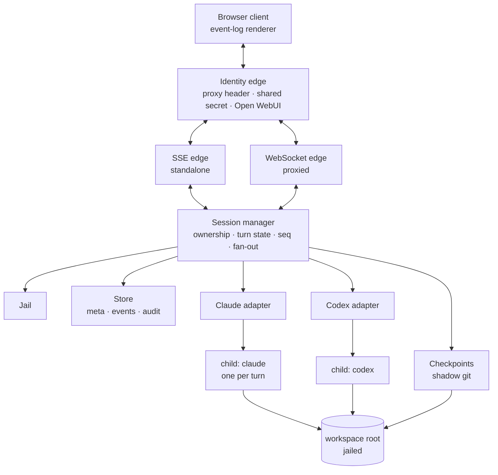
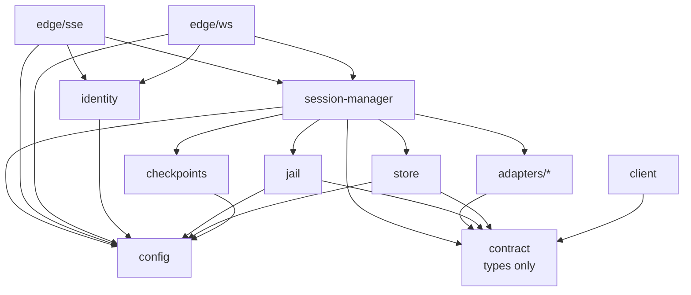

# Design — SkyNet HR

Reading order: `00-brief.md` first. This document assumes its non-goals are binding.

## Shape



Four layers, and the boundaries matter more than the boxes:

- **Transport edges** know about requests, identity and streams. They know nothing about
  vendors. There are two of them (D10) because the transport is a deployment property, not
  an architectural one.
- **Session manager** knows about ownership, lifecycle, turn state and the filesystem jail.
  It speaks only the normalised event vocabulary in `20-contract.md`.
- **Adapters** are the only code that knows a vendor exists. One per CLI.
- **Child processes** are the agents. We supervise them; we do not reimplement them.

The rule that keeps this honest: **a vendor string must never appear above the adapter
layer.** If the session manager or the client needs to branch on `claude` vs `codex`, the
normalised vocabulary is wrong and the fix belongs in `20-contract.md`, not in a
conditional.

The rule has one deliberate exception, and it must be stated or it will be discovered as a
bug: **vendor-minted opaque identifiers do cross the boundary.** See *Data model §
Identity spaces*.

## Prior art

Findings from reading `Forks-Claude-Code-Chat` at commit `ab6e307`. That repository is
licensed all-rights-reserved with a reference-only grant, so these are protocol facts and
techniques, **not** code to copy. Line references are for a reader who wants to check the
claim.

### Take

**The transport.** The Claude CLI is driven with
`--output-format stream-json --input-format stream-json --verbose`, with **stdin held
open** for the life of the turn (`src/extension.ts:926`). Messages go in as JSON lines;
events come out as NDJSON. Holding stdin open is what makes interactive permissions
possible at all — closing it after the prompt, which is the obvious first implementation,
forecloses the whole feature.

**The line splitter.** Accumulate, `split('\n')`, `pop()` the trailing fragment and carry
it into the next chunk (`src/extension.ts:1178-1185`). Obvious once seen, and the single
most common source of corrupt-JSON bugs when not done.

**The permission handshake.** `--permission-prompt-tool stdio` makes the CLI emit
`{type: 'control_request', request: {subtype: 'can_use_tool', ...}}`. The host renders a
prompt and writes back a `control_response` carrying `behavior: 'allow' | 'deny'`
(`src/extension.ts:2039`). `updatedPermissions` on an allow is how "always allow" is
expressed. This replaced an older approach that stood up a whole MCP server for the
purpose; that repo still carries the 540 KB fossil at its root.

**We take the handshake and leave `updatedPermissions`** (D35). Handing a standing grant to
the CLI persists it in the CLI's own settings, outside this server's storage, and every
later tool call it matches then runs with no `can_use_tool` on the wire — no
`permission.request`, no `permission.resolved`, no audit append, in this session or in a
later session on the same workspace owned by a different operator. DoD #7 promises a record
of *every* tool approval, so the standing rule is held here instead. See *Control flow § 2*.

**Session state is the CLI's, not ours.** `session_id` arrives on the `system`/`init`
event and goes back out as `--resume <id>` on the next turn (`src/extension.ts:971`). We
keep a transcript for display and replay only. This is the difference between a console
and a reimplementation of context management.

**Checkpoints via a shadow git directory.** A second `GIT_DIR` in server storage, pointed
at the workspace as its work-tree (`src/extension.ts:1742`):

```
git --git-dir=<storage>/<session>/ckpt.git --work-tree=<workspace> add -A
git --git-dir=<storage>/<session>/ckpt.git --work-tree=<workspace> commit --allow-empty -m "<label>"
git --git-dir=<storage>/<session>/ckpt.git --work-tree=<workspace> checkout <sha> -- .
```

The operator's real `.git` is never touched, the workspace needs no git at all, and the
mechanism is vendor-agnostic — which is why it survives our move to two backends intact.
The best idea in that repository.

**Its restore is those three lines, and three lines is not a restore** (D31). `checkout
<sha> -- .` writes the target tree over the work-tree and deletes nothing absent from it,
so every file the agent created since the target survives — including the wrong migration
or the injected script the rollback was invoked to remove. Our restore semantics are in
*Data model § Checkpoint*.

**Coarse "always allow" patterns.** Deriving `npm run *` from a concrete command so a
standing approval is a shape rather than a string. We need this and should not invent our
own grammar before looking at what `permission_suggestions` already offers on the wire.

### Leave

- **The rendering.** A 5,359-line `<script>` inside a template literal, 5,053 lines of CSS
  in another, `innerHTML =` throughout, no virtualisation, no batching. An unbounded DOM.
- **No token-level streaming.** `--include-partial-messages` appears nowhere in that
  source; assistant text arrives as whole blocks. We should try the flag — see *Open*.
- **The CSP.** `default-src * 'unsafe-inline' 'unsafe-eval' data: blob:` — survivable in a
  webview whose only user owns the machine, disqualifying in a browser app that renders
  model output.
- **Everything about its trust model.** A webview has exactly one user, who is also the
  machine owner. Nothing in that repository generalises to more than one operator, and
  `--dangerously-skip-permissions` is exposed as a checkbox.

### Not applicable

Its provider router (`src/router/`, ~500 lines translating Anthropic `/v1/messages` to
OpenAI `/chat/completions` behind `ANTHROPIC_BASE_URL`) is a clever way to make one CLI
talk to another vendor's *API*. We are doing the opposite — driving each vendor's own CLI —
so it solves a problem we do not have. Worth remembering if that ever changes.

## The hard problem: two permission models that do not unify

This is where the cross-vendor decision costs something, and it should be understood before
implementation starts rather than discovered in it.

| | Claude CLI | Codex CLI |
|---|---|---|
| When policy is set | Per tool call, at runtime | `sandbox_mode` at launch; `approval_policy` decides whether it *also* asks at runtime |
| Mechanism | `control_request` / `control_response` over stdio | `approval_policy`, `sandbox_mode` in config. The channel a runtime prompt arrives on is **unverified** |
| Granularity | This command, this path, now | The sandbox is whole-session. An `on-request` prompt would be per call, if it is reachable at all |
| Operator sees | A prompt they answer | A sandbox chosen in advance, plus whatever `on-request` surfaces |
| Source | Verified — read from the fork | `codex/PROFILES.md` in this repository; live behaviour unverified |

**Codex has a runtime approval concept of its own.** Every profile in `codex/PROFILES.md`
carries `approval_policy = "on-request"`. What is unverified is whether that prompt is
reachable over a programmatic stream, or exists only inside its terminal UI where a browser
console cannot answer it (D27).

So the asymmetry is one of **verification, not of capability**. Claude's runtime approval is
observed on the wire; Codex's is documented in config and unobserved. A
lowest-common-denominator design — launch-time policy only — would throw away the single
most valuable thing the console offers, which is approving a tool call from somewhere that
is not the server's terminal, and it would do so on the strength of an assumption nobody has
tested.

**Decision: model the interactive case as the contract, and let Codex under-deliver
against it, visibly.** See `90-decisions.md` D5, and D27 for the corrected premise above.
Until an experiment says otherwise, a Codex session launches with an explicit `sandbox_mode`,
surfaces that mode in the UI as a standing banner, and emits no `permission.request` events.
The client must therefore treat "no permission events" as a normal state for a session, not
as a stuck turn. If `on-request` turns out to be reachable programmatically, D5 is revisited
and Codex stops under-delivering — that is the shape open question 4 is looking for.

**Stated as plainly as it deserves: Codex's live stdio protocol is unverified.** What is
verified is its *on-disk rollout schema* — `~/.codex/sessions/YYYY/MM/DD/rollout-*.jsonl`,
records wrapped in `payload`, opening with `session_meta`, usage as `token_count` events
under `payload.info` (`tools/Measure-Session.ps1:28-29,181,454`). Whether the
live stream matches that schema is an assumption, and the first slice of the Codex adapter
is an experiment to find out, not an implementation. Budget for it accordingly.

## Data model

Seven entities. Five of them are persisted, and knowing which is which is the whole point of
this section. The counts are checkable against *Persistence summary* at the end; if they
disagree, that table is right and this sentence is the defect.

### Session

The unit of ownership. Everything else hangs off one.

| Field | Type | Mutability | Source |
|---|---|---|---|
| `id` | `SessionId` (UUIDv4) | immutable | server, at create |
| `owner` | `OperatorId` | immutable | identity edge, at create |
| `vendor` | `'claude' \| 'codex'` | immutable | client request, validated |
| `cwd` | absolute path | immutable | **jail output**, never the client string (D4) |
| `model` | `string \| null` | immutable | client request |
| `policy` | `PermissionPolicy` | immutable | adapter capability, at create |
| `sandbox` | `string \| null` | immutable | client request, validated by the adapter |
| `cliSessionId` | `string \| null` | **last-write-wins** | **vendor**, from *every* `system/init` |
| `lastSeq` | `number` | monotonic | server, on every emit; **derived at boot** |
| `state` | `'live' \| 'ended'` | one-way | server |
| `turn` | `Turn \| null` | mutable | server; `null` means idle. Always `null` when ended |
| `createdAt` / `endedAt` | ISO 8601 UTC | set once each | server |

`state` distinguishes the two ways a session has no turn running. A **live, idle** session
accepts a new message; an **ended** session does not, and answers `409 session_ended`. A
session rehydrated after a restart is always ended (D20), so `state` is what a client reads
to know whether the compose box should be enabled.

**There are three ways into `ended`, and the operator's is the one that was missing** (D36).
A server restart ends every session it rehydrates (D20); a storage failure ends the session
it struck (D41); and `POST /api/sessions/:id/end` ends one because the operator is finished
with it. Without that third path, "free the workspace" and "keep the record" are mutually
exclusive — the workspace stays busy under D19 until the session is deleted, and delete is
the path that destroys the transcript, the checkpoints and the tool output. The route is
refused with `409 turn_in_flight` while a turn runs, and everything on disk survives it.

`lastSeq` is **derived at boot from the tail of `events.ndjson`**, not read back from
`meta.json` (D37). A rehydrated session has an empty ring buffer and must still bound its
own replay; the alternative — keeping `meta.json` current on every emit — is a full-file
rewrite per envelope and leaves a torn write between the spill's real tail and the number
that claims to name it. `meta.json` carries a copy as a hint for diagnostics; where the two
disagree, the spill is right.

`sandbox` is the mode actually requested at create, stored so it can be answered for later.
`policy` is the adapter's *capability*; `sandbox` is the *choice*, and only the second one
answers "which sandbox was this session under?" after the fact — which the threat model
says the operator must be able to ask. It is also copied onto every audit record, because
D25 deletes `meta.json` and keeps `audit.ndjson`.

`cwd` deserves its own sentence: it is the **resolved real path** and it is resolved
exactly once, at session creation. Every later spawn reuses the stored resolution rather
than re-resolving the client's string. This is a deliberate TOCTOU trade — a root that is
re-pointed by symlink mid-session is not re-checked — accepted because the alternative
(re-resolving per turn) lets a session silently migrate to a different directory between
turns, which is worse.

`policy` and `sandbox` are immutable for the life of the session because both are
properties of how the child was launched. Changing a Codex sandbox means a new session, not
a mutation.

`cliSessionId` is **last-write-wins, from every `system/init`, not write-once** (D34). The
Claude CLI is documented to mint a fresh session id on each `--resume`, so a write-once cell
would have turn 3 resuming the id turn 1 reported — forking stale context that never saw
turn 2, or failing outright, depending on CLI version. The manager stores whatever the most
recent `init` reported and resumes with that. If a child dies before emitting `init` at all,
the cell stays null, the next turn spawns **without** `--resume`, and that emits
`session.notice / warn` saying the conversation context was not carried forward. It is
stated because the failure it prevents is the one D20 rejected full resumption over: a fresh
conversation the operator believes is continuous, rendering as an unbroken transcript.

### Turn

At most one live per session. **The turn owns the child process** — see *Concurrency*.

| Field | Type | Notes |
|---|---|---|
| `turnId` | `TurnId` (UUIDv4) | server-minted; carried on `turn.started`, and required on `POST /interrupt` |
| `phase` | `'starting' \| 'running'` | `starting` from the moment the slot is claimed until the pre-turn checkpoint returns (D32) |
| `startedAt` | ISO 8601 UTC | |
| `child` | process handle | in-memory only; dies with the turn |
| `pending` | `Map<RequestId, {callId}>` | in-memory only; outstanding permission requests |

**Turn is derived, not stored.** No `turns.json` exists. The turn history of a session is
reconstructible from its event log by pairing `turn.started` with `turn.ended`, and that
reconstruction is the only durable record. The live `Turn` object is scheduling state.

### Process record

The one part of a `Turn` that must outlive it, because the thing it describes can outlive
the server (D23). Boot reaps orphaned children, and it cannot reap what it cannot name.

| Field | Type | Notes |
|---|---|---|
| `pid` | `number` | OS process id, at spawn |
| `pgid` | `number \| null` | POSIX process group id; `null` on Windows, which has no equivalent to record |
| `sessionId` / `turnId` | ids | Which turn owned it |
| `startedAt` | ISO 8601 UTC | **Load-bearing** — see the reuse guard below |
| `image` | string | Executable name the child was spawned as |
| `exitedAt` | ISO 8601 UTC \| `null` | Tombstone, written when the child closes |

Append-only, server-wide, `pids.ndjson`. Server-wide rather than per-session for the same
reason the audit log is: the reader is boot, which has no session in hand yet and would
otherwise have to walk every session directory before it is allowed to accept a connection.

**A bare pid is not safe to kill and this is the trap the record exists to avoid.** Operating
systems reuse process ids, so a pid recorded before a reboot may name something entirely
unrelated afterwards — reaping it would kill an innocent process, as root on some hosts.
Boot therefore reaps an entry only when it has no `exitedAt`, its `startedAt` is later than
the host's last boot time, **and** the live process's image matches. An entry failing any of
those is not reaped; it is logged and tombstoned, because a stale record is a bookkeeping
problem and a wrong kill is an incident.

**Reaping kills the tree, not the pid** (D38). The recorded process is the agent CLI; what
holds the workspace open is whatever it spawned — a compiler, a test runner, a language
server. Killing the CLI alone orphans those to the OS, and the next session on that
workspace then fails a checkpoint restore on Windows because a process nothing tracks holds
a handle, which is the exact platform failure D16's per-turn child claims to make impossible
by construction. The mechanism is the platform's own, so D23's "Node exposes neither
natively" objection does not reach it: `taskkill /PID <pid> /T /F` on Windows, which walks
the tree from the live process table at kill time; `detached: true` at spawn plus
`process.kill(-pgid)` on POSIX. The reuse guard gates the group leader exactly as before —
it is the entry that is checked, and nothing is killed if that check fails. This is the same
discipline interrupt uses, and for the same reason; see *Concurrency § Interrupt*.

**The window between `spawn` returning and the append landing is an accepted exposure.** A
crash inside it leaves a child no record names, which boot cannot reap at all. Closing it
needs a handle that exists *before* the process does — a Windows Job Object — which is the
dependency D23 rejected and the reasoning there is unchanged. The window is short and its
consequence is one orphan an operator kills by hand, so it is written down rather than
designed around.

### Event envelope

`(sessionId, seq)` is the primary key of the entire system. Everything replayable is keyed
on it, which is why D2 put `seq` assignment in the session manager and why it is expensive
to change.

Shape is owned by `20-contract.md § Event envelope`; it is not restated here.

Two storage tiers, and they are not the same data:

- **Ring buffer**, in memory, bounded (currently 2000 envelopes). Serves live replay after
  a reconnect, and serves it fast.
- **Spill file**, `events.ndjson`, append-only, unbounded. The durable transcript, and
  **a read path as well as a write one** (D20), **for live sessions as much as ended ones**
  (D40). A rehydrated session has an empty ring buffer, so the spill is the only place its
  transcript exists — and a *live* session whose turn has outrun the ring is in the same
  position for the events that fell off the back of it.

A too-old `Last-Event-ID` is therefore answered from the spill, not with a gap. `replay_gap`
survives only for the case the spill genuinely cannot serve — it stopped being written
(D41), or its tail was torn — which is the honest residual and is reportable exactly as
before. A single turn emitting more than 2000 envelopes is not exotic: a test run streaming
tool results does it routinely, and under a ring-only read path brief DoD #5 fails precisely
mid-turn, which is the case it was written for.

The ring buffer is a strict suffix of the spill. If that ever stops being true, replay is
lying.

**Truncation happens before the envelope exists, and that is what protects the invariant**
(D22). A `tool.result` above the byte cap is truncated once, on the way in; the envelope
that reaches the ring buffer and the envelope appended to the spill are the same bytes. The
untruncated output is written separately, to
`<storage>/sessions/<sessionId>/tool-output/<turnId>/<callId>`, and is reachable only
through a session-scoped route so the ownership check applies to it like every other session
route. A design where the spill held the full output and the wire held the truncated one
would make replay-from-disk and replay-from-memory return different transcripts, which is
the same failure as a gap with none of the reporting.

**The `turnId` in that path is load-bearing, not decoration.** `callId` is vendor-minted, and
*Identity spaces* only *assumes* it is unique within a session. If a vendor mints one unique
within a turn, a `callId`-only path lets turn 2's oversized output overwrite turn 1's at the
same path — and the turn-1 envelope's fetch link then serves turn-2 bytes. That is silent
wrong data in the one store meant to preserve full outputs, and it is worse than the missing-
blob case, which at least announces itself with a `404`. `turnId` is server-minted and
session-unique, so the path holds whatever a vendor does. This closes the collision only: the
*correlation* half of the same question — pairing a `tool.result` to its `tool.call` — is
untouched and stays open.

These blobs are the one part of storage with no stated retention rule — see *Open questions*.

That invariant is what makes the two tiers interchangeable for reads, and D40 spends it: it
is *because* the ring is a strict suffix of the spill that a replay can be served from
either without the client being able to tell. S3.3 tests that a gap is reported **only when
the spill cannot serve one**, rather than for any too-old `Last-Event-ID`; that slice change
is made.

**How the spill is read is stated rather than assumed, and its cost is stated with it.** A
replay streams the file from the start, skipping until `after`, and serves from there. That
is O(file) per replay request, and the first cut accepts it: a session in the expected range
— tens of thousands of envelopes — is a single sequential read of a few megabytes. It does
not stay true for a session two orders of magnitude larger, where opening it becomes a
multi-second scan that grows with its own history. An offset index is the fix and it is not
designed here; it is in `90-decisions.md § Open` so it becomes an issue rather than a
surprise.

### Identity spaces

Six identifier namespaces coexist, three ours and three the vendor's. Conflating them is the
most likely source of a subtle cross-vendor bug, so they are enumerated:

| Id | Minted by | Unique within | Opaque to |
|---|---|---|---|
| `sessionId` | server | server | client |
| `turnId` | server | session | client |
| `seq` | server | session | nobody — it is ordered and compared |
| `cliSessionId` | **vendor** | vendor's own store | everything above the adapter |
| `callId` | **vendor** | session (assumed) | everything above the adapter |
| `requestId` | **vendor** | turn (assumed) | everything above the adapter |

The last three are the exception to "no vendor above the adapter". They cross the boundary
because the contract needs to correlate a `tool.result` to its `tool.call`, and inventing a
server-side alias for a vendor id buys nothing but a mapping table to get wrong. **They are
opaque**: no code above the adapter may parse, compare-for-ordering, or infer structure
from them. Equality is the only permitted operation.

The two "(assumed)" rows are assumptions about Claude that hold in the observed stream and
are **unverified for Codex**. If Codex mints `callId`s unique only within a turn, tool
correlation across a session breaks. That belongs in S8's experiment report. Storage no
longer rests on the assumption — the blob path carries `turnId`, so a turn-scoped `callId`
cannot overwrite anything — but correlation still does, and no path scheme fixes that.

### Checkpoint

| Field | Type | Source |
|---|---|---|
| `sha` | git object id | git |
| `label` | string | server |
| `ts` | ISO 8601 UTC | git commit time |

**Entirely derived.** The checkpoint list is `git log` against the shadow `GIT_DIR`; no
mirror is kept. Git is the store, and a second copy would be a second thing to fall out of
sync.

**Restore is three operations, and the third is the one that makes it a restore** (D31):

```
commit  --allow-empty -m "before restore to <sha>"    a way back
checkout <sha> -- .                                   revert what changed
clean   -fd                                           remove what appeared
```

`checkout <sha> -- .` writes the target tree over the work-tree and removes nothing absent
from it. Creating files is the common case for a coding agent, so without the `clean` an
operator who rolls back to undo a bad migration gets their edited files reverted and the
migration left on disk — with the console reporting success. The brief's DoD #6 says "roll
the workspace back to its state before any earlier message", and half a rollback is not
that.

Two properties make this safe enough to do without a confirmation dialog carrying a warning:

- **The safety checkpoint comes first.** `clean -fd` deletes work, including work never
  checkpointed, and an operator who restores to the wrong `sha` would otherwise have no way
  back. Committing the current state first means the mistake is itself a checkpoint.
- **Ignored paths are neither checkpointed nor cleaned.** `add -A` reads the workspace's own
  `.gitignore`, so `node_modules`, build output and local env files never enter the shadow
  repo — and `clean -fd` without `-x` leaves exactly the same set alone. The pair is
  deliberate and symmetric: `clean` can only remove things a checkpoint could have restored.
  A restore therefore does not force a dependency reinstall, which is the failure that would
  make operators stop using restores.

`checkout -- .` is still not atomic, so *Failure modes* keeps its partially-restored row.

### Audit record

**This is the canonical schema.** It was stated twice, here and in *Security controls*, and
the two copies had come to disagree about `reason`; that section now points here and states
nothing of its own.

```
{ts, operator, sessionId, vendor, sandbox, tool, input, decision, scope, reason}
```

`reason` is `string | null`. It carries the operator's stated reason on a denial, and it is
what names the cause when the *server* forced the decision rather than an operator — an
audit append that failed (see *Control flow § 2*), or a permission resolved
`cancelled_process_exit` because the child died.

`vendor` and `sandbox` are copied from the `Session` at decision time rather than looked up
later, and that redundancy is the point: D25 deletes `meta.json` and keeps `audit.ndjson`,
so a record that stored only `sessionId` could not answer "which sandbox governed this?"
about exactly the session someone had reason to remove. The threat model says the operator
must be told which sandbox they are under; this is what still says it a month afterwards.

Append-only, server-wide (`audit.ndjson`), never per-session. Server-wide because the
question it answers is "who approved what", which crosses sessions, and because a
per-session file is deletable along with the session it indicts.

**Never truncated, never derived, never lossy.** `input` is the exact input that was
approved — the same bytes shown to the operator. This is the only place in the system where
the byte cap that governs `tool.result` does not apply, and that is deliberate: an audit
record of a truncated command records something that did not run.

### Operator

`{ id: OperatorId }`. **Not persisted.** There is no user record, no profile, no
preferences — D3 chose delegated identity precisely so that no credential or account state
lives here. An operator exists as a string on a `Session` and on an `AuditRecord`, and
nowhere else.

### Persistence summary

```
<storage>/sessions/<sessionId>/
  meta.json           Session, minus turn/buffer/subscribers
  events.ndjson       envelopes, append-only
  tool-output/<turnId>/<callId>   untruncated tool output, one file per call  (D22)
  ckpt.git/           shadow git dir, work-tree = the session's workspace
<storage>/audit.ndjson
<storage>/pids.ndjson                                                (D23)
```

**`meta.json` has a write protocol, and it is not "whenever something changes"** (D37). It
is written by temp-file-then-atomic-rename — never in place — and it is written on exactly
three occasions: session create, a `state` transition, and a change to `cliSessionId`. It is
**not** written per event. The rejected alternative is the one the earlier wording implied:
rewriting the file on every emit to keep `lastSeq` current, which is thousands of full-file
rewrites per turn and still leaves a crash mid-rewrite corrupting the single file
rehydration depends on. Boot derives `lastSeq` from the spill's tail instead, so the number
cannot drift from the events it describes.

**"Durable" means fsync, and it is defined once here because D26 rests on it.** An append
that has reached the OS survives a process crash; it does not survive a host crash. Where
this design says *durable* — the audit record before a permission response reaches the child
— it means the data is fsync'd, and for a rename, the containing directory too. Ordinary
spill appends are **not** fsync'd per line; the cost is unjustifiable at event rates and the
loss window is bounded by the OS writeback interval. That difference is deliberate and is
stated so that nobody later reads one guarantee as the other.

A corrupt `meta.json` still costs the session — boot skips it (*Failure modes*), and the
transcript, checkpoints and blobs beside it become unreachable through the console. The
atomic rename is what makes that a hardware story rather than a routine one.

The two server-wide files are server-wide for the same reason and it is worth stating once:
their reader is not a session. Audit answers "who approved what" across sessions and must
survive the deletion of the session it indicts (D25); `pids.ndjson` is read by boot, before
any session exists in the registry.

| Entity | Memory | Disk |
|---|---|---|
| Session | registry `Map` | `meta.json` — **read at boot** (D20) |
| Turn | live object | derived from events |
| Process record | the live child handle | `pids.ndjson` — **read at boot** (D23) |
| Envelope | ring buffer (bounded) | `events.ndjson` (unbounded), **read for live and ended sessions alike** (D40); oversized `tool.result` output in `tool-output/` |
| Checkpoint | — | `ckpt.git` |
| Audit record | — | `audit.ndjson` |
| Operator | request-scoped | — |

Five of the seven are on disk. `Turn` is derived from the event log and `Operator` is
request-scoped by choice (D3), and those two absences are decisions rather than omissions.

No database in the first cut (D7). If session listing ever needs querying beyond "mine,
recent", that is the moment to add SQLite — not before.

## Module boundaries

Eleven modules — the two transport edges are two modules, not one with a slash in its name,
which is the whole point of D10. The dependency graph is acyclic, and the two edges most
likely to be drawn backwards are called out below the diagram.



| Module | Owns | Depends on | Exposes |
|---|---|---|---|
| `contract` | The normalised vocabulary | *nothing* | Types only, no runtime |
| `config` | Roots, auth mode, bind address, origin allow-list, caps | *nothing* | A validated config object |
| `identity` | Request → `OperatorId`, or rejection | `config` | One function per deployment mode |
| `jail` | Path resolution and containment | `config`, `contract` | `resolveInsideRoot` |
| `store` | meta, spill, tool-output blobs, audit, process records, ring buffer | `config`, `contract` | Read/append primitives |
| `checkpoints` | Shadow git lifecycle | `config`, `contract` | create / list / restore |
| `adapters/*` | **The only vendor knowledge** | `contract` | `spawn`, `send`, `respond`, `kill` |
| `session-manager` | Ownership, turn state, `seq`, fan-out, reaping | `config`, `jail`, `store`, `checkpoints`, `adapters`, `contract` | Session CRUD, subscribe |
| `edge/sse` | SSE framing, `Last-Event-ID` reconnect, **origin check on mutating routes** | `config`, `session-manager`, `identity`, `contract` | HTTP routes |
| `edge/ws` | WebSocket framing, first-message auth, **origin check at the handshake** | `config`, `session-manager`, `identity`, `contract` | HTTP routes |
| `client` | Rendering, **under the CSP and no-`innerHTML` rules** (D43) | `contract` | — |

**Adapters are leaves.** They depend on `contract` and nothing else. They do not read
config, do not touch the store, do not write audit records, and do not know whether a turn
is in flight. They are handed a resolved `cwd` and an `emit` callback and that is their
entire world. This is what keeps a second vendor from becoming a second architecture.

Two edges that must not be drawn, because each looks natural and each creates a cycle:

- **Adapter → session-manager**, to ask "is a turn already running?" The adapter must not
  own that question. See *Concurrency*, which moves it.
- **Adapter → store**, to write the audit record at the moment of the permission response.
  Tempting, because that is where the decision is known. The manager writes it instead,
  from the `permission.resolved` event, so that audit is a property of the event stream and
  not of one vendor's code path.

Three edges that must be drawn and were not. **session-manager → config**: the manager owns
fan-out, the ring buffer and truncation, and every bound on those is a cap owned by `config`
— the ring size, D18's per-subscriber high-water mark, the `tool.result` byte cap. With the
edge missing, the first implementer either adds it silently or buries the constants in the
manager, and buried constants are how a cap becomes unconfigurable without a release. **Both
edges → config**, for the origin allow-list (D29), which each edge applies before it resolves
identity — it is a property of the request rather than of the operator, so it does not belong
behind `identity`.

`checkpoints` depending only on `config` and `contract` — never on adapters — is what let
D6 survive the move to two backends unchanged. Keep it that way.

## Control flow

Three paths carry the whole system.

### 1. Session creation — operator picks a workspace and a vendor

```
POST /api/sessions {vendor, cwd, model?, sandbox?}
  edge          → origin allow-list check               → 403 bad_origin       (D29)
  edge          → identity: resolve OperatorId, else 401
  edge          → session-manager.create(owner, vendor, cwd, model, sandbox)
  manager       → jail.resolveInsideRoot(cwd, roots)     → 409 outside_workspace_root
  manager       : resolved path overlaps a live session's cwd?
                                                         → 409 workspace_busy   (D30)
  manager       : claim the path in the registry            SYNCHRONOUS         (D32)
  ──────────────── every check above completes before the first await ─────────────
  manager       → store: mkdir, write meta.json, open spill
  manager       → checkpoints: init ckpt.git             → notice on failure, not fatal
  manager       → adapters[vendor].create({cwd: resolved, model, sandbox, emit})
  manager       ← {sessionId}                            → on any failure, release the claim
```

Nothing is spawned. A session with no turn has no child process. The vendor's `policy` is
determined here, from adapter capability, and is what the client renders as either "you
will be asked" or a standing sandbox banner; `sandbox` is the mode the operator actually
chose, and it is stored, because the banner needs it on every rehydration and the audit
record needs it after the session is gone.

The jail check is the second step and never later. Every subsequent use of `cwd` reads the
stored resolution — including the busy check, which compares resolved paths so that two
spellings of one directory cannot slip past as two workspaces.

**The busy check is an overlap test, not an equality test** (D30). It refuses when the
resolved path *equals, contains, or is contained by* a live session's `cwd`. Equality alone
admits `D:\work\repo` and `D:\work\repo\packages\api` as two workspaces, and the second is
inside the first's work-tree — so session A's `add -A` checkpoints B's files and A's restore
silently reverts B's work, which is the exact hazard D19 exists to close.

**The claim is taken in the same synchronous block that tests it** (D32). Two `POST
/api/sessions` for one workspace arriving in the same tick would both pass a check that is
followed by an `await` on `mkdir`, and both would be admitted. The rule is stated once, in
*Concurrency § The single-writer invariant*, and it applies here and to `POST /message`.

### 2. A turn, interrupted by a permission request — the path that justifies the project

```
POST /api/sessions/:id/message {text}
  edge     → origin allow-list check                → 403 bad_origin        (D29)
  edge     → identity, then manager.get(id, owner)  → 404 if not owner
  manager  : state == 'live'?  else → 409 session_ended
  manager  : turn == null?     else → 409 turn_in_flight
  manager  : turn = {turnId, phase:'starting'}         SYNCHRONOUS          (D32)
  ──────────── every check above completes before the first await ────────────
  manager  → checkpoints.commit("before turn N")   → checkpoint.created
                                     on failure    → session.notice/warn; turn proceeds
                                                     with no restore point   (D42)
  manager  : turn.phase = 'running'                → turn.started
  manager  → adapter.send(text)
  adapter  → spawn(claude, --stream-json --permission-prompt-tool stdio [--resume id])
                       resume id is the LATEST init reported, or absent      (D34)
  adapter  → stdin: {"type":"user", ...}           stdin STAYS OPEN

  child    → stdout: system/init                   → session.started  (first turn only)
                                                     cliSessionId = init.session_id  (D34)
  child    → stdout: assistant/text                → message
  child    → stdout: control_request/can_use_tool  → permission.request
                       matches a standing rule?    → auto-answered here, audited (D35)
                                                     ... else turn blocks, child waits ...

POST /api/sessions/:id/permission {requestId, decision, scope}
  edge     → origin allow-list check                → 403 bad_origin        (D29)
  manager  : pending.delete(requestId)                 SYNCHRONOUS          (D33)
             missed?  → {accepted:false}, nothing else happens
  manager  → store.audit(...)      DURABLE FIRST                  (D26)
                       append failed? → deny, with reason; notice; no allow ever sent
  manager  → adapter.respond(...)  → stdin: control_response
  manager                                          → permission.resolved
  manager  : scope == 'always'?    → record the standing rule in THIS server  (D35)

  child    → stdout: user/tool_result              → tool.result
  child    → stdout: result                        → turn.ended; adapter closes stdin
  child    : exits
  manager  : turn = null
```

Six things here are easy to get wrong and expensive to discover late.

**stdin stays open across the permission round trip.** Closing it after the prompt
forecloses the feature entirely, and it is the obvious first implementation.

**The checkpoint is committed before the turn**, not after, because the state worth
returning to is the one before the agent touched anything.

**The audit record is durable before the response reaches the CLI** (D26). Writing it after
is the natural order — the decision is freshest there, and the operator waits a millisecond
less — but a crash in that window leaves a tool that ran with no record of who let it. The
threat model calls this log the artifact that makes multi-operator use defensible, and a log
with a hole exactly where the process died is not that. The cost is one durable append on
the approval path.

**The `pending` delete comes before the audit append, and that ordering is load-bearing in
both directions** (D33). It has to be synchronous with the lookup or two clients answering
at once both pass it during the first one's append — two audit records and two
`control_response`s on one child's stdin, with CLI behaviour undefined. And it has to be
*first*, because a crash between the delete and the append then loses the record of a
decision that never reached the child: nothing ran, so nothing is unaccounted for. The
reverse order puts the crash window somewhere it costs evidence instead of nothing.

**An audit append that fails denies the tool.** Disk full on `audit.ndjson` is a real state
and the design has to choose: fail open and run a tool with no record, or fail closed and
wedge a turn whose child is blocked forever. It does neither — it sends
`control_response {behavior:'deny'}` with the storage failure as the reason, emits
`permission.resolved` carrying that denial and a `session.notice / error` naming the cause.
The turn continues, the agent can respond to the denial, the operator is told why, and
nothing unaudited executes. Denial is the only decision that is safe to make without being
able to record it.

**"Always allow" is recorded here, not handed to the CLI** (D35). `updatedPermissions` would
persist the grant in the CLI's own settings, where every later match runs with no
`can_use_tool` on the wire at all — no event, no audit record, in this session or in a
later one on the same workspace owned by someone else. The manager keeps the rule in its own
session-scoped state and auto-answers matching requests itself, emitting the full
`permission.request` / `permission.resolved` pair with `scope: 'standing'` and appending an
audit record **every time**. That is what makes DoD #7's "every tool approval" literally
true, and it keeps a standing grant enumerable and revocable by the server that granted it.
The cost is that we need a matching grammar of our own — open question 8 stops being
optional for the slice that ships standing approvals, and `permission_suggestions` is where
the shape comes from even though the CLI no longer does the matching.

The child exits at the end of a normal turn. That is the design, not a failure — see
*Concurrency § Process lifetime*.

### 3. Reconnect and replay — brief DoD #5, "refresh mid-turn and lose nothing"

```
GET /api/sessions/:id/events        Last-Event-ID: 41
  edge     → identity, manager.get(id, owner)
  manager  → replay(session, after=41)
             buffer holds 41?  → yes: emit 42.. then subscribe live
                               → no:  read the spill from 42, then subscribe live   (D40)
                               → spill cannot serve it (write failed, tail torn)?
                                      emit one error{kind:'replay_gap'}
  edge     : subscribe; keepalive comment every 15 s
```

The turn is untouched by any of this. A disconnected client does not pause, cancel or
otherwise reach the child — events accumulate in the buffer and the spill exactly as they
would have. That property is what makes "close the laptop, answer the prompt from a phone"
work, and it falls out of the child being owned by the turn rather than by the connection.

**The spill is read here whether the session is live or ended** (D40), and that is what makes
the paragraph above true rather than aspirational. Closing the laptop is exactly how a
`Last-Event-ID` gets older than a 2000-envelope ring, and a turn streaming tool results
passes 2000 without being unusual. Serving the gap only for ended sessions would fail brief
DoD #5 in the middle of the case it was written for, with the events unrenderable until the
turn that produced them finished.

## Threat model

State the uncomfortable thing first: **giving someone console access is equivalent to
giving them the ability to run commands as the server's user.** The agent is a shell. Every
control below limits accident and scope; none of them defends against a determined
operator, because that would need a container per session and is explicitly out of scope
(`00-brief.md § Non-goals`).

| Adversary | In scope | Control |
|---|---|---|
| The internet | Yes | Server refuses to bind non-loopback without auth configured |
| **A malicious page in an operator's browser** | Yes | Origin allow-list on every mutating route and the WS handshake (D29). **Not** the bind check, and **not** the auth check |
| A curious operator starting a session outside their workspace | Yes | Path jail, resolved after symlinks — see below for what this does *not* cover |
| An agent reaching outside the workspace once running | Partly | Permission prompt (Claude) or vendor sandbox (Codex). **Not the jail** |
| An operator reading another's session | Yes | Ownership check on every session route |
| A confused agent, or prompt injection reaching one | Partly | Permission prompts, sandbox mode, checkpoints to undo |
| A determined operator | **No** | Out of scope — needs per-session containers |
| A compromised server | No | Out of scope |

**The second row is the one that goes around every other control, and it is new** (D29). An
operator's browser holds whatever authenticates it. Any page that browser visits can issue
`POST /api/sessions/:id/message`, or `/permission {behavior:'allow'}`, at the console's
address — cookies ride along on a cross-origin POST, and the response being unreadable does
not matter, because the damage is the request. What arrives at the server is an
authenticated, correctly-shaped instruction from the operator, and the audit log records it
as one. That is worse than an unrecorded compromise: the evidence actively misattributes it.

The *internet* row's controls do not touch this. Binding loopback-only does not help — the
browser is on the machine, or on the LAN, and that is precisely the address the forged
request goes to. Neither does auth, since the attack is a ride on a valid session rather
than a forged one. And the exposure is **not confined to the shared-secret cookie mode**: a
reverse proxy authenticates by its own cookie, which rides along the same way, and then
injects `X-User-Id` onto the forged request itself. The proxy modes are the primary
deployment and they are equally exposed, which is why the control is an origin check and not
a cookie attribute. See *Security controls § Origin discipline*.

**`workspaceRoot` is not a sandbox, and reading it as one is the most likely
misunderstanding of this design** (D28). The jail decides where a session may *start*, and it
pins `cwd` so a session cannot drift to another directory between turns (D4). It does nothing
about where the child process may reach once running: the agent runs with the server user's
full filesystem access, so an approved `cat` of a path outside every root succeeds.

What actually constrains a running agent differs by vendor, and the difference is not
cosmetic:

- **Claude** — the permission prompt, and nothing else. Containment is the operator's
  attention, one tool call at a time. This is the control the console exists to make usable
  from somewhere other than the server's terminal.
- **Codex** — its own `sandbox_mode`, enforced by the CLI below us. A `read-only` or
  `workspace-write` session is genuinely confined in a way a Claude session is not, which is
  the one place the vendor asymmetry runs in Codex's favour.

The two together are the honest statement of the *confused agent* row. Content the agent
reads — a README, an issue body, a web page — can contain text aimed at it. Where the control
is a prompt, **the prompt must show what is actually being run**, not a summary of it, and
the audit log must record the exact input that was approved. Where the control is a sandbox,
the operator must be told which one, which is what D5's standing banner is for.

None of this contradicts the brief; it makes explicit what the brief's first non-goal already
concedes. It is written out because a table row reading "path jail" invites a reader to
believe the agent is confined, and that belief is the one that gets someone hurt.

## Security controls

**Auth by delegation.** Primary mode trusts an identity header set by a reverse proxy
(Authelia, Authentik, oauth2-proxy, Cloudflare Access). A third mode consumes Open WebUI's
proxy contract — `X-User-Id`, `X-Session-Id`, bearer upstream auth (D11). Fallback mode is
a shared secret in a cookie, for a bare LAN box. We do not store credentials, hash
passwords, or implement reset flows — for a handful of trusted operators that is code with
a real vulnerability surface and no corresponding benefit. See `90-decisions.md` D3.

The header-trust modes have one sharp edge that must be got right: **a trusted header is
only trustworthy if the client cannot set it.** The server therefore binds loopback-only in
those modes by default, and refuses to start listening on a routable interface unless an
explicit `trustProxy` allow-list of upstream addresses is configured.

**Origin discipline.** Authenticating the *operator* is not the same as authenticating the
*page that made the request*, and every mode here authenticates by something a browser
attaches automatically. So: **every state-changing route requires an origin match** (D29).
`POST` and `DELETE` under `/api/`, and the WebSocket handshake before its first-message
auth, are accepted only when `Origin` — or `Sec-Fetch-Site: same-origin` where the browser
sends it — matches a configured allow-list. Anything else is `403 bad_origin`, refused
before identity is even resolved, because a request that should not have been made does not
deserve a lookup.

Three notes on why it is shaped this way:

- **The check is the control; `SameSite` is not.** The fallback cookie is
  `SameSite=Strict; HttpOnly; Path=/` as defence in depth, and that is all it can be — it
  governs *our* cookie, and the proxy modes are authenticated by a cookie belonging to
  Authelia or oauth2-proxy that we do not set and cannot attribute.
- **The WebSocket edge needs it at the handshake, not at the first message.** Browsers do
  not apply the same-origin policy to WebSocket connections, and `Origin` is the only signal
  the handshake carries. Deferring the check to first-message auth means the connection is
  already open and driven by whoever opened it.
- **It is refused, not sanitised.** There is no partial credit for a missing `Origin` on a
  mutating request; a browser always sends one on a cross-origin POST, and a non-browser
  client that cannot is configured with an allowed origin like any other caller.

The read routes are deliberately not covered. A cross-origin `GET` cannot be read back by
the attacking page, and putting the check on `GET /events` would break the one client shape
— a reverse proxy rewriting `Origin` — that is otherwise legitimate.

**Rendering.** The client is a browser app whose entire content is attacker-influenceable:
model output, tool results, stderr, and blobs fetched from `tool-output/`. The confused-agent
row in the threat model is not hypothetical for the renderer, so its rules are stated
here rather than left to whoever writes it (D43):

- A strict CSP, served on the document:
  `default-src 'none'; script-src 'self'; style-src 'self'; img-src 'self' data:; connect-src 'self'; frame-ancestors 'none'; base-uri 'none'; object-src 'none'`.
  No `unsafe-inline`, no `unsafe-eval` — which is what makes the criticism of the prior
  art's CSP something this design has standing to make.
- **No `innerHTML` for anything derived from an agent.** Text nodes only; diffs, code and
  tool output are built into elements the client constructs, never parsed as markup.
- The tool-output fetch route serves `Content-Type: text/plain; charset=utf-8` with
  `X-Content-Type-Options: nosniff` and `Content-Disposition: attachment`, so a tool result
  that happens to be HTML cannot render as a document in the console's own origin.

The consequence of skipping this is specific rather than theoretical: script executing in
the console's origin can issue exactly the POSTs the operator can, from a page the origin
check trusts.

**Fail closed on startup.** The server refuses to start if it would bind a non-loopback
interface with no auth mode configured. Not a warning. A misconfigured console is a remote
shell, and the failure mode of a warning is that nobody reads it.

**Workspace jail.** Configuration declares one or more `workspaceRoot` paths. A requested
working directory is accepted only if its **fully resolved real path** — symlinks followed,
`..` collapsed, case-normalised on Windows — is inside a root. The check runs at session
creation and the resolved path, never the client's string, is what gets passed as `cwd`.
What this control does and does not cover is stated in *Threat model*; the short version is
that it governs where a session starts, not where the agent can reach.

**Every route that reads session data is under `/api/sessions/:id`.** Not a style
preference — it is what makes "ownership check on every session route" a true statement
rather than an aspiration. A route keyed on a vendor-minted identifier instead, such as
fetching untruncated tool output by `callId` alone, is reachable by any authenticated
operator who can guess or observe one, and no amount of care elsewhere fixes it. D22 puts
the tool-output fetch under the session for this reason and no other.

**Audit trail.** Every permission decision appends a record to an append-only log,
**durably, before the decision reaches the CLI** (D26). The schema is owned by *Data model §
Audit record* and is not restated here — it was, the two copies disagreed about `reason`,
and an implementer following the wrong paragraph would have shipped a field short on an
append-only evidentiary file. This is the artifact that makes multi-operator use defensible,
and it is cheap. It is also the thing nobody adds later. It is server-wide and survives the
deletion of the session it describes (D25) — a log a subject can delete is not evidence.

Two decisions elsewhere exist to keep the word *every* honest in that first sentence:
standing approvals are matched by this server rather than by the CLI (D35), so an
auto-allowed call still appends; and a decision that cannot be appended is denied rather
than allowed (D33), so the log never has a hole where a tool ran.

## Failure modes

Grouped by boundary, because that is where the handling lives.

### Child process boundary

| Failure | Detection | System does | Operator sees | State left behind |
|---|---|---|---|---|
| CLI not installed | `spawn` `ENOENT` | `error / agent_unavailable`, `fatal`; turn cleared | "Agent unavailable" | Session live, no turn. Retryable |
| Child dies mid-turn | `close` with non-zero or signal | Resolve every pending permission with `cancelled_process_exit`; `turn.ended` | Turn ended abnormally, stderr shown | Session live. Checkpoint from before the turn is intact |
| Child dies before `system/init` | `close` with no init seen | `turn.ended`; `cliSessionId` unchanged (D34) | Turn ended abnormally | Session live. **Next turn spawns with no `--resume`** and says so — `session.notice / warn`, conversation context not carried forward |
| Child exits normally | `result` then `close(0)` | `turn.ended`, clear turn | Turn complete | Session idle |
| **Operator interrupts a turn** | `POST /interrupt` | Manager kills the child, resolves pending permissions with `cancelled_process_exit`, emits `turn.ended` with an interrupted stop reason (D24) | "Turn interrupted" — not an error | Session live and idle. Checkpoint from before the turn is intact; partial file writes are **not** rolled back |
| Interrupt of a turn that has already ended | No live child | `{ok: true}`, nothing emitted | Nothing | Idle, unchanged |
| Child hangs with no output | Client-side elapsed-since-last-envelope | **Nothing is killed** (D21); the client shows "no output for N min" | Elapsed time, and interrupt | Turn continues until the operator acts |
| Unrecognised record kind | `default` in the mapper | `error / adapter_unknown_record`, non-fatal, record preserved in `raw` | A diagnostic line | Stream continues |
| Malformed JSON line | Splitter parse failure | `error / adapter_bad_line`, non-fatal | A diagnostic line | Stream continues |
| Codex stream shape mismatch | Adapter schema check | `error / adapter_schema_mismatch`, **fatal** | Session refuses to start | Nothing renders and it says so |

Two rows deserve their own sentence.

**A Codex adapter that silently renders nothing is worse than one that refuses to start**,
because the operator will believe the agent is thinking. Fail loudly, never degrade quietly.

**Nothing in this system kills a turn on a timer** (D21). A long compile emits nothing and
looks exactly like a hang, so any threshold would kill the legitimate case this console
exists to supervise. The client instead reports elapsed silence and leaves interrupt to
hand — consistent with the threat model, where the operator is the control and can only be
one if they are given the information to act on. The SSE keepalive every 15 s is what lets
a client tell a silent agent from a dead connection, so this costs nothing on the wire.

### Client boundary

| Failure | Detection | System does | Operator sees | State left behind |
|---|---|---|---|---|
| Client disconnects mid-turn | Stream close | Nothing. Turn continues; events buffer | On return, full replay | Buffer and spill intact |
| Reconnect within buffer | `Last-Event-ID` present | Replay from `seq + 1` | Seamless | — |
| Reconnect past buffer | `Last-Event-ID` older than the ring | **Serve from the spill** (D40), then join live | Seamless, slower first paint | — |
| Reconnect past buffer, spill cannot serve | Spill write failed, or its tail is torn | One `error / replay_gap` | Brief reload | Client refetches. This is now the only path to a gap |
| Two clients answer one permission | Second lookup misses `pending` | `{accepted: false}` — **not an error** | "Already answered" | One response reached the CLI |
| Slow client stalls the stream | Per-subscriber queue high-water | Drop that subscriber, report a gap to it only | That client reloads | Other clients unaffected |
| Huge tool result | Byte cap on `tool.result` | Truncate **before the envelope is built**, set `truncated` and the real `bytes` (D22) | "Output truncated" with a fetch link | Full output at `sessions/<id>/tool-output/<turnId>/<callId>`; envelope identical in buffer and spill |
| Tool-output blob missing or unreadable | Read error on fetch | `404` on the fetch route; the truncated envelope is unaffected | "Full output no longer available" | Transcript intact |

### Filesystem and storage boundary

| Failure | Detection | System does | Operator sees | State left behind |
|---|---|---|---|---|
| `cwd` outside every root | Jail check | `409 outside_workspace_root` | Refusal naming the roots | No session created |
| Workspace overlaps a live session's | Registry lookup: equal, ancestor or descendant of a live `cwd` (D30) | `409 workspace_busy` | Refusal naming the holding path and operator | No session created; the existing one is untouched |
| Workspace is not a git repo | — | Nothing; shadow git needs no repo in the workspace | Checkpoints work normally | — |
| `ckpt.git` init fails | git exit code | `session.notice / warn`; session proceeds **without** checkpoints | Banner: no checkpoints | Session usable, DoD #6 unavailable |
| Pre-turn `checkpoint.commit` fails | git exit code | `session.notice / warn` naming the cause; **the turn proceeds** with no restore point (D42) | "This turn has no checkpoint", and `ckpt.git/index.lock` named when that is the cause | Turn runs. Earlier checkpoints intact; this turn is not rollback-able |
| Restore while a turn is in flight | Manager turn state | `409 turn_in_flight` | "Finish or interrupt first" | Workspace untouched |
| Restore fails part-way | git exit code | `error`, non-fatal | Failure named | **Workspace is partially restored.** Git's `checkout -- .` is not atomic; this is a known and accepted exposure. The safety checkpoint (D31) is already committed, so the pre-restore state is still reachable |
| Disk full or write error on spill | Write error | **Fatal to the session** (D41): interrupt the live turn with `stopReason: 'storage_failure'`, mark the session ended | "Storage failed; this session has ended" | Transcript ends at the last durable event. The ring never outruns the spill, so replay stays truthful |
| Audit append fails | Write error on `audit.ndjson` | **Deny** the permission with the failure as its reason; `session.notice / error` (D33) | "Denied — the approval could not be recorded" | Turn continues. No tool ran unaudited |
| Torn trailing line in `events.ndjson` | Last line fails to parse at read | Drop it, log it, serve the rest (D20 made the spill a read path, so this is now reachable) | Transcript one event short | File untouched; the next append starts a fresh line |
| Delete while a turn is in flight | Manager turn state | `409 turn_in_flight` | "Finish or interrupt first" | Nothing deleted |
| Operator ends a session | `POST /:id/end` | `state = 'ended'`, `endedAt` set, `session.ended` emitted, `meta.json` rewritten (D36) | Compose box disabled; everything still readable | **Workspace freed** for D30. Transcript, checkpoints and blobs all intact |
| End while a turn is in flight | Manager turn state | `409 turn_in_flight` | "Finish or interrupt first" | Nothing changed |
| Delete a live idle or ended session | — | Remove `meta.json`, `events.ndjson`, `tool-output/`, `ckpt.git/` and the registry entry. **`audit.ndjson` untouched** (D25) | Session gone from the list | Audit history intact; checkpoints unrecoverable |
| Partial failure during delete | Filesystem error | `error`, non-fatal; registry entry removed anyway | "Session removed, storage may need cleaning" | Orphaned files on disk, named in the log. Preferred over a session that reappears |
| Storage root unwritable at boot | Startup check | **Refuse to start** | Startup error | — |

### Server lifecycle

| Failure | Detection | System does | Operator sees | State left behind |
|---|---|---|---|---|
| Restart with sessions live | Boot rehydration | Load `meta.json`, derive `lastSeq` from the spill tail (D37), mark ended (D20) | Transcript and checkpoints browsable; compose box disabled | Sessions readable, not resumable |
| Restart mid-turn — spill ends on an unpaired `turn.started` | Boot scan of the spill tail | **Close the turn on disk** (D39): `permission.resolved / cancelled_process_exit` for each outstanding request, then `turn.ended / stopReason: 'server_restart'` | A turn that ends, saying the server restarted | Ordering guarantees hold unconditionally; no renderer special case |
| Message to a rehydrated session | `state == 'ended'` | `409 session_ended` | "This session ended when the server restarted" | Nothing started |
| Restart with a child running | `pids.ndjson` entry with no `exitedAt` | Reap before accepting connections, after checking the reuse guard (D23) | — | Orphan killed, entry tombstoned |
| Recorded pid predates the host's last boot, or its image does not match | Reuse guard | **Do not kill.** Log it, tombstone the entry, continue | — | Whatever now owns that pid is left alone. A stale record is bookkeeping; a wrong kill is an incident |
| `meta.json` unreadable or corrupt | Parse failure at boot | Skip that session, log it; **boot continues** | One session missing | Its files untouched for inspection |
| Bind non-loopback, no auth | Startup check | **Refuse to start**, say why | Startup error naming the fix | — |

## Concurrency and ordering

### What is actually concurrent

Very little, and that is deliberate. The Node event loop is single-threaded, and every
event in the system passes through one `emit` function per session. **That function is the
serialisation point**, and it is what makes `seq` gap-free and totally ordered without a
lock. There is no mutex anywhere in this design, and if one appears, something has been
built wrong.

**That argument covers `emit` and stops there.** `emit` is synchronous; the request handlers
are not, and a guard tested before an `await` is not held across it. What replaces the lock
in those paths is a rule rather than a primitive — see *The single-writer invariant* (D32).

Genuinely simultaneous:

- **Multiple sessions**, each with its own child, buffer and sequence. Independent by
  construction; they share only the storage root and the two server-wide append files.
  **Those two files are the design's only shared mutable state**, and the claim that no lock
  is needed rests on something worth stating rather than assuming: each is opened once, as a
  single append stream owned by `store`, and every writer goes through it. Ordered appends
  through one stream in one single-threaded process cannot interleave a partial line. Two
  server processes over one storage root would break that, and nothing currently prevents
  it — see *Open questions*.
- **Multiple subscribers to one session.** Fan-out is one-to-many over the same envelopes.
- **Child stdout arriving while an HTTP request is being handled.** Interleaved by the
  event loop at chunk granularity, never mid-envelope, because an envelope is constructed
  and dispatched synchronously inside `emit`.

### Process lifetime — the child belongs to the turn

**One child process per turn, not per session.** The CLI owns conversation state and it is
carried forward with `--resume <cliSessionId>`; the process itself is disposable. This is
the model the prior art verified, and it is what the spike implements.

Three consequences, and the third is the reason to prefer it:

1. `system/init` arrives on **every** turn, so `session.started` must be emitted only on
   the first — otherwise the client sees the session restart continuously.
2. An idle session holds no process, no file handles and no memory beyond its buffer.
3. **Checkpoint restore is safe by construction.** Restore is refused while a turn is in
   flight; no turn means no child; no child means nothing holds a handle on the workspace.
   On Windows, where an open handle blocks the write, this turns a whole class of
   platform-specific restore failure into an impossibility rather than a retry loop.

This is logged as D16, and it is the reason the contract needs an amendment — see
*Alternatives considered*.

### Interrupt — the operator's half of D21

D21 removed every server-side timer and put the judgement with the operator. That only works
if the operator has something to act with, so interrupt is a first-class path rather than a
convenience, and its semantics are stated here rather than left to the adapter (D24).

**Interrupt is the manager killing the turn's child.** The adapter exposes `kill` as
mechanism; everything about what it *means* — which events fire, what state is left, whether
it counts as a failure — belongs to the manager, for the same reason D17 moved turn state
there. `POST /interrupt` on a session with no live turn is `{ok: true}` and emits nothing;
an interrupt is a statement about a desired end state, not a command that can arrive too
late.

**It says which turn, and that is not a formality.** `POST /interrupt` carries `{turnId}`,
required, and the manager no-ops with `{ok:true}` when it does not match the live turn. Two
clients are an explicitly supported shape: client 1's interrupt for turn N can be in flight
as turn N ends on its own and client 2 starts turn N+1. Unscoped, that interrupt is not the
harmless late no-op the paragraph above describes — it terminates a turn nobody asked to
stop, seconds in, reported as an expected interruption and attributable to no one. The
client always has the `turnId`; it arrived on `turn.started`.

Three properties it must have:

1. **It is expected.** The resulting `turn.ended` carries an interrupted stop reason and the
   session stays live and idle. An operator who interrupts has not caused a crash and must
   not be shown one — that distinction is why the contract needs a stop-reason value it does
   not currently have, listed under *Open questions*.
2. **It terminates on Windows.** A child there does not receive `SIGINT` the way the Unix
   path assumes, and `child.kill('SIGINT')` on Windows terminates rather than signals. The
   sequence is therefore terminate-then-force with a grace period, on a process **tree**,
   because an agent CLI's own children — a compiler, a test runner — are what hold the
   workspace open and are exactly what makes D16's Windows guarantee matter. The mechanism
   is the platform's own — `taskkill /T /F`, or `process.kill(-pgid)` against a group
   established by `detached: true` — and **boot reaping uses the same one** (D38), which it
   previously did not: it killed the recorded pid and left the tree behind.
3. **Pending permissions resolve.** Every outstanding `permission.request` gets a
   `permission.resolved` carrying `cancelled_process_exit`, the same as an unexpected death,
   so no client waits forever on a prompt whose child is gone.

What interrupt does **not** do is undo anything. Files the agent already wrote stay written;
the checkpoint taken before the turn is what returns the workspace, and that is a separate
operator action. Interrupt stops the agent; restore stops the consequences.

A graceful protocol-level interrupt — asking the CLI to close its own turn so its session
state stays coherent — is strictly better if a vendor exposes one, and is additive on top of
this. It is not the design because it is unverified for both vendors, and because its
behaviour when the child is blocked awaiting a permission response is undefined, which is
precisely the state an operator most wants to escape.

### The single-writer invariant

**At most one turn in flight per session.** This is the invariant everything else leans on,
and it is enforced by the **session manager**, not by the adapter.

That ownership matters and is a correction to the spike, where `turn_in_flight` is raised
from inside the adapter. Two operations need the answer:

- `POST /message` — must refuse a second turn.
- `POST /checkpoint/restore` — must refuse while a turn runs (S6.5).

Restore does not go through the adapter and must not have to. Putting turn state in the
manager keeps the adapter a leaf and gives both operations one authority to ask. Logged as
D17.

**Single-threaded is not the same as atomic, and this is where that distinction is paid for**
(D32). The `emit` argument above is about a synchronous function, and none of these handlers
are synchronous. Written in the natural order, `POST /message` reads
`check turn == null` → `await checkpoints.commit` — a git subprocess, seconds on a large
tree — → `set turn`. Two requests arriving in the same tick both pass the check before
either sets the guard, and two children spawn for one session. `POST /sessions` has the
identical shape around the busy check and `await mkdir`, which defeats D30.

So the rule, and it is the only concurrency rule in this design beyond `emit`:

> **A guard is claimed in the same synchronous block that tests it. No `await` may sit
> between a check and the mutation that check protects.**

Concretely: the turn slot is occupied by a `Turn` in phase `starting` before the checkpoint
is awaited, and the workspace claim is registered before storage is touched — both released
on failure. Distinguish *the slot is claimed* from *`turn.started` is emitted*: the event
still follows the checkpoint, so the ordering guarantee that a turn's checkpoint precedes
its `turn.started` is untouched.

This is why the races table below can name "manager turn state" as an enforcer and be
telling the truth. Without the rule, that column describes an intention.

A mutex would also solve it, and is rejected for the reason the section opens with: an async
lock is a scheduler, it has to be acquired correctly in five places instead of one, and
"there is no mutex anywhere in this design" is a claim worth being able to keep making.

### Ordering guarantees the renderer may rely on

Guaranteed by the design, not by convention:

- `seq` is strictly increasing by one, per session, from 1. A gap is a bug, never a dropped
  event. Only the ring buffer may lose events, and only by reporting `replay_gap`.
- `turn.started` precedes every event of that turn, and `turn.ended` follows all of them.
- `tool.result` follows its `tool.call`. Absent one by `turn.ended`, the call was abandoned.
- `permission.request` is answered by exactly one `permission.resolved`, including when the
  child dies — that case carries `cancelled_process_exit`.
- The checkpoint for turn N is committed **before** `turn.started` for turn N.
- The audit record for a permission decision is durable **before** that decision reaches the
  child (D26). Not renderer-facing, but it is an ordering guarantee and this is where the
  ordering guarantees live.

**These hold across a server crash, and that costs boot some work** (D39). A process that
dies mid-turn leaves a spill ending on an unpaired `turn.started`, which would falsify the
second and fourth items above for every rehydrated session that was busy when the server
went down — the common case, not an edge one. Boot appends the closing events rather than
the guarantees being weakened to accommodate it. See *Boot ordering*.

Not guaranteed, and the client must not assume it:

- That `usage` arrives once per turn. Claude emits it per assistant record.
- That `message.delta` and `message` do not both appear for one turn. The client renders
  one or the other and must pick by `turnId`.

### Races, and what resolves each

| Race | Resolution | Enforced by |
|---|---|---|
| Two clients answer one permission | First wins; second gets `{accepted:false}` | `pending` map delete, **synchronous with the lookup and before the audit append** (D33) |
| Two clients send a message at once | First wins; second gets `409` | Manager turn state, **claimed before the first `await`** (D32) |
| Restore during a turn | Refused `409` | Manager turn state |
| Interrupt for turn N arrives after turn N+1 started | No-op `{ok:true}`; N+1 is untouched | `turnId` on the interrupt route |
| Child emits while a client reconnects | Buffer is appended before fan-out; replay reads the buffer | Synchronous `emit` |
| A slow subscriber | Per-subscriber queue; drop that one, gap it, keep the rest | Fan-out; logged as D18 |
| Interrupt arrives as the turn ends on its own | Whichever clears `turn` first wins; the loser is a no-op returning `{ok:true}` | Manager turn state (D24) |
| Delete arrives during a turn | Refused `409` | Manager turn state (D25) |
| Two sessions on overlapping workspaces | The second is refused at create | Manager, on **overlap** of the resolved paths of **live** sessions (D19 + D20 + D30), claimed synchronously |
| A client arrives during boot rehydration | Cannot — listening starts after rehydration | Boot ordering |

The last row is the one race resolved by exclusion rather than by ordering. Two sessions
whose work-trees overlap would have independent shadow git directories and no lock between
them, so a restore in one silently reverts the other's work. Rather than build a locking
story to make that safe, **a workspace admits one live session at a time** and the second
`POST /api/sessions` is refused. The comparison is on the resolved real path, so two
spellings of one directory are correctly caught as the same workspace.

**Overlap, not equality** (D30). `add -A` walks the whole subtree under the work-tree, so a
session at `D:\work\repo\packages\api` is inside the work-tree of one at `D:\work\repo` and
the hazard is identical — in both directions, since either can be created first. The check
therefore refuses a resolved path that equals, contains, or is contained by a live session's
`cwd`. It costs something real and it should be said rather than discovered: **two operators
cannot take different packages of one monorepo.** The refusal names the holding path and
operator so at least the second one knows why, and the alternative — pathspec-scoping each
session's checkpoints — was rejected because it makes restore partial by design and hands
the shared-workspace question back to every downstream component.

That refusal is the whole mechanism. Nothing downstream — checkpoints, restore, the
adapters — needs to consider a shared workspace, because there cannot be one.

**The check tests `state == 'live'`, and that qualifier is load-bearing.** Rehydrated
sessions are ended (D20) but still hold their `cwd`. A busy check that ignored `state`
would let one restart make a workspace permanently unusable, with the only remedy being to
delete storage — two individually correct decisions combining into a defect. This is the
one place D19 and D20 touch, and it is why they are stated together.

### Boot ordering

Four steps, and the order is the point:

```
1. reap    pids.ndjson entries with no exitedAt, subject to the reuse guard   (D23)
           kill the process TREE, not the recorded pid                        (D38)
2. rehydrate  meta.json → registry, every session marked ended                (D20)
           lastSeq derived from the spill's tail, not read from meta.json      (D37)
3. close   any turn the spill left unterminated, by appending to the spill     (D39)
4. listen  only now are connections accepted
```

Reaping precedes rehydration so that no rehydrated session can be adopted by an orphan
still holding its workspace. Listening comes last so that no client can observe a registry
that is half-loaded — a `GET /api/sessions` answered mid-rehydration would report a partial
list as though it were complete, which is a wrong answer rather than a slow one.

**Step 3 exists because every crash during a turn produces a transcript that violates the
guarantees the renderer was told to rely on** (D39). The spill ends on a `turn.started` with
no `turn.ended`, possibly an unanswered `permission.request`, possibly a `tool.call` with no
result. *Ordering guarantees* states that `turn.ended` follows all of a turn's events and
that a `permission.request` is answered by exactly one `permission.resolved` — without
qualification, because the guarantee is what a client is entitled to assume. So boot makes
it true rather than the guarantees acquiring an exception: a `permission.resolved` carrying
`cancelled_process_exit` for each outstanding request, then a `turn.ended` with an
interrupted-by-restart stop reason, appended at the next `seq` and durable before the session
is served. The cost is that boot writes to the spill; the alternative is every renderer and
every replay consumer carrying a case for "the transcript might just stop", forever.

Step 3 runs before listening for the same reason step 2 does. A client that connected first
would read the broken tail.

Step 1 kills nothing it cannot positively identify. An entry whose `startedAt` predates the
host's last boot, or whose pid now belongs to a process with a different image, is logged
and tombstoned rather than reaped — the reasoning is in *Data model § Process record*, and
the short version is that pid reuse turns a tidy-up into a wrong kill.

Neither step 1 nor step 2 may abort boot. A `meta.json` that fails to parse is skipped and
logged; an unreapable pid is tombstoned and logged. One unreadable session must not deny the
operator every other session, and its files are left untouched so the failure can be
inspected rather than cleaned up automatically.

## Alternatives considered

Full entries, with rejected options and reversibility, live in **`design/90-decisions.md`**
— that file is the canonical record and this section is an index into it. The lines below
exist so a reader can see that a choice was made without leaving the page; where they and
`90-decisions.md` disagree, that file wins and this one is the defect.

New in this pass:

- **D16 — the child process is turn-scoped.** Chosen: spawn per turn, carry state with
  `--resume`. Rejected: a long-lived child per session — it holds workspace handles across
  idle time, which on Windows blocks checkpoint restore and converts a structural guarantee
  into a retry loop; it also needs idle supervision and reaping that a per-turn child does
  not.
- **D17 — turn-in-flight state is owned by the session manager.** Chosen: the manager holds
  it. Rejected: the adapter holding it, as the spike does — checkpoint restore also needs
  the answer and does not go through an adapter, so the adapter would have to be consulted
  about something outside its concern, making it non-leaf and creating the cycle *Module
  boundaries* forbids.
- **D18 — fan-out uses a per-subscriber queue with explicit gap reporting.** Chosen: each
  subscriber gets its own bounded queue; overflow drops that subscriber and tells it.
  Rejected: a shared synchronous write to every subscriber — one slow client applies
  backpressure to every other client and to the child's stdout drain. Rejected unbounded
  per-subscriber buffering — turns a slow client into a server memory leak.
- **D19 — a workspace admits one live session at a time.** Chosen: refuse the second with
  `409 workspace_busy`, compared on the resolved real path. Rejected: allowing it with a
  warning banner — the hazard is silent data loss and a banner is not a lock, so it tells an
  operator about a race they cannot avoid. Rejected allowing it with checkpoints disabled on
  the second session — removes the hazard but costs that operator DoD #6 for reasons outside
  their own session. Rejected deferring to S6 — creation ships in S2, and this is the same
  argument D4 makes about the jail belonging in the create path from the first commit.
- **D20 — sessions rehydrate read-only after a restart.** Chosen: load `meta.json` at boot,
  mark every session ended; transcript and checkpoints browsable, no new turns. Rejected:
  full resumption via `--resume` — it assumes the vendor CLI still holds that
  `cliSessionId`, which is unverified, and it fails *silently* by starting a fresh
  conversation the operator believes is continuous. Rejected deleting storage on boot —
  discards hours-old transcripts and weakens the audit trail S7 exists for. Rejected keeping
  today's behaviour — the storage root grows without bound with sessions nothing can reach.
- **D21 — no turn timeout; a stall indicator instead.** Chosen: no server-side timer ends a
  turn; the client reports elapsed silence and interrupt stays to hand. Rejected an idle
  timeout on silence, and rejected a hard cap on duration — a long compile or test run emits
  nothing and is indistinguishable from a hang, so both kill the legitimate case this
  console exists to supervise. Rejected configurable-and-off-by-default — a kill path that
  is off by default is never exercised, which is how it becomes a bug found during an
  incident.

- **D22 — untruncated tool output is a per-session blob behind a session-scoped route.**
  Chosen: truncate before the envelope exists, write the full bytes to
  `sessions/<id>/tool-output/<turnId>/<callId>` — the `turnId` segment added by the
  structural pass, so a turn-scoped vendor `callId` cannot overwrite an earlier turn's blob —
  and fetch it under `/api/sessions/:id`. Rejected: the
  spill holding the full output while the wire carries the truncated one — replay from disk
  and replay from memory would then return different transcripts, falsifying the stated
  ring-is-a-suffix-of-the-spill invariant with none of `replay_gap`'s reporting. Rejected
  dropping the fetch entirely — cheapest, and it also removes the unowned route, but a large
  test log becomes permanently unreadable through the console. Rejected keeping the route
  keyed on `callId` alone — a vendor-minted identifier outside `/api/sessions/:id` is
  reachable by any authenticated operator, which is a hole in the ownership check the threat
  model relies on.
- **D23 — orphan reaping reads a server-wide `pids.ndjson` with a reuse guard.** Chosen: an
  append-only record per spawn, tombstoned at exit, reaped at boot only when the recorded
  start time is after the host's last boot and the process image still matches. Rejected:
  the pid inside each `meta.json` — writes that file on every turn, and makes reaping depend
  on rehydration having parsed it, so a corrupt `meta.json` orphans its child. Rejected a job
  object or process group and no record at all — structurally the strongest, and it deletes
  the file entirely, but Node exposes neither natively on the platform pair the brief
  requires, so it buys a dependency to replace one append-only file.
- **D24 — interrupt is the manager killing the turn's child, and it is an expected end.**
  Chosen: terminate-then-force on the process tree, pending permissions resolved
  `cancelled_process_exit`, `turn.ended` with an interrupted stop reason, session stays live
  and idle. Rejected: a graceful protocol-level interrupt over the CLI's own control channel
  — better where it exists, but unverified for both vendors and undefined when the child is
  blocked awaiting a permission response, which is the state an operator most wants to
  escape. It remains additive later. Rejected refusing interrupt while a permission is
  outstanding — removes the escape hatch in the one state where the turn is definitely not
  progressing.
- **D25 — deleting a session removes its storage and never the audit log.** Chosen: remove
  `meta.json`, the spill, the tool-output blobs, `ckpt.git` and the registry entry; refuse
  with `409` during a turn; leave `audit.ndjson` whole. Rejected: a soft delete — adds a
  third lifecycle state beside live and ended, plus a cleanup path someone must write or the
  storage root grows without bound, which is the failure D20 was written to close. Rejected
  keeping `meta.json` as a tombstone — a new rehydration case for a session whose transcript
  is gone, to record something the audit log already records.
- **D26 — the audit record is durable before the permission response reaches the child.**
  Chosen: append, then respond. Rejected: responding first — the natural order, marginally
  lower latency, and it leaves a window where a crash means a tool ran with no record of who
  authorised it. Rejected a best-effort append with no ordering — the same hole, harder to
  see.
- **D27 — Codex's approval model was overstated; the asymmetry is one of verification.**
  Chosen: state that `approval_policy = "on-request"` gives Codex a runtime approval concept
  and that what is unverified is whether it is reachable over a programmatic stream. D5's
  decision is unchanged; its premise is corrected. Rejected: leaving the earlier wording —
  it reads as a settled capability gap and would have justified never running the experiment
  that open question 4 asks for.

- **D28 — the workspace jail is a start-time control, not a sandbox, and the threat model
  now says so.** Chosen: split the jail row into what it covers (where a session starts, and
  `cwd` not drifting between turns) and what constrains a running agent (the permission
  prompt for Claude, the vendor sandbox for Codex). Rejected: leaving the row — it was not
  false against the brief, whose first non-goal already concedes console access is shell
  access, and that is the problem: a cell reading "path jail" invites belief in containment
  while the concession sits in another document. Rejected adding real containment instead —
  that is per-session containers, a binding non-goal.

From the structural review pass (D29–D43):

- **D29 — cross-origin request forgery is a named adversary, answered by an origin
  allow-list.** Chosen: every mutating route and the WS handshake require `Origin` or
  `Sec-Fetch-Site` to match; `403 bad_origin` otherwise; `SameSite=Strict` on the fallback
  cookie as defence in depth only. Rejected: a double-submit token — the textbook answer,
  buying nothing the origin check does not, at the cost of issuance, rotation and a WS path
  that must carry it. Rejected bearer-token-only auth — removes the class by construction
  and costs the bare-LAN mode D3 assumes and the Open WebUI contract D11 assumes. Rejected
  relying on `SameSite` alone — it governs our cookie, and the proxy modes authenticate by
  one we do not set.
- **D30 — the workspace busy check tests overlap, not equality.** Chosen: refuse when the
  resolved path equals, contains or is contained by a live session's `cwd`. Rejected:
  pathspec-scoped checkpoints per session — preserves monorepo use, and makes restore partial
  by design while handing the shared-workspace question back to every downstream component
  D19 freed from it. Rejected accepting the nesting hazard — it is the silent data loss D19
  exists to close.
- **D31 — restore removes files created after the target, behind a safety checkpoint.**
  Chosen: commit, `checkout <sha> -- .`, `clean -fd`. Rejected: `checkout` alone — leaves
  every file the agent created, which is half of DoD #6 reported as success. Rejected `clean`
  without the preceding commit — a mistaken restore then has no way back.
- **D32 — a guard is claimed in the same synchronous block that tests it.** Chosen: state the
  rule once and apply it to the turn slot and the workspace claim. Rejected: a per-session
  async mutex — solves it and makes "no mutex anywhere" false, in five call sites instead of
  one.
- **D33 — the `pending` delete precedes the audit append, and a failed append denies.**
  Chosen: synchronous delete, durable append, then respond; on append failure send a denial
  carrying the reason. Rejected: appending before the delete — duplicate responses on one
  child's stdin. Rejected fail-open — a tool runs unaudited. Rejected wedging the turn — the
  child blocks forever in the one state an operator cannot escape.
- **D34 — `cliSessionId` is last-write-wins from every `system/init`.** Chosen: store the
  latest, resume with it, and warn loudly when there is none. Rejected: write-once — the CLI
  mints a new id per `--resume`, so turn 3 would resume turn 1's conversation.
- **D35 — standing approvals are held by this server, not handed to the CLI.** Chosen: keep
  the rule in session state, auto-answer, emit the full event pair and audit every match.
  Rejected: forwarding `updatedPermissions` — persists the grant outside our storage, where
  later matches run with no event and no audit record, for other operators, unrevokably.
  Rejected dropping "always allow" — most defensible, and it makes an `npm run *` loop
  unusable.
- **D36 — an operator can end a session.** Chosen: `POST /:id/end`, refused during a turn,
  frees the workspace and keeps everything on disk. Rejected: an idle auto-end — a
  server-side timer, which D21 removed deliberately.
- **D37 — `meta.json` has a write protocol, and `durable` means fsync.** Chosen: atomic
  rename, written on three occasions, never per event; `lastSeq` derived from the spill tail.
  Rejected: a per-event rewrite — thousands of full-file writes per turn, still torn by a
  crash.
- **D38 — reaping kills the process tree.** Chosen: `taskkill /T /F` on Windows,
  `process.kill(-pgid)` on POSIX, both platform-native so D23's dependency objection does not
  reach them; the spawn→append window is stated as accepted. Rejected: killing the recorded
  pid alone — orphans the grandchildren that actually hold the workspace.
- **D39 — boot closes a turn the crash left open.** Chosen: append the resolutions and a
  `turn.ended` before serving. Rejected: qualifying the ordering guarantees — pushes the case
  onto every renderer and every replay consumer permanently.
- **D40 — the spill serves replay for live sessions, not only ended ones.** Chosen: a
  too-old `Last-Event-ID` is read from disk; `replay_gap` survives for the case disk cannot
  serve. Rejected: a larger ring — moves the threshold without bounding it. This resolves
  open question 1 and changes what S3.3 tests.
- **D41 — a spill write failure ends the session.** Chosen: interrupt the turn, mark ended.
  Rejected: continuing to stream — the ring then holds events the spill never will, which is
  the invariant D22 protects, broken by our own error handling and with none of
  `replay_gap`'s reporting.
- **D42 — a failed pre-turn checkpoint warns; the turn proceeds.** Chosen: `session.notice /
  warn`, naming `index.lock` where that is the cause, and the turn runs without a restore
  point. Rejected: refusing the turn — protects DoD #6 and wedges the session on a stale lock
  file the operator cannot clear from the console.
- **D43 — the client's rendering rules are part of the design.** Chosen: a strict CSP, no
  `innerHTML` on agent-derived content, and `nosniff` + `attachment` + `text/plain` on the
  blob route. Rejected: leaving it to the implementation — the design criticises the prior
  art's CSP and had none of its own, and an XSS in this origin can issue every POST the
  operator can.

Standing decisions this design rests on, all in `90-decisions.md`: D1/D10 transport,
D2 sequencing, D3 delegated auth, D4 the jail, D5 the permission asymmetry, D6 shadow git,
D7 no database, D8 reference-only prior art, D9/D11/D12 the Open WebUI evaluations.

## What we add that the prior art has none of

Ordered by how much they hurt to retrofit:

1. **Auth and per-operator session ownership** — retrofitting ownership through a codebase
   that assumed one user is the expensive one.
2. **The workspace jail** — must be in the session-creation path from the first commit.
3. **Replay on reconnect** — needs a monotonic `seq` on every event from day one. Adding a
   sequence number later means every stored transcript predates it.
4. **The vendor normalisation layer** — the contract, not an afterthought.
5. **Event size caps and backpressure.**
6. **Process supervision and reaping.**
7. **The audit log.**
8. **Token-level streaming**, if `--include-partial-messages` proves out.

Items 1, 2 and 3 are the ones that dictate structure. The rest can be added to a sound
structure without disturbing it.

## Open questions

Questions this design cannot answer without information it was not given. Carried to
`90-decisions.md § Open` as they are resolved or promoted to issues.

Numbering is stable; a resolved item keeps its number and says what resolved it, because
these are cited by number elsewhere in this document and in the slices.

**Needing a decision from the owner:**

1. **Resolved by D40.** A too-old `Last-Event-ID` is served from the spill for live and ended
   sessions alike. It was framed here as an optional simplification; it was a brief conflict —
   under a ring-only read path, DoD #5 fails mid-turn, which is the case DoD #5 is about.
   S3.3's assertion changed from "a gap is reported" to "a gap is reported only when the
   spill cannot serve"; that slice change is carried in `30-slices.md`.
2. **Tool-output blobs have no retention rule** (D22). They are the only storage that grows
   with tool volume rather than with session count, and a single `find`-heavy turn can
   outweigh a month of transcripts. Options are a per-session byte budget, an age-based
   sweep at boot, or deleting them with their session and otherwise never — the last is what
   the design does today by omission, which is a decision made by not making one.
3. **Nothing prevents two server processes over one storage root.** The no-lock argument in
   *Concurrency* holds for one process and silently stops holding for two — interleaved
   appends to `audit.ndjson` and `pids.ndjson`, two registries disagreeing about which
   workspace is busy (D19), and boot reaping a live sibling's children. A lock file at the
   storage root is the obvious answer and it is small; it is listed here rather than decided
   because the failure it prevents is an operator running the server twice by accident, and
   whether that is worth a startup failure mode is a judgement about deployment, not about
   architecture.

**Needing an experiment:**

4. Is Codex's `approval_policy = "on-request"` reachable over a programmatic stream, or only
   inside its terminal UI? D27 corrected the premise; this is the question that was hiding
   behind the old wording, and a yes revisits D5 outright.
5. Does `--include-partial-messages` give usable token-level deltas, and does it change the
   event contract? Cheap to test, and the answer changes the renderer.
6. Does the Codex CLI expose a live NDJSON stream at all, and does it match the rollout
   schema? First Codex slice answers this (S8.1).
7. Are Codex's `callId`s unique within a session, or only within a turn? If the latter,
   tool correlation breaks and *Data model § Identity spaces* needs a server-side alias
   after all. The *storage* half of this is closed — the blob path carries `turnId` — but
   correlation is not, and no path scheme closes it.
8. Whether `permission_suggestions` from the Claude CLI is a sufficient grammar for
   "always allow", or whether a local rule language is needed. Look before inventing.
   **D35 makes this blocking for the slice that ships standing approvals** rather than a
   nice-to-know: the server now does the matching, so it needs a grammar it can evaluate.

**Known drift, not a question:**

9. **Resolved.** All ten amendments this design implied for `20-contract.md` are made, in
   that document, at commit `0535303`. Three needed decisions of their own and carry them:
   D45 for `session.exit` and where `state` lives, D47 for the undefined `Attachment`, and
   D50 for the vendor authorisation the contract asserted and nothing could hold. Two gaps
   the derivation exposed are open rather than closed, and are in
   `90-decisions.md § Open`: attachment handling, and who owns `ToolCall.summary`.
10. `Start-AgentSession.ps1` (D14) is unreconciled against this architecture. Carried in
    `90-decisions.md § Open`; not restated here.
11. **The spill has no index, and replay reads it from the start.** Acceptable at the
    expected volume and not at 100× it, where opening an old session becomes a multi-second
    scan that grows with the session's own history. An offset sidecar is the fix; it is
    listed rather than designed because the bound has not been hit and the file format is
    what it would constrain. Carried in `90-decisions.md § Open`.
