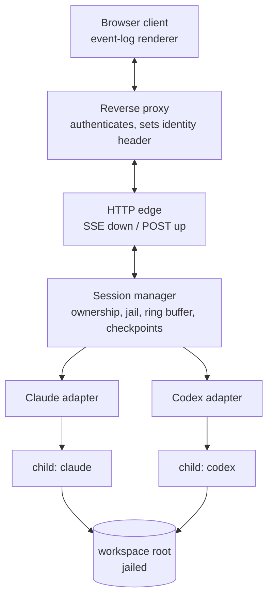

# Design — Agent Console

Reading order: `00-brief.md` first. This document assumes its non-goals are binding.

## Shape



Four layers, and the boundaries matter more than the boxes:

- **HTTP edge** knows about requests, identity and streams. It knows nothing about vendors.
- **Session manager** knows about ownership, lifecycle and the filesystem jail. It speaks
  only the normalised event vocabulary in `20-contract.md`.
- **Adapters** are the only code that knows a vendor exists. One per CLI.
- **Child processes** are the agents. We supervise them; we do not reimplement them.

The rule that keeps this honest: **a vendor string must never appear above the adapter
layer.** If the session manager or the client needs to branch on `claude` vs `codex`, the
normalised vocabulary is wrong and the fix belongs in `20-contract.md`, not in a
conditional.

## Prior art

Findings from reading `Forks-Claude-Code-Chat` at commit `ab6e307`. That repository is
licensed all-rights-reserved with a reference-only grant, so these are protocol facts and
techniques, **not** code to copy. Line references are for a reader who wants to check the
claim.

### Take

**The transport.** The Claude CLI is driven with
`--output-format stream-json --input-format stream-json --verbose`, with **stdin held
open** for the life of the turn (`src/extension.ts:926`). Messages go in as JSON lines;
events come out as NDJSON. Holding stdin open is what makes interactive permissions
possible at all — closing it after the prompt, which is the obvious first implementation,
forecloses the whole feature.

**The line splitter.** Accumulate, `split('\n')`, `pop()` the trailing fragment and carry
it into the next chunk (`src/extension.ts:1178-1185`). Obvious once seen, and the single
most common source of corrupt-JSON bugs when not done.

**The permission handshake.** `--permission-prompt-tool stdio` makes the CLI emit
`{type: 'control_request', request: {subtype: 'can_use_tool', ...}}`. The host renders a
prompt and writes back a `control_response` carrying `behavior: 'allow' | 'deny'`
(`src/extension.ts:2039`). `updatedPermissions` on an allow is how "always allow" is
expressed. This replaced an older approach that stood up a whole MCP server for the
purpose; that repo still carries the 540 KB fossil at its root.

**Session state is the CLI's, not ours.** `session_id` arrives on the `system`/`init`
event and goes back out as `--resume <id>` on the next turn (`src/extension.ts:971`). We
keep a transcript for display and replay only. This is the difference between a console
and a reimplementation of context management.

**Checkpoints via a shadow git directory.** A second `GIT_DIR` in server storage, pointed
at the workspace as its work-tree (`src/extension.ts:1742`):

```
git --git-dir=<storage>/<session>/ckpt.git --work-tree=<workspace> add -A
git --git-dir=<storage>/<session>/ckpt.git --work-tree=<workspace> commit --allow-empty -m "<label>"
git --git-dir=<storage>/<session>/ckpt.git --work-tree=<workspace> checkout <sha> -- .
```

The operator's real `.git` is never touched, the workspace needs no git at all, and the
mechanism is vendor-agnostic — which is why it survives our move to two backends intact.
The best idea in that repository.

**Coarse "always allow" patterns.** Deriving `npm run *` from a concrete command so a
standing approval is a shape rather than a string. We need this and should not invent our
own grammar before looking at what `permission_suggestions` already offers on the wire.

### Leave

- **The rendering.** A 5,359-line `<script>` inside a template literal, 5,053 lines of CSS
  in another, `innerHTML =` throughout, no virtualisation, no batching. An unbounded DOM.
- **No token-level streaming.** `--include-partial-messages` appears nowhere in that
  source; assistant text arrives as whole blocks. We should try the flag — see *Open*.
- **The CSP.** `default-src * 'unsafe-inline' 'unsafe-eval' data: blob:` — survivable in a
  webview whose only user owns the machine, disqualifying in a browser app that renders
  model output.
- **Everything about its trust model.** A webview has exactly one user, who is also the
  machine owner. Nothing in that repository generalises to more than one operator, and
  `--dangerously-skip-permissions` is exposed as a checkbox.

### Not applicable

Its provider router (`src/router/`, ~500 lines translating Anthropic `/v1/messages` to
OpenAI `/chat/completions` behind `ANTHROPIC_BASE_URL`) is a clever way to make one CLI
talk to another vendor's *API*. We are doing the opposite — driving each vendor's own CLI —
so it solves a problem we do not have. Worth remembering if that ever changes.

## The hard problem: two permission models that do not unify

This is where the cross-vendor decision costs something, and it should be understood before
implementation starts rather than discovered in it.

| | Claude CLI | Codex CLI |
|---|---|---|
| When policy is set | Per tool call, at runtime | At launch |
| Mechanism | `control_request` / `control_response` over stdio | `approval_policy`, `sandbox_mode` in config |
| Granularity | This command, this path, now | Whole session |
| Operator sees | A prompt they answer | A sandbox they chose in advance |
| Source | Verified — read from the fork | `codex/PROFILES.md` in SubZeroDev.AgentKit |

These are not two spellings of one idea. Claude's model is a conversation; Codex's is a
policy. A lowest-common-denominator design — launch-time policy only — throws away the
single most valuable thing the console offers, which is approving a tool call from
somewhere that is not the server's terminal.

**Decision: model the interactive case as the contract, and let Codex under-deliver
against it, visibly.** See `90-decisions.md` D5. A Codex session launches with an explicit
`sandbox_mode`, surfaces that mode in the UI as a standing banner, and emits no
`permission.request` events. The client must therefore treat "no permission events" as a
normal state for a session, not as a stuck turn.

**Stated as plainly as it deserves: Codex's live stdio protocol is unverified.** What is
verified is its *on-disk rollout schema* — `~/.codex/sessions/YYYY/MM/DD/rollout-*.jsonl`,
records wrapped in `payload`, opening with `session_meta`, usage as `token_count` events
under `payload.info` (`SubZeroDev.AgentKit/tools/Measure-Session.ps1:158,454`). Whether the
live stream matches that schema is an assumption, and the first slice of the Codex adapter
is an experiment to find out, not an implementation. Budget for it accordingly.

## Threat model

State the uncomfortable thing first: **giving someone console access is equivalent to
giving them the ability to run commands as the server's user.** The agent is a shell. Every
control below limits accident and scope; none of them defends against a determined
operator, because that would need a container per session and is explicitly out of scope
(`00-brief.md § Non-goals`).

| Adversary | In scope | Control |
|---|---|---|
| The internet | Yes | Server refuses to bind non-loopback without auth configured |
| A curious operator wandering outside their workspace | Yes | Path jail, resolved after symlinks |
| An operator reading another's session | Yes | Ownership check on every session route |
| A confused agent, or prompt injection reaching one | Partly | Permission prompts, sandbox mode, checkpoints to undo |
| A determined operator | **No** | Out of scope — needs per-session containers |
| A compromised server | No | Out of scope |

The fourth row deserves attention. Content the agent reads — a README, an issue body, a web
page — can contain text aimed at the agent. The permission prompt is the control, which
means **the prompt must show what is actually being run**, not a summary of it, and the
audit log must record the exact input that was approved.

## Security controls

**Auth by delegation.** Primary mode trusts an identity header set by a reverse proxy
(Authelia, Authentik, oauth2-proxy, Cloudflare Access). Fallback mode is a shared secret in
a cookie, for a bare LAN box. We do not store credentials, hash passwords, or implement
reset flows — for a handful of trusted operators that is code with a real vulnerability
surface and no corresponding benefit. See `90-decisions.md` D3.

The header-trust mode has one sharp edge that must be got right: **a trusted header is only
trustworthy if the client cannot set it.** The server therefore binds loopback-only in that
mode by default, and refuses to start listening on a routable interface unless an explicit
`trustProxy` allow-list of upstream addresses is configured.

**Fail closed on startup.** The server refuses to start if it would bind a non-loopback
interface with no auth mode configured. Not a warning. A misconfigured console is a remote
shell, and the failure mode of a warning is that nobody reads it.

**Workspace jail.** Configuration declares one or more `workspaceRoot` paths. A requested
working directory is accepted only if its **fully resolved real path** — symlinks followed,
`..` collapsed, case-normalised on Windows — is inside a root. The check runs at session
creation and the resolved path, never the client's string, is what gets passed as `cwd`.

**Audit trail.** Every permission decision appends `{ts, operator, sessionId, tool, input,
decision, scope}` to an append-only log. This is the artifact that makes multi-operator use
defensible, and it is cheap. It is also the thing nobody adds later.

## Failure modes

| Failure | Consequence if unhandled | Handling |
|---|---|---|
| Agent exits mid-turn | Client waits forever on a prompt that can never be answered | Cancel pending permission requests, emit `session.exit`. The fork does this and it is easy to omit |
| Client disconnects mid-turn | Output lost; operator re-runs work | Process continues, events buffer, replay on reconnect by `Last-Event-ID` |
| Huge tool result | SSE flood, browser stall | Per-event byte cap; truncate with a `truncated: true` flag and fetch-by-id for the remainder |
| NDJSON split across chunks | Corrupt JSON, dropped events | Carry-over splitter, unit-tested against a byte-by-byte feed |
| Unbounded transcript | Server memory growth | Ring buffer in memory, spill to disk per session |
| Server restart | Orphaned agent processes | Record child PIDs; reap on boot before accepting connections |
| Two clients, one session | Interleaved permission answers | First answer wins; the losing client is told the request was already resolved |
| Workspace not a git repo | Checkpoints silently absent | Shadow git needs no repo in the workspace; init on session create and say so if it fails |

## Storage

Everything is per-session, under a server storage root:

```
<storage>/sessions/<sessionId>/
  meta.json        owner, vendor, resolved cwd, cli session id, created
  events.ndjson    transcript spill, append-only
  ckpt.git/        shadow git dir, work-tree = the session's workspace
<storage>/audit.ndjson
```

No database in the first cut. Sessions are files, the audit log is a file, and the ring
buffer is memory. If session listing ever needs querying beyond "mine, recent", that is the
moment to add SQLite — not before.

## What we add that the prior art has none of

Ordered by how much they hurt to retrofit:

1. **Auth and per-operator session ownership** — retrofitting ownership through a codebase
   that assumed one user is the expensive one.
2. **The workspace jail** — must be in the session-creation path from the first commit.
3. **Replay on reconnect** — needs a monotonic `seq` on every event from day one. Adding a
   sequence number later means every stored transcript predates it.
4. **The vendor normalisation layer** — the contract, not an afterthought.
5. **Event size caps and backpressure.**
6. **Process supervision and reaping.**
7. **The audit log.**
8. **Token-level streaming**, if `--include-partial-messages` proves out.

Items 1, 2 and 3 are the ones that dictate structure. The rest can be added to a sound
structure without disturbing it.

## Open

Carried to `90-decisions.md § Open` as they are resolved or promoted to issues.

- Does `--include-partial-messages` give usable token-level deltas, and does it change the
  event contract? Cheap to test, and the answer changes the renderer.
- Does the Codex CLI expose a live NDJSON stream at all, and does it match the rollout
  schema? First Codex slice answers this.
- Does Codex offer any runtime approval hook, or is `approval_policy` genuinely the whole
  story? If there is a hook, D5 gets revisited.
- Checkpoint restore across two operators sharing one workspace — currently undefined, and
  it should probably be refused rather than resolved.
